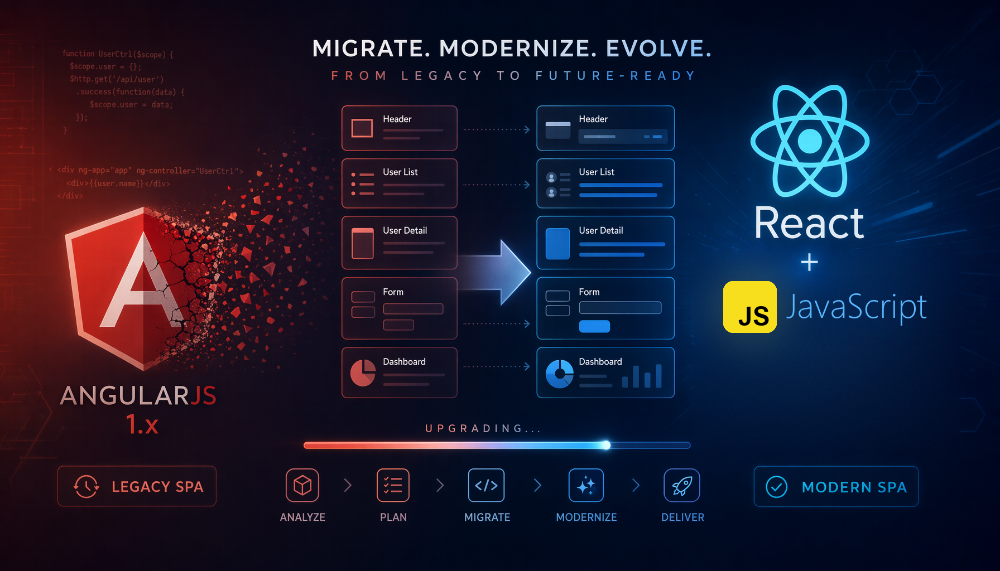
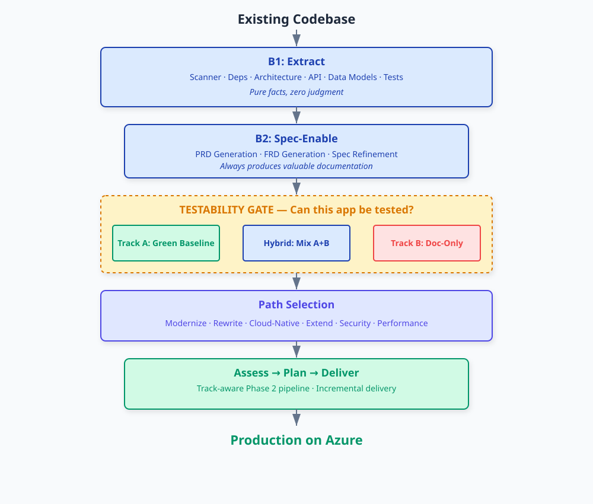
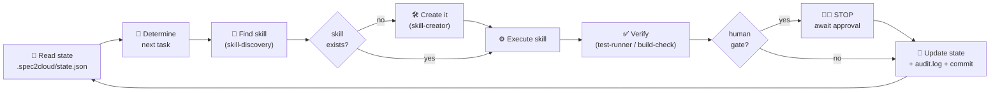

# 🌆 ANGULARJS to REACT: AI-ASSISTED MODERNIZATION LAB



---

## 🎯 MISSION

**GlobalTravel Corp** runs a corporate travel portal built in 2016 on AngularJS 1.6 - Bower packages, a Grunt pipeline, jQuery DOM manipulation, `$scope` soup, Restangular, and a test suite that has been red for years.

AngularJS reached **end of life in January 2022** ([link to the blog](https://blog.angular.dev/discontinued-long-term-support-for-angularjs-cc066b82e65a)).

Your mission is to modernize it into **React 19 + TypeScript**, *without* the "big bang rewrite that never ships". You will do it the way real modernization programmes should be run: **understand first, specify second, test third, change last** - using the [**spec2cloud**](https://github.com/EmeaAppGbb/spec2cloud) as the framework and GitHub Copilot as the engine.

---

## 🧭 WHY NOT JUST "COPILOT, PORT THIS TO REACT"?

You can absolutely paste an AngularJS controller into Copilot and get a React component back. That might work for *some files*. It falls apart across 40 files, because nobody - human or model - can answer the only question that matters:

> **"Did we just change the behaviour of the system?"**

Legacy apps have no spec. The behaviour *is* the code. So before you touch anything, you make the implicit explicit:

```text
   the code           →   what it DOES        →   what it SHOULD do   →   the new code
 (AngularJS 1.6)         (extracted specs)       (reviewed specs)         (React 19)
                                ▲                       ▲
                                │                       │
                         humans review here     humans approve here
```

That is **Spec-Driven Development (SDD)** applied to brownfield, and it is exactly what spec2cloud automates: a set of Copilot skills plus an (agentic) orchestrator that keeps state, stops at human gates, and never silently invents behaviour.

📖 Reference: [spec2cloud/docs/brownfield.md](https://github.com/EmeaAppGbb/spec2cloud/blob/vNext/docs/brownfield.md)

---

## 🔁 THE WORKFLOW



### Phase B1 · Extract
<sub>*Document what IS, not what SHOULD BE.*</sub>

Six skills read the legacy codebase and write down reality. No opinions, no improvements.

| Skill | Output for this repo |
|-------|----------------------|
| `codebase-scanner` | AngularJS 1.6.10, Bower + Grunt, 5 feature modules, 3 directives, 2 filters, 3 services |
| `dependency-inventory` | 8 Bower packages (angular, ui-router, ui-bootstrap, restangular, jquery, jquery-ui, moment, lodash) + npm devDeps |
| `architecture-mapper` | UI-Router state graph, controller ↔ service ↔ Restangular data flow, Mermaid diagrams |
| `api-extractor` | OpenAPI contract reverse-engineered from `api-mock/server.js` (~36 routes) |
| `data-model-extractor` | Flight, Hotel, Trip, ItineraryItem, TravelRequest, ExpenseReport entities + relationships |
| `test-discovery` | 1 Karma spec file, 11 tests, 0% meaningful coverage |

➡️ **🧑‍⚖️ Human Gate: Extraction Review.** If the extraction is wrong, *everything* downstream is wrong, so read it, correct it, then approve.

### Phase B2 · Spec-Enable
<sub>*Always produces valuable specifications.*</sub>

| Skill | Output |
|-------|--------|
| `prd-generator` | `specs/prd.md` - **Product Requirement Documentation**. What the product does, from the outside in |
| `frd-generator` | `specs/frds/*.md` - **Feature Requirement Documentation**, one per feature, each with a **"Current Implementation"** section that pins the spec to today's code |
| `spec-refinement` | Ambiguities resolved, gaps closed, contradictions surfaced |
| `ddd-modeling` *(optional)* | `specs/domain/{proposals,domain-model,database-model}.md` |

➡️ **🧑‍⚖️ Human Gates: PRD Review, FRD Review, Refinement Review.**

### 🧪 The Testability Gate

Before writing a single line of React you answer six questions about the legacy app:

| # | Question | This repo |
|---|----------|-----------|
| 1 | Can you build and start it locally? | ✅ `npm start` |
| 2 | Are external dependencies reachable or mockable? | ✅ `api-mock/` is a self-contained Express API |
| 3 | Can you exercise the API? | ✅ `curl http://localhost:3000/api/...` |
| 4 | Can you render the UI? | ✅ http://localhost:8080 |
| 5 | Is there a dev/test environment? | ✅ the dev container you are reading this in |
| 6 | Can you run the existing test suite? | ✅ `npm test` runs — **and fails 11/11 on purpose** (see below) |

| Boxes ticked | Track | What you do |
|--------------|-------|-------------|
| 5–6 | 🟢 **Track A — Green Baseline** | Capture behaviour as Gherkin `@existing-behavior`, scaffold tests that **pass against the legacy app**, then migrate with a safety net |
| 3–4 | 🟡 **Hybrid** | Track A for the testable features, Track B for the rest |
| 0–2 | 📋 **Track B — Doc-Only** | `@documentation-only` scenarios + manual verification checklists + a testability roadmap |

**GlobalTravel Corp will score 6/6, so we are in Track A.** The decision must be recorded as an ADR in `specs/adrs/` (skill: `adr`) — because in a real programme, *why* you chose a track is the thing people will question six months later.

### 🟢 Track A in three steps

1. **Gherkin capture** (`gherkin-generation`): every FRD behaviour becomes a scenario tagged `@existing-behavior`.
2. **Test scaffolding** (`test-generation`, `e2e-generation`, `playwright-cli`): Cucumber steps, Playwright e2e, unit tests.
3. **Green verification** (`test-runner`, `build-check`): everything must be green before any migration starts.

> ⚠️ **The golden rule of a green baseline:**
> if a test fails against the legacy app, **fix the test, not the app.**
> The legacy behaviour - bugs included - *is* the specification.

➡️ **🧑‍⚖️ Human Gate: Green Baseline.**

### 🔀 Choose your path

spec2cloud supports six brownfield paths. **This lab uses `Modernize`.**

| Path | Assessment skill | Planning skill | Used here |
|------|------------------|----------------|-----------|
| **Modernize** (tech debt, dead frameworks) | `modernization-assessment` | `modernization-planner` | ✅ **yes** |
| **Rewrite** (replace components entirely) | `rewrite-assessment` | `rewrite-planner` | optional stretch |
| **Cloud-Native** (containers / Azure) | `cloud-native-assessment` | `cloud-native-planner` | optional stretch |
| **Extend** (add features) | — | `extension-planner` | no |
| **Security** | `security-assessment` | `security-planner` | no |
| **Performance** | `performance-assessment` | — | no |

➡️ **🧑‍⚖️ Human Gate: Path Selection.**

### Phases A → P → 2

| Phase | What happens | Key skills |
|-------|--------------|------------|
| **A · Assess** | Score every module: complexity, risk, coupling, migration order | `modernization-assessment` |
| **P · Plan** | Increment plan + target stack decision, written as ADRs | `modernization-planner`, `tech-stack-resolution`, `adr` |
| **2 · Deliver** | Per increment: tests → contracts → implementation → verification → PR | `test-generation`, `contract-generation`, `implementation`, `test-runner`, `build-check`, `commit-protocol` |

---

## 🤖 THE RALPH LOOP

<sub>*Ralph is the spec2cloud orchestrator. It runs the 11-step loop below, over and over, until the work is done.*</sub>

spec2cloud's orchestrator (`AGENTS.md`) runs a deterministic 11-step cycle, over and over, until the work is done. 



**State lives in git**, and is updated after *every* action:

| File | Purpose |
|------|---------|
| `.spec2cloud/state.json` | Current phase, track, increment, gate status |
| `.spec2cloud/audit.log` | Append-only trail of every skill invocation |
| `.spec2cloud/models.json` | Which model did what |

Brownfield adds these to `state.json`:

```jsonc
{
  "mode": "brownfield",
  "brownfield": {
    "testability": "high",
    "track": "A",
    "testabilityChecklist": { /* the 6 answers */ },
    "featureTracks": { "flight-search": "A", "expenses": "A" },
    "greenBaseline": { "status": "green", "verifiedAt": "..." }
  }
}
```

Because state is in git, you can **stop, hand over, and resume** — `resume` is a first-class skill. 

---

## 🧑‍⚖️ HUMAN-IN-THE-LOOP GATES

The agent **stops and waits** at each of these. Nothing is approved by default.

| Gate | You are approving… | Blast radius if you rubber-stamp it |
|------|--------------------|-------------------------------------|
| **Extraction Review** | "this is genuinely what the code does" | 🔴 every spec below is fiction |
| **PRD Review** | product scope & intent | 🔴 you modernize the wrong product |
| **FRD Review** | per-feature behaviour | 🟠 features silently change |
| **Testability Gate** | Track A / B / Hybrid + ADR | 🔴 you migrate blind |
| **Green Baseline** | the safety net is real and green | 🔴 regressions ship undetected |
| **Track B Review** | doc-only scenarios are sufficient | 🟠 manual verification misses cases |
| **Path Selection** | Modernize vs Rewrite vs … | 🟠 wrong strategy, wasted effort |
| **Assessment Review** | complexity & risk scoring | 🟠 wrong migration order |
| **Gherkin Review** | scenarios == real behaviour | 🔴 tests encode wrong behaviour |
| **Spec / Design / Tech-Stack Review** | target architecture | 🟠 expensive to reverse later |
| **PR Review** | the actual diff | 🟠 the usual |
| **Deploy Review** | going live | 🔴 the usual, but louder |

---

## 🎯 THE TARGET STACK

```
React 19 + TypeScript (strict)
    ├── ⚡ Vite 6            build + dev server (HMR that actually works)
    ├── 🧭 TanStack Router   type-safe routing        ← replaces UI-Router
    ├── 🔄 TanStack Query    server state + caching   ← replaces Restangular
    ├── 🐻 Zustand           client state             ← replaces $rootScope
    ├── 🧪 Vitest + Testing Library   unit/component tests   ← replaces Karma + Jasmine
    ├── 🎭 Playwright        e2e / behaviour tests    ← replaces "click it and see"
    ├── 📅 date-fns          dates                    ← replaces Moment.js
    └── 🎨 CSS Modules       styles                   ← replaces global Bootstrap 3 CSS
```

### Migration map

| Legacy (AngularJS 1.6) | Target (React 19) | Notes |
|------------------------|-------------------|-------|
| Controller + `$scope` | Function component + `useState`/`useReducer` | `$scope` is not state — it is a DI-scoped bag. Untangle it. |
| `$rootScope` broadcast/on | Zustand store or React context | `$rootScope.$broadcast('flight:selected')` becomes an explicit store action |
| UI-Router `$stateProvider` | TanStack Router route tree | Hash routing (`#!/flights`) → real paths (`/flights`) |
| Restangular | TanStack Query + `fetch` | Base URL moves from hardcoded to `import.meta.env` |
| `.directive()` | Component (or hook, if behaviour-only) | `date-picker` wraps jQuery UI → native `<input type="date">` or Radix |
| `.filter('currency')` | `Intl.NumberFormat` | Delete the filter entirely |
| `.filter('dateFormat')` | `date-fns/format` | Delete the filter entirely |
| `$(...).animate()` / `.offset()` | `element.scrollIntoView({ behavior: 'smooth' })` | **remove jQuery completely** |
| `$http` interceptors (auth) | TanStack Query + fetch wrapper | JWT stays in `localStorage` for the lab (flagged as tech debt) |
| Bower + Grunt | npm + Vite | `bower_components/` is deleted at the end |
| Karma + Jasmine | Vitest | The 11 red tests become the first Gherkin scenarios |

### 🎯 Non-negotiable outcomes

- Zero jQuery in the React app.
- Zero `any` in migrated modules (`strict: true`).
- Every migrated feature has a passing Gherkin-derived test.
- Legacy app keeps working until the last module is migrated (strangler-fig, not big bang).

---

## ⚡ QUICK START

### Option A: GitHub Codespaces (recommended for the hackathon)

[](https://codespaces.new/alessandro-avila/appmodlab-angularjs-to-react)

1. Click the badge (or **Code ▸ Codespaces ▸ Create codespace on main**).
2. Wait for `post-create.sh` — it installs everything **and verifies it**.
   You should see `Dev container is ready.` in green. If you see red `[FAIL]` lines, tell a facilitator.
3. In the terminal:
   ```bash
   npm start
   ```
4. Open the forwarded port **8080**. Click **Enter Portal**. You are in.

> ⏱️ First build should take ~4–6 minutes.

### Option B: Local dev container (VS Code + Docker)

```bash
git clone https://github.com/alessandro-avila/appmodlab-angularjs-to-react.git
cd appmodlab-angularjs-to-react
code .
# then: Ctrl/Cmd+Shift+P → "Dev Containers: Reopen in Container"
npm start
```

### Option C: Bare metal (no container)

Only if A and B are impossible. You need **Node.js 22 LTS**, **git**, and a Chromium
browser on `CHROME_BIN` for the Karma suite.

```bash
git clone https://github.com/alessandro-avila/appmodlab-angularjs-to-react.git
cd appmodlab-angularjs-to-react
npm ci
npm start
```

### Everything the container gives you

| Tool | Why |
|------|-----|
| Node.js 22 LTS | React 19 / Vite 6 require Node ≥ 20.19 |
| GitHub CLI (`gh`) | PRs, gates, `gh auth` |
| **GitHub Copilot CLI** (`copilot`) | agentic loop from the terminal |
| Chromium + Playwright browsers | Karma today, Playwright e2e tomorrow — pre-installed so nobody downloads 300 MB on conference wifi |
| Python 3 | some spec2cloud skills shell out to it |
| Azure CLI + `azd` | optional deployment stretch goal |
| Docker-in-Docker | containerised stretch goals |
| VS Code extensions | Copilot, Copilot Chat, Playwright, Vitest, ESLint, Prettier, YAML, Docker |
| Ports 3000 / 8080 / 35729 / 5173 / 4173 | mock API · legacy app · livereload · Vite dev · Vite preview |
| `spec2cloud` npm package pre-cached | `npx spec2cloud init` works instantly, even offline-ish |

### Verified platforms

The container is **multi-architecture** - it is built from `linux/amd64` **and** `linux/arm64` images, so it runs natively on Apple Silicon with no emulation and no Rosetta.

| Host | Arch | Status |
|------|------|--------|
| GitHub Codespaces | x86-64 | ✅ verified |
| Linux | x86-64 | ✅ verified |
| Windows + Docker Desktop / WSL2 | x86-64 | ✅ verified |
| **macOS Apple Silicon** (M1–M4) | arm64 | ✅ image + all 6 features build and every tool runs natively |
| macOS Intel | x86-64 | ✅ same image as Linux/Windows |

> **macOS tip:** give Docker Desktop at least **4 CPUs / 8 GB** under
> *Settings → Resources*. `NODE_OPTIONS` asks for a 4 GB heap, and the default
> macOS allocation is often too small.

---

## 🏃 RUNNING THE LEGACY APP

```bash
npm start           # mock API (:3000) + web app (:8080) together  ← use this
npm run api         # mock API only
npm run serve       # web app only
npm run build       # Grunt production build → dist/
npm test            # Karma suite (single run) — expected: 11 failures
npm run test:watch
```

| Service | URL | Notes |
|---------|-----|-------|
| Legacy app | http://localhost:8080 | UI-Router hash routes, e.g. `#!/flights` |
| Mock API | http://localhost:3000/api | Express, ~36 routes, JWT middleware |
| LiveReload | :35729 | injected automatically by `grunt serve` |

**Login:** there is no real login. Click **Enter Portal** — a mock JWT is written to `localStorage`. (`AuthService` + a `$rootScope.$on('$stateChangeStart')` guard.)

**Try:** Flights → `SFO` → `JFK` → pick two dates → **Search Flights** → click a result.
That single flow touches routing, a directive wrapping a jQuery plugin, a filter, a service, Restangular, and jQuery DOM manipulation. It is the perfect first migration target.

### What you are modernizing

| | |
|---|---|
|  |  |
| **Login** — mock auth, JWT into `localStorage` | **Dashboard** — hub for the five modules |
|  |  |
| **Flight search** — round-trip toggle, jQuery UI datepickers, filters, sorting | **Hotel booking** — destination, date range, guests/rooms, card results |
|  |  |
| **Itinerary** — list / timeline / print views | **Travel requests** — status filters, search, validation-heavy form |


**Expense reconciliation** — status tabs, search, date-range filter, report creation.

---

## 🧨 KNOWN LEGACY DEBT

This is a *brownfield* lab. Some things are broken **on purpose** because fixing them is the exercise. Do not "helpfully" repair these before the hackathon starts.

| Fact | Notes |
|------|--------------|
| **`npm test` fails 11/11.** `test/spec/flight-search.spec.js` asserts behaviour the controller does not have (e.g. a `getPopularRoutes()` call on init, a different `$scope.filters` shape). | This is the single best artefact in the repo. It feeds `test-discovery`, it is the honest answer to Testability-Gate question 6, and it is the perfect drill for the Track A rule **"fix the test, not the app"**. |
| `ui.bootstrap` is declared in `app/app.js` but **never used**. No `uib-*` directive, no `$uibModal`. | A real dependency-inventory finding. `modernization-assessment` should catch it and drop the dependency. |
| API base URL hardcoded to `http://localhost:3000/api` in `app/app.js`. | Config-as-code smell. Becomes `import.meta.env.VITE_API_URL`. |
| **Searching flights logs a Moment.js deprecation warning** - `moment("08/15/2026")` is parsed with no format string, so it falls back to `new Date()`. | Expected, and harmless. A real `data-model-extractor` / date-handling finding: the React rewrite parses dates explicitly instead of guessing. |
| JWT stored in `localStorage`, no refresh, no expiry handling. | Feeds the optional `security-assessment` path. |
| `bower_components/` is **committed to the repo**. | 2016 called. It also means the app runs with zero network access. Deleted at the end of the migration. |
| Global Bootstrap 3 CSS, no scoping. | Becomes CSS Modules. |
| jQuery used for scrolling, datepickers, and animations inside Angular controllers. | The canonical "framework fighting the framework" anti-pattern. |

---

## 🌿 BRANCH STRATEGY - To be updated

| Branch | Contents |
|--------|----------|
| `main` | 🏛️ The **legacy AngularJS app**. |
| `lab/00-spec2cloud-init` | 🧰 `main` + spec2cloud installed (`.github/skills/`, `AGENTS.md`, `.spec2cloud/`, `specs/`, `.vscode/mcp.json`) |

<details>
<summary><b>What <code>spec2cloud init</code> adds to your working tree</b></summary>

| Path | Purpose |
|------|---------|
| `AGENTS.md` | The orchestrator. Copilot reads it automatically — this is what runs the Ralph loop. |
| `.github/skills/**/SKILL.md` | 46 skills (extract, spec, test, plan, implement, deploy) |
| `skills-lock.json` | Pinned skill versions |
| `.spec2cloud/state.json`, `audit.log`, `models.json` | Workflow state, committed to git |
| `.vscode/mcp.json`, `.mcp.json` | MCP server wiring |
| `specs/` | Where PRDs, FRDs, ADRs, and Gherkin land |

Useful flags: `--minimal` (add to an existing project), `--force` (overwrite), `--ref vNext` (pin the branch), `--target <dir>`. Conflicting files are preserved as `*.spec2cloud` rather than clobbered.
</details>

---

## 🚀 STARTING THE MODERNIZATION

```bash
# 1. Install the framework (skip if you branched from lab/00-spec2cloud-init)
npx spec2cloud init --flow brownfield --ref vNext

# 2. Authenticate Copilot CLI (once per Codespace)
copilot

# 3. Kick off the loop
```

Then, in Copilot CLI or Copilot Chat, the orchestrator in `AGENTS.md` activates automatically:

```
Analyze this codebase and start the spec2cloud brownfield workflow.
This is an AngularJS 1.6 app. Target is React 19 + TypeScript.
```

### 🗣️ Prompting that actually works - to be refactored

| ❌ Weak | ✅ Strong |
|---------|----------|
| "Convert this to React" | "Run `codebase-scanner` and `dependency-inventory` on `app/`. Output the technology inventory only. Do not propose changes." |
| "Write tests" | "For FRD `flight-search`, generate Gherkin tagged `@existing-behavior` that describes what `flight-search.controller.js` does **today**, including the bugs." |
| "Make it modern" | "Using `specs/frds/flight-search.md` and the green baseline in `tests/`, implement the React 19 component. Reuse the existing Gherkin as the acceptance criteria. Do not change behaviour." |
| "Fix the failing tests" | "The Karma suite asserts `popularRoutes` which the controller never populates. Per the Track A rule, correct the **test** to match current behaviour and record the discrepancy in the FRD." |

**Rules of thumb**

1. **One skill per prompt.** The orchestrator handles sequencing, soyou do not need to.
2. **Point at files to be more specific** `app/components/flight-search/` beats "the flight thing".
3. **Say what *not* to do.** "Do not refactor", "do not change behaviour", "do not add dependencies".
4. **Make it prove it.** "Run `npm test` and paste the output" beats "make sure it works".

---

## 📅 HACKATHON RUNBOOK

| # | Block | ⏱️ | What you actually do | Deliverable |
|---|-------|----|----------------------|-------------|
| 1 | **Kick-off & context** | 30m | KMD use cases, current pain, success criteria | Agreed definition of done |
| 2 | **Modernisation approach** | 60m | AngularJS → React patterns; incremental (strangler-fig) vs rewrite; React architecture; **why SDD for brownfield** | Path decision (Modernize) |
| 3 | **AI-assisted development** | 75m | Copilot for transformation & refactoring; prompting; agentic development; the Ralph loop; HITL gates | Everyone has Copilot CLI working in their Codespace |
| 4 | **Live demo** | 60m | Facilitator drives **B1 → B2 → Testability Gate → Track A → first React component**, end to end, live | Reference walkthrough |
| 5 | **🏗️ Hands-on hackathon** | 3h | Teams run the loop on real modules (see below) | Migrated components + specs |
| 6 | **Wrap-up & next steps** | 60m | Playback, reusable patterns, pilot workloads, follow-on plan | Pilot shortlist |

### Suggested 3-hour team plan

| Time | Phase | Target |
|------|-------|--------|
| 0:00–0:30 | B1 Extract | Full extraction + **Extraction Review gate** |
| 0:30–1:00 | B2 Spec-Enable | PRD + FRD for **one** module + **gate** |
| 1:00–1:20 | Testability Gate | Checklist + Track A + ADR |
| 1:20–1:50 | Track A | Gherkin `@existing-behavior` + green baseline |
| 1:50–2:10 | Assess + Plan | Migration order, target stack ADR |
| 2:10–2:50 | Deliver | First React 19 component, tests green |
| 2:50–3:00 | PR | Open PR, capture learnings |

---

## 📂 PROJECT STRUCTURE

```
appmodlab-angularjs-to-react/
├── .devcontainer/
│   ├── devcontainer.json          # Codespaces + local dev container
│   ├── post-create.sh             # installs AND verifies the toolchain
│   └── welcome.sh                 # terminal banner with the commands you need
├── api-mock/
│   └── server.js                  # Express mock API — the "backend" (:3000)
├── app/
│   ├── index.html                 # script manifest (the 2016 way)
│   ├── app.js                     # module decl, Restangular config, route guards
│   ├── app.routes.js              # UI-Router states + inline login
│   ├── components/
│   │   ├── flight-search/         # controller + service + template
│   │   ├── hotel-booking/
│   │   ├── itinerary/
│   │   ├── travel-request/
│   │   └── expense-reconciliation/
│   ├── directives/
│   │   ├── approval-status.directive.js
│   │   ├── currency-input.directive.js
│   │   └── date-picker.directive.js     # wraps the jQuery UI datepicker
│   ├── filters/
│   │   ├── currency.filter.js
│   │   └── date-format.filter.js
│   ├── services/
│   │   ├── api.service.js
│   │   ├── auth.service.js
│   │   └── user.service.js
│   └── assets/css/
├── bower_components/              # committed on purpose (2016 archaeology)
├── test/
│   ├── karma.conf.js
│   └── spec/flight-search.spec.js # 11 tests, 11 red, intentionally
├── Gruntfile.js                   # concat + uglify + cssmin + connect + watch
├── bower.json
└── package.json
```

**After `spec2cloud init` you additionally get** `AGENTS.md`, `.github/skills/`, `.spec2cloud/`, `specs/`, `skills-lock.json`.

---

## 🏗️ LEGACY STACK

| Layer | Technology | Status |
|-------|------------|--------|
| Framework | AngularJS **1.6.10** | ☠️ EOL Jan 2022 |
| Router | UI-Router 0.4.x | ☠️ unmaintained |
| HTTP | Restangular 1.6.x | ☠️ unmaintained |
| UI kit | Bootstrap 3 + angular-ui-bootstrap 2.5 | ⚠️ Bootstrap 3 EOL |
| DOM | jQuery 2.2 + jQuery UI 1.12 | ⚠️ anti-pattern inside Angular |
| Dates | Moment.js 2.x | ⚠️ in maintenance mode |
| Utils | Lodash 4 | ⚠️ mostly redundant with ES2015+ |
| Packages | **Bower** | ☠️ deprecated 2017 |
| Build | Grunt 1.x | ⚠️ legacy |
| Tests | Karma 1.7 + Jasmine 2.8 | ☠️ Karma deprecated 2023 |
| Backend | Express mock API | ✅ keep as-is for the lab |

---

## ✅ ACCEPTANCE CRITERIA

**Minimum viable outcome (every team)**

- [ ] Phase B1 extraction complete and reviewed at the gate
- [ ] PRD + at least one FRD with a "Current Implementation" section, reviewed
- [ ] Testability Gate answered, track chosen, **ADR written**
- [ ] Gherkin `@existing-behavior` scenarios for at least one module
- [ ] Green baseline: the scenarios pass **against the legacy app**
- [ ] At least one module migrated to React 19 + TypeScript, tests still green
- [ ] PR opened with the spec + tests + code in the same changeset

**Stretch**

- [ ] All five modules migrated; `bower_components/` deleted
- [ ] Strangler-fig routing: React and AngularJS coexisting behind one entry point
- [ ] `strict: true` with zero `any` in migrated code
- [ ] Playwright e2e covering the full booking flow
- [ ] Deployed to Azure Static Web Apps via `azd`
- [ ] `security-assessment` run on the JWT/`localStorage` handling

**Definition of done for a migrated module**

1. Its FRD describes current *and* target behaviour.
2. Its Gherkin scenarios pass on both the legacy and the React implementation.
3. No jQuery. No `any`. No `$scope`.
4. The gate that approved it is recorded in `.spec2cloud/audit.log`.

---

## 🛠️ TROUBLESHOOTING

<details>
<summary><b>The app loads but every page is blank</b></summary>

Almost always a vendored library failing to load, which stops Angular bootstrapping.
Open DevTools → Console. Check `bower_components/angular-ui-bootstrap/dist/ui-bootstrap-tpls.js` and `bower_components/jquery-ui/jquery-ui.min.js` return **200**, not 404.
Both are committed — if they 404, your `grunt serve` is serving only `app/` (see `Gruntfile.js` → `connect.server.options.base` must be `['app', '.']`).
</details>

<details>
<summary><b>"Failed to load…" errors in every module</b></summary>

The mock API is not running. Use `npm start` (both) rather than `npm run serve` (web only).
Verify: `curl http://localhost:3000/api/airports`.
</details>

<details>
<summary><b>Port already in use</b></summary>

```bash
# Linux / macOS / Codespaces
lsof -ti:3000 | xargs -r kill -9
lsof -ti:8080 | xargs -r kill -9
```
```powershell
# Windows
Get-NetTCPConnection -LocalPort 3000 | ForEach-Object { Stop-Process -Id $_.OwningProcess -Force }
```
</details>

<details>
<summary><b><code>npm test</code> fails with 11 failures</b></summary>

✅ **Correct.** That is the designed starting state - see *Known and intentional legacy debt*.
A **crash** (browser never launches) is different: check `CHROME_BIN`.
```bash
echo $CHROME_BIN   # should be /usr/bin/chromium in the container
chromium --version
```
</details>

<details>
<summary><b>Karma hangs and never exits</b></summary>

Use `npm test` (adds `--single-run`). `npm run test:watch` is the watching variant.
</details>

<details>
<summary><b><code>Cannot start ChromeHeadless</code> / Chrome crashes mid-run</b></summary>

`test/karma.conf.js` auto-detects a container (via `/.dockerenv`) and switches to a
`ChromeHeadlessContainer` launcher with `--no-sandbox --disable-dev-shm-usage
--disable-gpu`, so this should not happen. If it does:

```bash
node -e "var c={set:o=>console.log(o.browsers),LOG_INFO:1};require('./test/karma.conf.js')(c)"
# in a container this must print [ 'ChromeHeadlessContainer' ]
```

| Symptom | Cause | Handled by |
|---------|-------|-----------|
| `Running as root without --no-sandbox is not supported` | running as root; Chrome refuses | `--no-sandbox` |
| Chrome dies part-way through the run | Docker gives `/dev/shm` only **64 MB** | `--disable-dev-shm-usage` + `"runArgs": ["--shm-size=1g"]` |
| `GPU process isn't usable` | no GPU in a container | `--disable-gpu` |

Outside a container the plain `ChromeHeadless` launcher is used, so your local
Chrome keeps its normal sandbox.
</details>

<details>
<summary><b>Apple Silicon: is anything emulated?</b></summary>

No. The base image and every feature publish native `linux/arm64` builds, and
`node_modules` contains no native binaries, so nothing is cross-compiled or
emulated. Confirm with:

```bash
uname -m          # aarch64
node -p process.arch   # arm64
```

If you see `x86_64` inside the container on an M-series Mac, Docker Desktop is
forcing amd64 — clear **Settings → General → "Use Rosetta for x86/amd64 emulation"**
and any `DOCKER_DEFAULT_PLATFORM=linux/amd64` in your shell profile.
</details>

<details>
<summary><b>Datepickers do nothing</b></summary>

jQuery UI failed to load. Check the console for a 404 on `jquery-ui.min.js`, and that
`app/index.html` loads it **after** `jquery.min.js`.
</details>

<details>
<summary><b>In Codespaces the browser cannot reach :8080</b></summary>

`Gruntfile.js` detects containers (`CODESPACES` / `REMOTE_CONTAINERS` / `DEVCONTAINER`)
and binds to all interfaces. If you overrode the env, unset it and restart.
Then use the **Ports** panel — not `localhost` in your host browser.
</details>

<details>
<summary><b><code>copilot</code>: command not found</b></summary>

```bash
npm install -g @github/copilot
copilot        # follow the device-code sign-in
```
</details>

<details>
<summary><b><code>npx spec2cloud init</code> hangs</b></summary>

It is waiting on an interactive prompt that has no TTY. Pass the flags explicitly:
```bash
npx spec2cloud init --flow brownfield --ref vNext --minimal --force
```
</details>

<details>
<summary><b>Copilot ignores the workflow / invents its own plan</b></summary>

It has not picked up `AGENTS.md`. Confirm the file exists at the repo root, that you opened the repo root (not a subfolder), and start with an explicit instruction:
*"Read AGENTS.md and follow the brownfield workflow. Do not skip human gates."*
</details>

---

## 📚 RESOURCES

**spec2cloud**
- [Repository](https://github.com/EmeaAppGbb/spec2cloud) · [Brownfield guide](https://github.com/EmeaAppGbb/spec2cloud/blob/vNext/docs/brownfield.md) · [Concepts / Ralph loop](https://github.com/EmeaAppGbb/spec2cloud/blob/vNext/docs/concepts.md) · [State & gates](https://github.com/EmeaAppGbb/spec2cloud/blob/vNext/docs/state-and-gates.md) · [Quick start](https://github.com/EmeaAppGbb/spec2cloud/blob/vNext/docs/quickstart.md)

**GitHub Copilot**
- [Copilot CLI](https://docs.github.com/copilot/concepts/agents/about-copilot-cli) · [Prompt engineering](https://docs.github.com/copilot/using-github-copilot/prompt-engineering-for-github-copilot) · [Custom instructions](https://docs.github.com/copilot/customizing-copilot/adding-repository-custom-instructions-for-github-copilot)

**React**
- [react.dev](https://react.dev/) · [Vite](https://vite.dev/) · [TanStack Router](https://tanstack.com/router) · [TanStack Query](https://tanstack.com/query) · [Zustand](https://zustand.docs.pmnd.rs/) · [Vitest](https://vitest.dev/) · [Testing Library](https://testing-library.com/react) · [Playwright](https://playwright.dev/)

**Migration background**
- [AngularJS EOL](https://blog.angular.dev/discontinued-long-term-support-for-angularjs-cc066b82e65a) · [Strangler Fig pattern](https://learn.microsoft.com/azure/architecture/patterns/strangler-fig) · [date-fns](https://date-fns.org/) · [You Might Not Need Lodash](https://youmightnotneed.com/lodash)

---

## 🙋 SUPPORT

- **During the hackathon:** grab a Microsoft facilitator, that is what they are there for.
- **Lab issues:** open an issue in [this repository](https://github.com/alessandro-avila/appmodlab-angularjs-to-react/issues).
- **Framework issues:** open an issue in [EmeaAppGbb/spec2cloud](https://github.com/EmeaAppGbb/spec2cloud/issues).

---

## 📜 LICENSE

MIT.
Originally derived from [EmeaAppGbb/appmodlab-angularjs-to-react-angular-modern](https://github.com/EmeaAppGbb/appmodlab-angularjs-to-react-angular-modern), re-targeted to React-only and re-platformed onto the spec2cloud brownfield workflow.
