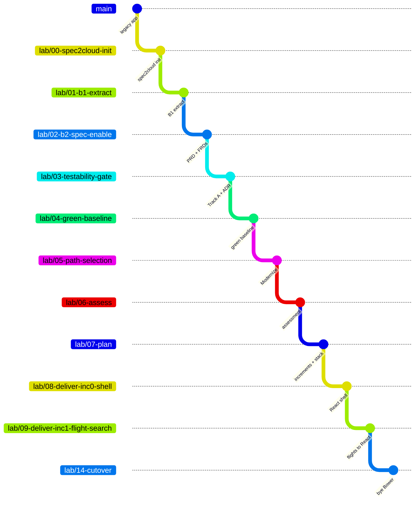

# 📚 THE WALKTHROUGH

<sub>*Every step of the AngularJS → React modernization, as it actually happened.*</sub>

This is the operational companion to the [root README](../../README.md). The README explains
**what** spec2cloud's brownfield pathway is. This folder documents **exactly how we ran it on this
repo** — the prompt used at each step, the artifacts it produced, the gate decision, and what went
wrong.

> [!IMPORTANT]
> **Read these docs from `main`, and pull them onto your lab branch before every step.**
>
> ```bash
> git checkout main -- docs/ README.md
> ```
>
> `docs/` lives on `main`. A `lab/*` branch carries whatever `docs/` looked like when it was cut, and
> nothing merges `main` forward — so the copy sitting on your branch is **always behind**, and gets
> further behind with every step.
>
> This is not hypothetical. [Increment 0](08-deliver-inc0-shell.md#-outcome) was run against
> instructions **1935 lines out of date**, which cost three deviations in the first increment that
> produced code. Run the line above **first**, before you read the step, or you will read the wrong
> version of it.

> [!WARNING]
> **Then check you cut the branch from the right place.** `main` carries the *story* and has **no
> `specs/` and no `src/`** — so a branch accidentally cut from `main` looks superficially fine and is
> missing every artifact the step depends on.
>
> ```bash
> git ls-tree -r --name-only HEAD -- specs/ src/ | Measure-Object -Line
> ```
>
> Zero means you branched from `main`. Fix it before you start — while the branch has no unique
> commits, it is a one-line reset:
>
> ```bash
> git reset --hard lab/NN-previous-step
> ```
>
> This has happened **twice** in this lab: once at `lab/03-testability-gate` and again at
> `lab/11-deliver-inc3-itinerary`. Both times the agent caught it by noticing the artifacts were
> missing — but it costs a whole exchange, and it is thirty seconds to check.

---

## 🧭 HOW TO USE THIS

Each step is one file. Each file follows the same shape:

| Section | What it gives you |
|---------|-------------------|
| 🎯 **Goal** | What "done" means for this step |
| 🧰 **Skills invoked** | Which spec2cloud skills run, what they read, what they write |
| ✅ **Prerequisites** | What must be true before you start |
| 🌿 **Branch setup** | The exact `git` commands |
| 🗣️ **The prompt** | Copy-paste it into Copilot CLI or Copilot Chat |
| 📦 **Expected artifacts** | What should exist when the skill finishes |
| 📤 **Outcome** | What *actually* happened on this repo |
| 🧑‍⚖️ **Human gate** | The checklist to run **before** you approve |
| ⚠️ **Pitfalls** | Traps specific to this codebase |

<sub>Steps 10–14 drop the *Skills invoked* section — every delivery increment runs the same Phase 2
pipeline, which is spelled out once in [step 08](08-deliver-inc0-shell.md). They gain a *"what this
module actually contains"* table instead, so you can mark the agent's work against the real
source.</sub>

---

## 🗣️ A NOTE ON THE PROMPTS

The prompts here are deliberately short. They say what we want and the few things this repo makes
weird — nothing else.

That is not brevity for its own sake. `AGENTS.md` already tells the orchestrator which skills a
phase runs, in what order, where they write, and when to stop at a gate. Restating all of it
produces a prompt that works today and breaks the moment the framework moves, and it quietly
teaches you to drive spec2cloud as a command line rather than as an agent.

So each prompt carries only what the agent cannot get from the framework or from the repo:

| Include | Leave out |
|---------|-----------|
| Local facts with consequences — `bower_components/` is committed; the Karma suite fails 11/11 *by design* | Skill names, execution order, output paths |
| Scoping decisions only a human holds — the mock API is out of scope; no cloud is required | Restating the extraction back to the agent |
| Things stated so they can be **falsified** — *"verify whether `ui.bootstrap` is used and say either way"* | Findings already sitting in `specs/docs/` |
| What is authorised to change, and what is not | Behaviour the green baseline already pins executably |

The last row is the one that matters most. By [step 09](09-deliver-inc1-flight-search.md) the
prompt does not list a single behaviour to preserve — it points at the feature file. If that turns
out to be insufficient, the baseline had a hole, and finding it there is much cheaper than finding
it at cutover.

> **Rule of thumb:** if a line in your prompt would be equally true of any AngularJS app, delete
> it. What is left is the prompt.

---

## 🌿 THE BRANCHING MODEL

The story lives on `main`. The **artifacts** live on `lab/*` branches, one per step, each branched
from its predecessor. So `lab/07-plan` contains everything from steps 00–07, and checking out any
branch gives you a working snapshot of the journey at that moment.



<sub>*(steps 10–13 elided from the diagram for readability — same pattern, one branch per module)*</sub>

**`lab/final-solution` is a pointer, not a line of work.** Because every branch is cut from its
predecessor, `lab/14-cutover` already *accumulates* all fourteen steps — it is the finished
application. `lab/final-solution` is created at that same commit once step 14 is green, purely so
that anyone landing on the repo can find the working React + TypeScript app without knowing the step
numbering:

```bash
git branch lab/final-solution lab/14-cutover
```

Two branches, one commit, no divergence. If you want the journey, read `main` and walk the `lab/NN-*`
branches in order. If you just want the modernized app, check out `lab/final-solution`.

**Consequence worth internalising:** if step 01's extraction is wrong, every branch downstream
carries the error. That is not a flaw in the tooling — it is *why* the Extraction Review gate
exists, and why you should read the output rather than clicking approve.

> ⚠️ **`docs/` lives on `main` — pull it forward at every branch cut.**
>
> ```bash
> git checkout main -- docs/ README.md
> ```
>
> A `lab/*` branch carries whatever `docs/` looked like when it was cut, and nothing merges `main`
> forward. [Increment 0](08-deliver-inc0-shell.md#-outcome) was run against instructions **1935 lines
> out of date**, which cost three deviations in the first increment that produced code. The line
> above is now in every step's *Branch setup*.

---

## 🗺️ THE STEPS

### Common trunk — always runs

| # | Step | Phase | Human gate | Status |
|---|------|-------|-----------|--------|
| 00 | [spec2cloud init](00-spec2cloud-init.md) | B0 · Onboarding | — | ✅ Verified |
| 01 | [B1 · Extract](01-b1-extract.md) | B1 · Extract | Extraction Review | ✅ Verified |
| 02 | [B2 · Spec-Enable](02-b2-spec-enable.md) | B2 · Spec-Enable | PRD ✅ / FRD ✅ / Refinement ✅ | ✅ Verified |

### The fork in the road

| # | Step | Phase | Human gate | Status |
|---|------|-------|-----------|--------|
| 03 | [Testability Gate](03-testability-gate.md) | Gate | Testability Gate | ✅ Verified |
| 04 | [Green Baseline](04-green-baseline.md) | Track A | Green Baseline | ✅ Verified |
| 05 | [Path Selection](05-path-selection.md) | Gate | Path Selection | ✅ Verified |

### A → P → 2

| # | Step | Phase | Human gate | Status |
|---|------|-------|-----------|--------|
| 06 | [Assess](06-assess.md) | A · Assess | Assessment Review | ✅ Verified |
| 07 | [Plan](07-plan.md) | P · Plan | Plan ✅ / Tech-Stack ✅ | ✅ Verified |
| 08 | [Increment 0 — React shell](08-deliver-inc0-shell.md) | 2 · Deliver | PR Review | ✅ Verified |
| 09 | [Increment 1 — flight-search](09-deliver-inc1-flight-search.md) | 2 · Deliver | PR Review | ✅ Verified |
| 10 | [Increment 2 — hotel-booking](10-deliver-inc2-hotel-booking.md) | 2 · Deliver | PR Review | ✅ Verified |
| 11 | [Increment 3 — itinerary](11-deliver-inc3-itinerary.md) | 2 · Deliver | PR Review | ✅ Verified |
| 12 | [Increment 4 — travel-request](12-deliver-inc4-travel-request.md) | 2 · Deliver | PR Review | ✅ Verified |
| 13 | [Increment 5 — expenses](13-deliver-inc5-expenses.md) | 2 · Deliver | PR Review | ✅ Verified |
| 14 | [Cutover](14-cutover.md) | 2 · Deliver | PR Review | ✅ Verified |

<sub>⏳ Pending = the doc has the prompt and the expected artifacts, but the **Outcome** section is
waiting for a real run. ⚠️ Run recorded — gate open = the run happened and the outcome is written
up, but the human gate has not been approved yet. ✅ Verified = the outcome is recorded from an
actual execution on this repo and the gate passed.</sub>

### 📎 Companion pages

| Page | What it covers |
|---|---|
| [▶️ Running the apps](running-the-apps.md) | How to start and test **both** the AngularJS original and the React rewrite — commands, ports, credentials, and a five-minute walkthrough. |
| [🔬 Is this really React?](code-tour.md) | A code tour that proves the AngularJS is gone — console checks, the route ledger, an old-pattern → new-pattern map, and the grep traps that will mislead you. |
| [💰 What the migration cost](token-economics.md) | The real bill — **$1,174** — read from the CLI's usage ledger and priced against GitHub's published rates. Also explains why the raw "1.3 billion tokens" figure is throughput, not volume. |

---

## 🏁 HOW IT ENDED

**All fifteen steps ran end to end on this repository.** The finished application is on
[`lab/final-solution`](https://github.com/alessandro-avila/appmodlab-angularjs-to-react/tree/lab/final-solution)
— start with its [WRAP-UP.md](https://github.com/alessandro-avila/appmodlab-angularjs-to-react/blob/lab/final-solution/WRAP-UP.md).

| | Before | After |
|---|---|---|
| Framework | AngularJS 1.6 (EOL Jan 2022) | **React 19** |
| Language | JavaScript, untyped | **TypeScript**, strict |
| Build | Grunt + Bower | **Vite 8** |
| State | `$scope` + `$rootScope` events | **Zustand** |
| HTTP | `$http`, unvalidated | **`fetch`** + **Zod** at the boundary |
| Tests | Karma — **11/11 failing** | **459 unit + 258 scenarios, green** |
| Specs | none | PRD · 6 FRDs · contracts · **24 ADRs** |

**975 files and 384,709 lines deleted.** Six increments. **~$1,174** in model spend.

### What the lab actually demonstrates

**Eight of the fifteen steps produced no application code.** Extraction, PRD, FRDs, the
testability gate, the green baseline, assessment and planning came to roughly 40% of the
budget and produced decisions rather than features. That is what made the final three days
boring: six increments, no rework, nothing re-litigated.

**The API was never touched.** `api-mock/` is byte-identical to baseline capture day apart
from three authorised fixes, and 14 API-only scenarios were never re-pointed across six
increments. A stable seam is what makes an incremental rewrite possible at all.

**The baseline pinned behaviour, not intentions.** 235 scenarios captured what the app *did*,
including its bugs — which is why nothing drifted silently. It is also why four presentation
defects survived to the end: every assertion reads `innerText`, and in all four cases the
text was correct. A green suite proves the app *says* the right things, not that it *works*.

**Escalating beat guessing, every time.** Five contradictions between prompt and specification
were caught by stopping to ask — four inherited, one authored during the lab. Each would have
propagated through every later increment.

**Seven zero-consumer files were found and deleted** rather than ported: directives, filters
and services built to solve problems nobody had.

> **Where to go next.** [Step 14](14-cutover.md) closes the story, including the four
> user-visible defects found *after* the suite was green — three of which had been shipping in
> the AngularJS original for years.

---

## 🧩 WHAT WE ARE MIGRATING

Steps 09–13 each take one AngularJS module all the way to React 19. They are ordered by the
assessment in [step 06](06-assess.md) — not by convenience.

| Module | UI-Router state | Legacy source | Why it is interesting |
|--------|-----------------|---------------|------------------------|
| **Flight search** | `flights` → `#!/flights` | `app/components/flight-search/` | Touches everything: a directive wrapping a jQuery UI plugin, two filters, Restangular, raw jQuery DOM manipulation, three `$watch`es. The only module with (broken) tests — and it silently resets your price filter on every search. |
| **Hotel booking** | `hotels` → `#!/hotels` | `app/components/hotel-booking/` | Listens for `flight:selected` and pre-fills itself from the flight you picked — a cross-module coupling with nothing in either file to hint at it. Also an AND-not-OR amenity filter and a Bootstrap jQuery modal. |
| **Itinerary** | `itinerary` → `#!/itinerary` | `app/components/itinerary/` | Consumes what the other two produce via `itinerary:refresh`. Prints by cloning DOM into `window.open`. Contains the only correct date parse in the codebase. |
| **Travel requests** | `travelRequest` → `#!/travel-request` | `app/components/travel-request/` | Fail-fast validation — six checks, one message at a time — which every React form library will happily "improve". Plus `approval-status.directive.js`. |
| **Expenses** | `expenses` → `#!/expenses` | `app/components/expense-reconciliation/` | Dashboard aggregates that must match to the cent, an inclusive date-range filter, a jQuery-triggered file input, and `currency-input.directive.js` + `currency.filter.js`. |

> The interesting thing about that column: none of it is in the README, and most of it is not
> obvious from reading a single file. It is what [step 06](06-assess.md) is supposed to surface —
> which makes it the yardstick for whether the assessment was any good.

Plus the cross-cutting pieces that get **dissolved** rather than migrated:

| Legacy | Fate |
|--------|------|
| `app/directives/date-picker.directive.js` | Deleted — jQuery UI datepicker → native `<input type="date">` |
| `app/directives/currency-input.directive.js` | Deleted — folded into a controlled React input |
| `app/directives/approval-status.directive.js` | Becomes a presentational component |
| `app/filters/currency.filter.js` | Deleted — `Intl.NumberFormat` |
| `app/filters/date-format.filter.js` | Deleted — `date-fns/format` |
| `app/services/api.service.js` | Becomes a fetch wrapper + data-fetching hooks |
| `app/services/auth.service.js` | Becomes an auth store |
| `app/app.routes.js` | Becomes a router route tree |

---

## ▶️ START HERE

[**Step 00 — spec2cloud init**](00-spec2cloud-init.md)
