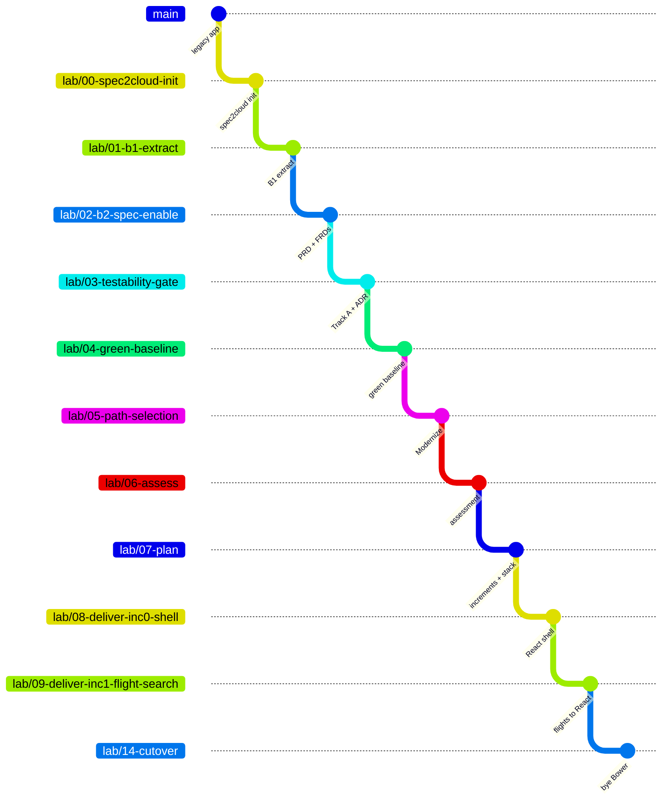

# 📚 THE WALKTHROUGH

*Every step of the AngularJS → React modernization, as it actually happened.*

This is the operational companion to the [root README](../../README.md). The README explains
**what** spec2cloud's brownfield pathway is. This folder documents **exactly how we ran it on this
repo** — the prompt used at each step, the artifacts it produced, the gate decision, and what went
wrong.

---

## 🧭 HOW TO USE THIS

Each step is one file. Each file follows the same shape:

| Section | What it gives you |
|---------|-------------------|
| 🎯 **Goal** | What "done" means for this step |
| 🧰 **Skills invoked** | Which spec2cloud skills run, what they read, what they write |
| ✅ **Prerequisites** | What must be true before you start |
| 🌿 **Branch setup** | The exact `git` commands |
| 🗣️ **The prompt** | Copy-paste it into Copilot CLI or Copilot Chat |
| 📦 **Expected artifacts** | What should exist when the skill finishes |
| 📤 **Outcome** | What *actually* happened on this repo |
| 🧑‍⚖️ **Human gate** | The checklist to run **before** you approve |
| ⚠️ **Pitfalls** | Traps specific to this codebase |

Steps 10–14 drop the *Skills invoked* section — every delivery increment runs the same Phase 2
pipeline, which is spelled out once in [step 08](08-deliver-inc0-shell.md). They gain a *"what this
module actually contains"* table instead, so you can mark the agent's work against the real
source.

---

## 🗣️ A NOTE ON THE PROMPTS

The prompts here are deliberately short. They say what we want and the few things this repo makes
weird — nothing else.

That is not brevity for its own sake. `AGENTS.md` already tells the orchestrator which skills a
phase runs, in what order, where they write, and when to stop at a gate. Restating all of it
produces a prompt that works today and breaks the moment the framework moves, and it quietly
teaches you to drive spec2cloud as a command line rather than as an agent.

So each prompt carries only what the agent cannot get from the framework or from the repo:

| Include | Leave out |
|---------|-----------|
| Local facts with consequences — `bower_components/` is committed; the Karma suite fails 11/11 *by design* | Skill names, execution order, output paths |
| Scoping decisions only a human holds — the mock API is out of scope; no cloud is required | Restating the extraction back to the agent |
| Things stated so they can be **falsified** — *"verify whether `ui.bootstrap` is used and say either way"* | Findings already sitting in `specs/docs/` |
| What is authorised to change, and what is not | Behaviour the green baseline already pins executably |

The last row is the one that matters most. By [step 09](09-deliver-inc1-flight-search.md) the
prompt does not list a single behaviour to preserve — it points at the feature file. If that turns
out to be insufficient, the baseline had a hole, and finding it there is much cheaper than finding
it at cutover.

> **Rule of thumb:** if a line in your prompt would be equally true of any AngularJS app, delete
> it. What is left is the prompt.

---

## 🌿 THE BRANCHING MODEL

The story lives on `main`. The **artifacts** live on `lab/*` branches, one per step, each branched
from its predecessor. So `lab/07-plan` contains everything from steps 00–07, and checking out any
branch gives you a working snapshot of the journey at that moment.

*(steps 10–13 elided from the diagram for readability — same pattern, one branch per module)*

**Consequence worth internalising:** if step 01's extraction is wrong, every branch downstream
carries the error. That is not a flaw in the tooling — it is *why* the Extraction Review gate
exists, and why you should read the output rather than clicking approve.

---

## 🗺️ THE STEPS

### Common trunk — always runs

| # | Step | Phase | Human gate | Status |
|---|------|-------|-----------|--------|
| 00 | [spec2cloud init](00-spec2cloud-init.md) | B0 · Onboarding | — | ✅ Verified |
| 01 | [B1 · Extract](01-b1-extract.md) | B1 · Extract | Extraction Review | ✅ Verified |
| 02 | [B2 · Spec-Enable](02-b2-spec-enable.md) | B2 · Spec-Enable | PRD ✅ / FRD ✅ / Refinement ✅ | 🟡 all 3 run, 2 gates open |

### The fork in the road

| # | Step | Phase | Human gate | Status |
|---|------|-------|-----------|--------|
| 03 | [Testability Gate](03-testability-gate.md) | Gate | Testability Gate | ⏳ Pending |
| 04 | [Green Baseline](04-green-baseline.md) | Track A | Green Baseline | ⏳ Pending |
| 05 | [Path Selection](05-path-selection.md) | Gate | Path Selection | ⏳ Pending |

### A → P → 2

| # | Step | Phase | Human gate | Status |
|---|------|-------|-----------|--------|
| 06 | [Assess](06-assess.md) | A · Assess | Assessment Review | ⏳ Pending |
| 07 | [Plan](07-plan.md) | P · Plan | Plan + Tech-Stack Review | ⏳ Pending |
| 08 | [Increment 0 — React shell](08-deliver-inc0-shell.md) | 2 · Deliver | PR Review | ⏳ Pending |
| 09 | [Increment 1 — flight-search](09-deliver-inc1-flight-search.md) | 2 · Deliver | PR Review | ⏳ Pending |
| 10 | [Increment 2 — hotel-booking](10-deliver-inc2-hotel-booking.md) | 2 · Deliver | PR Review | ⏳ Pending |
| 11 | [Increment 3 — itinerary](11-deliver-inc3-itinerary.md) | 2 · Deliver | PR Review | ⏳ Pending |
| 12 | [Increment 4 — travel-request](12-deliver-inc4-travel-request.md) | 2 · Deliver | PR Review | ⏳ Pending |
| 13 | [Increment 5 — expenses](13-deliver-inc5-expenses.md) | 2 · Deliver | PR Review | ⏳ Pending |
| 14 | [Cutover](14-cutover.md) | 2 · Deliver | PR Review | ⏳ Pending |

⏳ Pending = the doc has the prompt and the expected artifacts, but the **Outcome** section is
waiting for a real run. ⚠️ Run recorded — gate open = the run happened and the outcome is written
up, but the human gate has not been approved yet. ✅ Verified = the outcome is recorded from an
actual execution on this repo and the gate passed.

---

## 🧩 WHAT WE ARE MIGRATING

Steps 09–13 each take one AngularJS module all the way to React 19. They are ordered by the
assessment in [step 06](06-assess.md) — not by convenience.

| Module | UI-Router state | Legacy source | Why it is interesting |
|--------|-----------------|---------------|------------------------|
| **Flight search** | `flights` → `#!/flights` | `app/components/flight-search/` | Touches everything: a directive wrapping a jQuery UI plugin, two filters, Restangular, raw jQuery DOM manipulation, three `$watch`es. The only module with (broken) tests — and it silently resets your price filter on every search. |
| **Hotel booking** | `hotels` → `#!/hotels` | `app/components/hotel-booking/` | Listens for `flight:selected` and pre-fills itself from the flight you picked — a cross-module coupling with nothing in either file to hint at it. Also an AND-not-OR amenity filter and a Bootstrap jQuery modal. |
| **Itinerary** | `itinerary` → `#!/itinerary` | `app/components/itinerary/` | Consumes what the other two produce via `itinerary:refresh`. Prints by cloning DOM into `window.open`. Contains the only correct date parse in the codebase. |
| **Travel requests** | `travelRequest` → `#!/travel-request` | `app/components/travel-request/` | Fail-fast validation — six checks, one message at a time — which every React form library will happily "improve". Plus `approval-status.directive.js`. |
| **Expenses** | `expenses` → `#!/expenses` | `app/components/expense-reconciliation/` | Dashboard aggregates that must match to the cent, an inclusive date-range filter, a jQuery-triggered file input, and `currency-input.directive.js` + `currency.filter.js`. |

> The interesting thing about that column: none of it is in the README, and most of it is not
> obvious from reading a single file. It is what [step 06](06-assess.md) is supposed to surface —
> which makes it the yardstick for whether the assessment was any good.

Plus the cross-cutting pieces that get **dissolved** rather than migrated:

| Legacy | Fate |
|--------|------|
| `app/directives/date-picker.directive.js` | Deleted — jQuery UI datepicker → native `<input type="date">` |
| `app/directives/currency-input.directive.js` | Deleted — folded into a controlled React input |
| `app/directives/approval-status.directive.js` | Becomes a presentational component |
| `app/filters/currency.filter.js` | Deleted — `Intl.NumberFormat` |
| `app/filters/date-format.filter.js` | Deleted — `date-fns/format` |
| `app/services/api.service.js` | Becomes a fetch wrapper + TanStack Query hooks |
| `app/services/auth.service.js` | Becomes a Zustand store |
| `app/app.routes.js` | Becomes a TanStack Router route tree |

---

## ▶️ START HERE

[**Step 00 — spec2cloud init**](00-spec2cloud-init.md)
