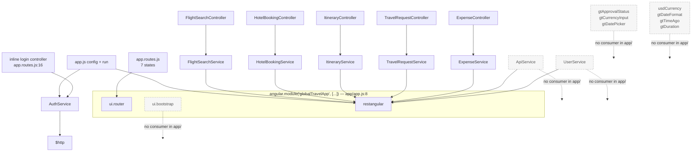

# Component Inventory — globaltravel-portal

_Extracted on 2026-08-03 by `architecture-mapper`. Documents components as they exist in code._

**Method:** every `.controller()`, `.service()`, `.directive()` and `.filter()` registration in
`app/` was enumerated from source, then each registered name was searched for across `app/`,
`test/` and `api-mock/` to establish its dependents. "None found" means the search returned no
occurrence outside the registration itself.

**Source of truth:** code. Filenames and comments that disagree with the registrations are recorded
in `specs/docs/architecture/overview.md`.

---

## Inventory Summary

| Kind | Files | Registrations | With at least one dependent | With no dependent found |
|------|-------|---------------|----------------------------|------------------------|
| Controllers (named) | 5 | 5 | 5 | 0 |
| Controllers (inline, anonymous) | — | 1 | 1 | 0 |
| Services (application) | 3 | 3 | 1 | 2 |
| Services (feature) | 5 | 5 | 5 | 0 |
| Directives | 3 | 3 | 0 | 3 |
| Filters | 2 | 4 | 0 | 4 |
| Express server | 1 | 36 route handlers | — | — |
| **Total AngularJS registrations** | **18** | **21** | **12** | **9** |

Registered service methods: 44 across 8 services. 19 have a caller in `app/`; 25 have none.

---

## Module dependency graph

Every arrow above is a constructor-injection edge read from a `['Dep', function(Dep){…}]`
annotation. There is no edge between any two controllers, no edge between any two feature services,
and no edge from a service to a controller.

---

## Controllers

### FlightSearchController

| | |
|---|---|
| **Path** | `app/components/flight-search/flight-search.controller.js` (258 lines) |
| **Registered at** | `:10` |
| **Type** | AngularJS controller, `$scope`-style |
| **Injects** | `$scope`, `$rootScope`, `$timeout`, `FlightSearchService` |
| **Bound to** | state `flights` (`app.routes.js:35`), template `flight-search.template.html` |
| **Dependents** | `app.routes.js:35`; `test/spec/flight-search.spec.js` |
| **Responsibilities (from code)** | holds `searchParams`, `flights`, `filteredFlights`, `filters`, `priceRange`, `airlines`, `selectedFlight`, `isLoading`, `errorMessage`, `hasSearched`; validates the search form (`:130`); calls `FlightSearchService.search` (`:112`) and `.bookFlight` (`:216`); derives airline list and price bounds with Lodash (`:114-117`); applies client-side filtering (`applyFilters`); initialises two jQuery UI datepickers (`:70-90`); shows/hides a jQuery overlay (`:104`, `:126`) |
| **`$watch`es** | `searchParams.departDate` deep watch (`:45`), `searchParams.tripType` (`:55`), plus a deep watch closing at `:66` |
| **Emits** | `notification:add` ×4 (`:120,123,220,224`), `flight:selected` (`:207`), `itinerary:refresh` (`:221`) |
| **Listens** | `auth:login` (`:245`), deregistered on `$destroy` (`:250`) |
| **DOM targets** | `#departDate`, `#returnDate`, `#search-overlay`, `#flight-details`, `.search-field-required`, `html, body` |
| **Service methods it does not call** | `getPopularRoutes`, `getFlightDetails`, `searchAirports` |

### HotelBookingController

| | |
|---|---|
| **Path** | `app/components/hotel-booking/hotel-booking.controller.js` (281 lines) |
| **Registered at** | `:10` |
| **Injects** | `$scope`, `$rootScope`, `$timeout`, `$filter`, `HotelBookingService` |
| **Bound to** | state `hotels` (`app.routes.js:41`), template `hotel-booking.template.html` |
| **Dependents** | `app.routes.js:41` |
| **Responsibilities (from code)** | search parameters and results for hotels; room selection and booking; client-side filtering and sorting; calls `searchHotels` (`:121`), `getHotelRooms` (`:196`), `bookRoom` (`:234`); formats prices with `$filter('currency')` — the AngularJS built-in, at `:265`; initialises two datepickers (`:71-90`) |
| **Emits** | `notification:add` ×4 (`:124,127,236,243`), `itinerary:refresh` (`:238`) |
| **Listens** | `flight:selected` (`:266`), deregistered on `$destroy` (`:272`) |
| **DOM targets** | `#cityInput`, `#hotelCheckIn`, `#hotelCheckOut`, `#hotel-rooms`, `#bookingConfirmationModal`, `html, body` |
| **Service methods it does not call** | `getHotelDetails`, `getReviews` |

### ItineraryController

| | |
|---|---|
| **Path** | `app/components/itinerary/itinerary.controller.js` (235 lines) |
| **Registered at** | `:10` |
| **Injects** | `$scope`, `$rootScope`, `$timeout`, `$filter`, `ItineraryService` |
| **Bound to** | state `itinerary` (`app.routes.js:47`), template `itinerary.template.html` |
| **Dependents** | `app.routes.js:47` |
| **Responsibilities (from code)** | loads trips and trip details; adds notes to itinerary items; cancels items; switches between timeline and list view (`:129-135`); builds a print document in a pop-up window (`:171-181`); date/time formatting helpers using Moment.js; `getItemIcon` maps item type to a Bootstrap glyphicon |
| **Emits** | `notification:add` ×5 (`:49,150,152,163,165`) |
| **Listens** | `itinerary:refresh` (`:223`), deregistered on `$destroy` (`:227`) |
| **DOM targets** | `#itinerary-details`, `.itinerary-timeline`, `.itinerary-list`, `.btn`/`.no-print` (removed from the print clone), `html, body` |
| **External call** | writes a `<link>` to `maxcdn.bootstrapcdn.com` into the print document (`:176`) |
| **Service methods it does not call** | `createTrip`, `updateTrip`, `deleteTrip`, `shareTrip` |

### TravelRequestController

| | |
|---|---|
| **Path** | `app/components/travel-request/travel-request.controller.js` (311 lines) |
| **Registered at** | `:10` |
| **Injects** | `$scope`, `$rootScope`, `$timeout`, `TravelRequestService` |
| **Bound to** | state `travelRequest`, url `/travel-request` (`app.routes.js:53`), template `travel-request.template.html` |
| **Dependents** | `app.routes.js:53` |
| **Responsibilities (from code)** | list, create, edit and cancel travel requests; computes `totalEstimate` from the five `estimatedCosts` fields; manages a travellers array; reads `$rootScope.currentUser` directly for `travelerName`/`travelerEmail` (`:172-173`), falling back to the literals `'Demo User'` / `'demo@globaltravel.com'`; validates required fields and flags `#destinationField` |
| **Emits** | `notification:add` ×5 (`:103,184,191,236,238`) |
| **Listens** | `auth:login` (`:299`), deregistered on `$destroy` (`:303`) |
| **DOM targets** | `#trDepartDate`, `#trReturnDate`, `#travel-request-form`, `#destinationField`, `#requestDetailModal`, `html, body` |
| **Service methods it does not call** | `getRequest`, `getApprovalHistory`, `getPolicyLimits` |

### ExpenseController

| | |
|---|---|
| **Path** | `app/components/expense-reconciliation/expense.controller.js` (342 lines) |
| **Registered at** | `:10` |
| **Injects** | `$scope`, `$rootScope`, `$timeout`, `$filter`, `ExpenseService` |
| **Bound to** | state `expenses` (`app.routes.js:59`), template `expense.template.html` |
| **Dependents** | `app.routes.js:59` |
| **Responsibilities (from code)** | list, create, view and delete expense reports; maintains an in-progress expense line array and a running total; declares `expenseCategories` as twelve Title-Case strings (`:28-32`); formats amounts with `$filter('currency')` — the AngularJS built-in, at `:266`; triggers a hidden file input via jQuery (`:248`) and reads the selection in a native `change` handler that calls `$scope.$apply` (`:256`); reads `$rootScope.currentUser` directly for `submittedBy` (`:194`) |
| **Emits** | `notification:add` ×6 (`:85,170,203,209,239,241`) |
| **Listens** | `auth:login` (`:330`), deregistered on `$destroy` (`:334`) |
| **DOM targets** | `#expenseDate`, `#reportStartDate, #reportEndDate`, `#new-expense-report`, `.expense-required`, `#receiptFileInput`, `#expenseDetailModal` |
| **Service methods it does not call** | `updateReport`, `uploadReceipt`, `getStatistics`, `linkToTravelRequest` |

`$scope.uploadReceipt` (`expense.controller.js:246`) is a controller method that triggers a click on
`#receiptFileInput`. It does not call `ExpenseService.uploadReceipt`; the two share a name only.

### Inline login controller (anonymous)

| | |
|---|---|
| **Path** | `app/app.routes.js:16-25` — declared inline on the `login` state, no registered name |
| **Injects** | `$scope`, `$state`, `AuthService` |
| **Bound to** | state `login`, inline `template` string (`app.routes.js:15`) |
| **Dependents** | the `login` state definition only |
| **Responsibilities (from code)** | exposes `enter()`, which calls `AuthService.login` with the hardcoded pair `'demo@globaltravel.com'` / `'password'` (`:20`) and on success calls `$state.go('dashboard')`. Takes no input from the user. |

---

## Application services

### AuthService

| | |
|---|---|
| **Path** | `app/services/auth.service.js` (54 lines) |
| **Registered at** | `:9` — `.service('AuthService', ['$http', '$rootScope', …])` |
| **Injects** | `$http`, `$rootScope` |
| **Public methods** | `login(email, password)` `:17`, `logout()` `:32`, `isAuthenticated()` `:42`, `getCurrentUser()` `:50` |
| **Dependents** | `app/app.js:30` (run block, calls `isAuthenticated` at `:33`); `app/app.routes.js:16` (inline controller, calls `login` at `:20`) |
| **Methods with no caller** | `logout`, `getCurrentUser` — no occurrence in `app/`, `test/`, or any template |
| **Integration points** | `$http.post` to the literal `http://localhost:3000/api/auth/login` (`:18`) — the only HTTP call in `app/` that does not go through Restangular, so it does not carry the Restangular base URL or the auth interceptor; `localStorage.setItem('authToken', …)` (`:22`), `removeItem` (`:33`), `getItem` (`:43`) |
| **Side effects on `$rootScope`** | sets `currentUser` (`:23`, `:34`), broadcasts `auth:login` (`:24`) and `auth:logout` (`:35`) |
| **Notes from code** | `isAuthenticated()` returns `!!localStorage.getItem('authToken')` — presence only; the token is not decoded and its `exp` is not checked. `getCurrentUser()` returns `$rootScope.currentUser`, which is `null` after a page reload because nothing repopulates it from the stored token. |

### ApiService

| | |
|---|---|
| **Path** | `app/services/api.service.js` (61 lines) |
| **Registered at** | `:9` — `.service('ApiService', ['Restangular', …])` |
| **Injects** | `Restangular` |
| **Public methods** | `getAll(endpoint)` `:16`, `getOne(endpoint, id)` `:26`, `create(endpoint, data)` `:36`, `update(endpoint, id, data)` `:47`, `delete(endpoint, id)` `:57` |
| **Dependents** | **none found.** Searching `ApiService` across `app/`, `test/` and `api-mock/` returns only the registration line `api.service.js:9` and the file's own header comment |
| **Integration points** | would issue Restangular calls against whatever `endpoint` string a caller passes; with no callers, no concrete route is reachable through it |

### UserService

| | |
|---|---|
| **Path** | `app/services/user.service.js` (30 lines) |
| **Registered at** | `:8` — `.service('UserService', ['Restangular', '$rootScope', …])` |
| **Injects** | `Restangular`, `$rootScope` |
| **Public methods** | `getProfile()` `:14`, `updatePreferences(preferences)` `:26` |
| **Dependents** | **none found.** Searching `UserService` across `app/`, `test/` and `api-mock/` returns only the registration line |
| **Integration points** | `Restangular.one('users','me').get()` → `GET /api/users/me` (`:15`); `.customPUT()` → `PUT /api/users/me` (`:27`). Neither route is declared in `api-mock/server.js` |
| **Side effects on `$rootScope`** | assigns `currentUser` (`:16`) |

---

## Feature services

All five are registered with `.service(Name, ['Restangular', '$q', function(Restangular, $q){…}])`
and are injected by exactly one controller each.

### FlightSearchService

| | |
|---|---|
| **Path** | `app/components/flight-search/flight-search.service.js` (77 lines), registered `:9` |
| **Dependents** | `FlightSearchController` |
| **Methods** | `search(params)` `:18` — `GET /api/flights`, enriches each result with `departureFormatted`, `arrivalFormatted`, `durationFormatted`, `priceFormatted`, `departDateFormatted` via Moment.js and Lodash `_.map` `bookFlight(flightId, details)` `:38` — `POST /api/flights/:id/book` `getPopularRoutes()` `:46` — `GET /api/flights/popular` — **no caller** `getFlightDetails(flightId)` `:55` — `GET /api/flights/:id` — **no caller** `searchAirports(query)` `:64` — `GET /api/airports?q=` — **no caller** |

### HotelBookingService

| | |
|---|---|
| **Path** | `app/components/hotel-booking/hotel-booking.service.js` (79 lines), registered `:9` |
| **Dependents** | `HotelBookingController` |
| **Methods** | `searchHotels(params)` `:18` — `GET /api/hotels` `getHotelRooms(hotelId, dates)` `:36` — `GET /api/hotels/:id/rooms` `bookRoom(bookingData)` `:47` — `POST /api/bookings/hotels` `getHotelDetails(hotelId)` `:56` — `GET /api/hotels/:id` — **no caller** `getReviews(hotelId, page)` `:66` — `GET /api/hotels/:id/reviews` — **no caller** |

### ItineraryService

| | |
|---|---|
| **Path** | `app/components/itinerary/itinerary.service.js` (103 lines), registered `:9` |
| **Dependents** | `ItineraryController` |
| **Methods** | `getTrips()` `:15` — `GET /api/trips` `getTripDetails(tripId)` `:30` — `GET /api/trips/:id` `addNote(itemId, noteText)` `:49` — `POST /api/itinerary-items/:id/notes` `cancelItem(itemId)` `:61` — `PUT /api/itinerary-items/:id` `createTrip(tripData)` `:70` — `POST /api/trips` — **no caller** `updateTrip(tripId, data)` `:80` — `PUT /api/trips/:id` — **no caller** `deleteTrip(tripId)` `:89` — `DELETE /api/trips/:id` — **no caller** `shareTrip(tripId, email)` `:99` — `POST /api/trips/:id/share` — **no caller** |

### TravelRequestService

| | |
|---|---|
| **Path** | `app/components/travel-request/travel-request.service.js` (90 lines), registered `:9` |
| **Dependents** | `TravelRequestController` |
| **Methods** | `getRequests()` `:17` — `GET /api/travel-requests` `submitRequest(requestData)` `:45` — `POST /api/travel-requests` `updateRequest(requestId, requestData)` `:55` — `PUT /api/travel-requests/:id` `cancelRequest(requestId)` `:64` — `PUT /api/travel-requests/:id` with `{status:'cancelled'}` `getRequest(requestId)` `:36` — `GET /api/travel-requests/:id` — **no caller** `getApprovalHistory(requestId)` `:73` — `GET /api/travel-requests/:id/approvals` — **no caller** `getPolicyLimits()` `:86` — `GET /api/travel-policy` — **no caller** |

### ExpenseService

| | |
|---|---|
| **Path** | `app/components/expense-reconciliation/expense.service.js` (113 lines), registered `:9` |
| **Dependents** | `ExpenseController` |
| **Methods** | `getReports()` `:17` — `GET /api/expense-reports` `getReportDetails(reportId)` `:34` — `GET /api/expense-reports/:id` `submitReport(reportData)` `:53` — `POST /api/expense-reports` `deleteReport(reportId)` `:72` — `DELETE /api/expense-reports/:id` `updateReport(reportId, reportData)` `:63` — `PUT /api/expense-reports/:id` — **no caller** `uploadReceipt(expenseId, file)` `:82` — `POST /api/expenses/:id/receipt`, multipart via `FormData` and `withHttpConfig` — **no caller** `getStatistics(params)` `:97` — `GET /api/expense-reports/statistics` — **no caller**; the route is also shadowed server-side (see `overview.md`) `linkToTravelRequest(reportId, travelRequestId)` `:107` — `PUT /api/expense-reports/:id` — **no caller** |

---

## Directives

All three are registered with `['$timeout', function($timeout){…}]` and use isolate scopes. None is
referenced by any template in `app/`: searching for `gt-approval-status`, `gt-currency-input` and
`gt-date-picker` (and their camelCase forms) across `app/**/*.html` returns no matches.

| Directive | Path | Registered | `restrict` | `require` | Isolate scope bindings | Dependents |
|-----------|------|-----------|-----------|-----------|------------------------|------------|
| `gtApprovalStatus` | `app/directives/approval-status.directive.js` (130 lines) | `:13` | `E` | — | `status: '='`, `showIcon: '=?'`, `animate: '=?'`, `size: '@'` | **none found** |
| `gtCurrencyInput` | `app/directives/currency-input.directive.js` (120 lines) | `:13` | `A` | `ngModel` | `currencySymbol: '@'`, `maxValue: '=?'`, `allowNegative: '=?'` | **none found** |
| `gtDatePicker` | `app/directives/date-picker.directive.js` (98 lines) | `:13` | `A` | `ngModel` | `minDate: '=?'`, `maxDate: '=?'`, `dateFormat: '@'`, `onDateChange: '&?'` | **none found** |

Each `link` function wraps its element in jQuery (`$(element)`) and manipulates it directly —
`approval-status.directive.js:23,100,103`, `currency-input.directive.js:24`,
`date-picker.directive.js:27,37`. `gtDatePicker` and `gtCurrencyInput` call `scope.$apply` from
their jQuery callbacks (`date-picker.directive.js:42`, `currency-input.directive.js:43`).

The date-picking behaviour the application actually renders does not come from `gtDatePicker`. Each
of the five controllers calls `$('#…').datepicker({…})` on its own inputs inside a `$timeout`, and
the templates declare those inputs as plain `<input type="text">` with `ng-model` — no directive
attribute.

---

## Filters

Four filters are registered across two files. None is referenced by any template or by any
`$filter('…')` call in `app/`.

| Filter | File | Registered at | Behaviour read from code | Dependents |
|--------|------|--------------|--------------------------|------------|
| `usdCurrency` | `app/filters/currency.filter.js` (46 lines) | `:12` | formats a number as a US-dollar string | **none found** |
| `gtDateFormat` | `app/filters/date-format.filter.js` (76 lines) | `:14` | formats a date via Moment.js | **none found** |
| `gtTimeAgo` | `app/filters/date-format.filter.js` | `:47` | relative time via Moment.js | **none found** |
| `gtDuration` | `app/filters/date-format.filter.js` | `:60` | formats a minute count as a duration | **none found** |

Two controllers do call `$filter('currency')` — `hotel-booking.controller.js:265` and
`expense.controller.js:262`. `'currency'` is the AngularJS built-in filter, not the application's
`'usdCurrency'`. No call site passes `'usdCurrency'`, `'gtDateFormat'`, `'gtTimeAgo'` or
`'gtDuration'` to `$filter`.

The filename `date-format.filter.js` is singular; the file registers three filters.

---

## Templates

| Template | Path | Rendered by | Element ids declared |
|----------|------|-------------|---------------------|
| Application shell | `app/index.html` (88 lines) | `ng-app="globalTravelApp"`, contains `ui-view` and the navbar | — |
| Login | inline string, `app/app.routes.js:15` | state `login` | — |
| Dashboard | inline string, `app/app.routes.js:29` | state `dashboard` — this state declares no controller | — |
| Flight search | `app/components/flight-search/flight-search.template.html` | `FlightSearchController` | `#origin`, `#destination`, `#departDate`, `#returnDate`, `#passengers`, `#cabinClass`, `#search-overlay`, `#flight-details` |
| Hotel booking | `app/components/hotel-booking/hotel-booking.template.html` | `HotelBookingController` | `#cityInput`, `#city`, `#hotelCheckIn`, `#hotelCheckOut`, `#guests`, `#rooms`, `#hotel-rooms`, `#bookingConfirmationModal` |
| Itinerary | `app/components/itinerary/itinerary.template.html` | `ItineraryController` | `#itinerary-details` |
| Travel request | `app/components/travel-request/travel-request.template.html` | `TravelRequestController` | `#travel-request-form`, `#destinationField`, `#trDepartDate`, `#trReturnDate`, `#requestDetailModal` |
| Expense reconciliation | `app/components/expense-reconciliation/expense.template.html` | `ExpenseController` | `#new-expense-report`, `#expenseDate`, `#receiptFileInput`, `#reportStartDate`, `#reportEndDate`, `#expenseDetailModal` |

28 ids are declared across the five feature templates. 22 are selected by a controller; 6
(`#origin`, `#destination`, `#passengers`, `#cabinClass`, `#city`, `#guests`, `#rooms`) are bound
with `ng-model` only.

---

## API tier

### Express server

| | |
|---|---|
| **Path** | `api-mock/server.js` (718 lines) — the only file in `api-mock/` |
| **Type** | Express 4.22.1 application, single file, no router modules |
| **Requires** | `express`, `cors`, `body-parser`, `jsonwebtoken` (`:6-9`) |
| **Global middleware** | `cors()` `:15`, `bodyParser.json()` `:16`, `bodyParser.urlencoded({extended:true})` `:17` |
| **Route middleware** | `authMiddleware` (`:23-35`) — passed explicitly to 33 of 36 handlers |
| **Route handlers** | 36, enumerated in `specs/contracts/api/` |
| **Helper functions** | `generateId()` `:66`, `generateFlights(origin, destination, date, cabinClass)` `:78`, `generateHotels(city, checkIn, checkOut)` `:110`, plus `randomItem`/`randomInt` used throughout |
| **State** | module-level arrays `users` `:42`, `airports` `:50`, `trips` `:142`, `travelRequests` `:175`, `expenseReports` `:222`, and the object `travelPolicy` `:257` — mutated in place by handlers |
| **Listen** | `app.listen(PORT, …)` `:705`, `PORT = 3000` `:12` (literal, not from `process.env`) |
| **Dependents** | the browser tier at runtime only, via the two hardcoded URLs. No file in `app/` or `test/` imports or requires this module |
| **Error handling** | one `try`/`catch`, inside `authMiddleware` `:29-34`. No error-handling middleware, no 404 fallback route, no `try`/`catch` in any route handler |
| **Output** | `console.log` in the `app.listen` callback `:706-718`; no logging library |

Unauthenticated routes — the three handlers declared without `authMiddleware`:

| Route | Declared at |
|-------|-------------|
| `POST /api/auth/login` | `:273` |
| `POST /api/auth/logout` | `:295` |
| `GET /api/airports` | `:311` |

---

## Components with no dependent found

Collected for reference. "No dependent found" is the result of a repository-wide search for the
registered name across `app/`, `test/` and `api-mock/`.

| Component | Kind | Registered at |
|-----------|------|--------------|
| `ApiService` | service | `app/services/api.service.js:9` |
| `UserService` | service | `app/services/user.service.js:8` |
| `gtApprovalStatus` | directive | `app/directives/approval-status.directive.js:13` |
| `gtCurrencyInput` | directive | `app/directives/currency-input.directive.js:13` |
| `gtDatePicker` | directive | `app/directives/date-picker.directive.js:13` |
| `usdCurrency` | filter | `app/filters/currency.filter.js:12` |
| `gtDateFormat` | filter | `app/filters/date-format.filter.js:14` |
| `gtTimeAgo` | filter | `app/filters/date-format.filter.js:47` |
| `gtDuration` | filter | `app/filters/date-format.filter.js:60` |

Also declared but with no consuming code found: the module dependency `'ui.bootstrap'`
(`app/app.js:10`) and the script `bower_components/angular-ui-bootstrap/dist/ui-bootstrap-tpls.js`
(`app/index.html:54`). A search of `app/` for `uib-`, `$uibModal`, `$uibModalInstance` and
`uibDate` returns no matches. The modal dialogs in the templates
(`#bookingConfirmationModal`, `#requestDetailModal`, `#expenseDetailModal`) are Bootstrap 3 markup
opened with the jQuery plugin call `.modal('show')`.

---

## Not determinable from source

| Question | Status |
|----------|--------|
| Whether `ApiService`, `UserService`, the 3 directives and the 4 filters were ever consumed | unknown — no consuming code exists in the repository at this commit, and the repository holds no history reference that would answer it from source |
| Whether the 25 uncalled service methods correspond to a UI that was removed or never built | unknown |
| Whether `ui.bootstrap` was loaded for a feature that was removed | unknown — the dependency is declared and the script is loaded; no usage exists |
| Intended behaviour of `AuthService.getCurrentUser()` after a page reload | unknown — it reads `$rootScope.currentUser`, which no code repopulates from the stored token |
