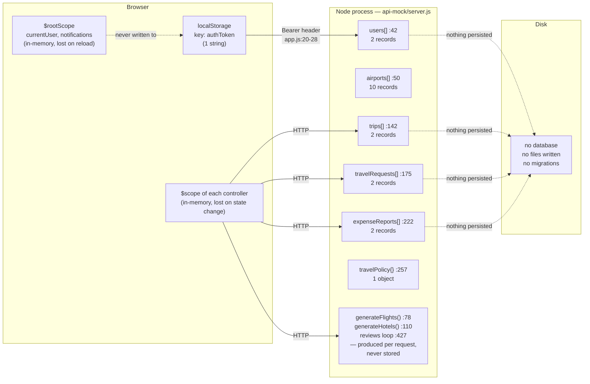
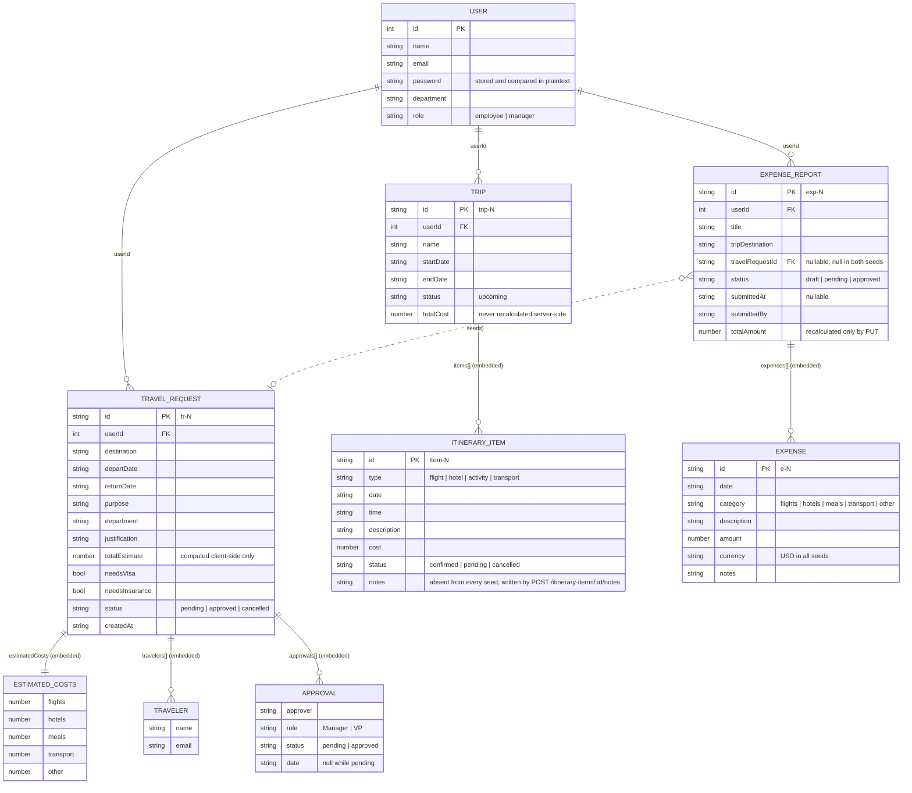
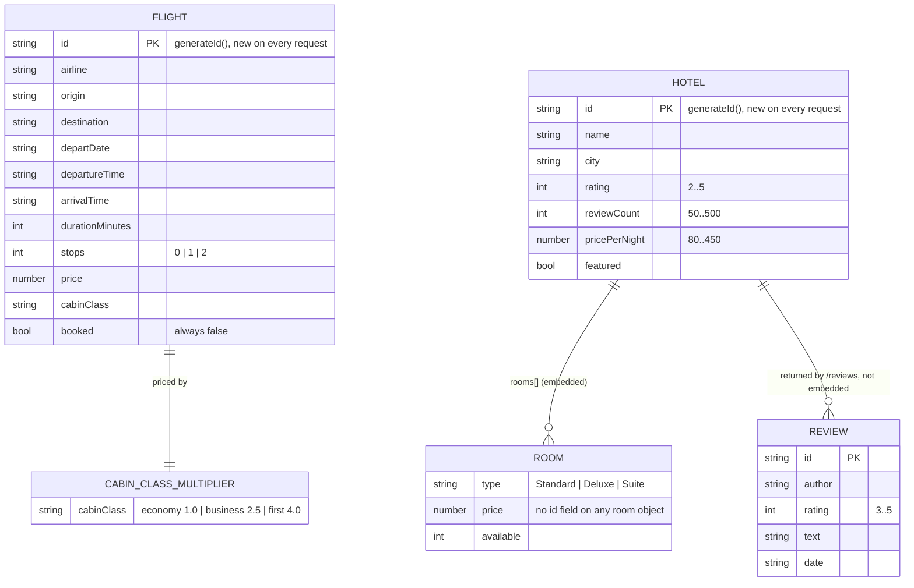

# Data Models — globaltravel-portal

> **Extraction output — Phase B1e.** Produced by the `data-model-extractor` skill from the
> source under `app/`, `api-mock/` and `test/`. This document records the data structures the
> code actually declares and manipulates. Where a comment, README or filename disagrees with the
> code, the code is recorded. Where a fact cannot be determined from source it is recorded as
> **unknown** rather than inferred.

---

## Contents

- [Data layer summary](#data-layer-summary)
- [Where data lives](#where-data-lives)
- [Entity relationship diagram](#entity-relationship-diagram)
- [Persisted entities](#persisted-entities)
- [Generated entities](#generated-entities)
- [Lookup arrays](#lookup-arrays)
- [Client-side derived fields](#client-side-derived-fields)
- [Identifier scheme](#identifier-scheme)
- [Vocabulary and enumerations](#vocabulary-and-enumerations)
- [Referential integrity](#referential-integrity)
- [Comments and filenames vs code](#comments-and-filenames-vs-code)
- [Not determinable from source](#not-determinable-from-source)

---

## Data layer summary

| Question | Finding | Evidence |
|----------|---------|----------|
| Is there a database? | No | `api-mock/server.js` has exactly four `require` calls — `express`, `cors`, `body-parser`, `jsonwebtoken` (`server.js:6-9`). No driver, no client, no connection string. |
| Is there an ORM or query builder? | No | No `mongoose`, `sequelize`, `knex`, `typeorm` or `prisma` token appears in `api-mock/server.js`, and none is listed in `package.json`. |
| Are there migrations? | No | No `.sql`, `.prisma`, `.db`, `.sqlite` file exists under `app/`, `api-mock/` or `test/`; no migrations directory exists. |
| Is there a schema definition? | No | No JSON Schema, no validation library, no type declarations. Entity shapes exist only as object literals. |
| Is anything written to disk? | No | `api-mock/server.js` never requires `fs` and contains no `writeFile`/`readFile` call. |
| Where does server state live? | Four module-level JavaScript arrays and one object literal | `users` `server.js:42`, `airports` `:50`, `trips` `:142`, `travelRequests` `:175`, `expenseReports` `:222`, `travelPolicy` `:257` |
| How long does written data survive? | Until the Node process exits | Handlers call `Array.prototype.push`, `splice` and `Object.assign` on the module-level arrays. Nothing is serialised. |
| Does the browser persist anything? | One string | `localStorage` key `authToken` — written at `app/services/auth.service.js:22`, removed at `:33`, read at `:43` and at `app/app.js:21`. No `sessionStorage`, no `document.cookie`, no IndexedDB anywhere in `app/`. |

---

## Where data lives

Restarting `api-mock/server.js` restores exactly the six seed collections above and discards every
create, update and delete made since the previous start.

---

## Entity relationship diagram

Cardinalities below are read from the seeded literals and the handler bodies, not from any
declared constraint — the code declares none.

Entities produced per request and never stored are shown separately, because they participate in
no relationship — nothing holds a foreign key to them and they hold none:

---

## Persisted entities

Nine shapes are stored in the module-level arrays. Four of them exist only embedded inside a
parent record and are never addressed by a route of their own.

### User — `api-mock/server.js:42-45`

| Field | Type in seed | Notes |
|-------|--------------|-------|
| `id` | number | `1`, `2` — the only numeric ids in the whole dataset |
| `name` | string | `Sarah Johnson`, `Mike Chen` |
| `email` | string | `demo@globaltravel.com`, `manager@globaltravel.com` |
| `password` | string | **stored as plaintext** (`'password'` for both users) and compared with `===` at `server.js:277` |
| `department` | string | `Engineering` for both |
| `role` | string | `employee`, `manager` |

- 2 records. No create, update or delete handler exists for this entity.
- `password` is excluded from the login response (`server.js:291`) and from the JWT claims
  (`:284`). Every other field appears in both.
- `role` is placed in the JWT at `:284` but is never read by any handler — see
  `specs/contracts/api/travel-request.yaml`, `x-discrepancies/no-authorization-check`.
- `GET /api/auth/me` (`:299`) is the only handler that reads `users` after login.
- `app/services/user.service.js` targets `GET`/`PUT /api/users/me` (`:15`, `:27`). **Neither route
  exists** in `api-mock/server.js`, and neither method has a caller in `app/`.

### Airport — `api-mock/server.js:50-61`

| Field | Type | Notes |
|-------|------|-------|
| `code` | string | 3-letter IATA code, e.g. `JFK` |
| `name` | string | e.g. `John F. Kennedy International` |
| `city` | string | e.g. `New York` |

- 10 records. Read-only: the single handler `GET /api/airports` (`:311`) filters them
  case-insensitively across all three fields (`:316-320`).
- This is the only route in the entire API that touches a stored collection without
  `authMiddleware`.
- The 10 `code` values correspond one-to-one with the 10 entries in the `cities` array (`:48`),
  but the two arrays are independent literals — no code links them.
- `FlightSearchService.searchAirports` (`app/components/flight-search/flight-search.service.js:64`)
  is the only client method that targets this route, and it has no caller.

### Trip — `api-mock/server.js:142-173`

| Field | Type | Notes |
|-------|------|-------|
| `id` | string | `trip-1`, `trip-2`; created ids are `'trip-' + generateId()` (`:467`) |
| `userId` | number | `1` in both seeds; on create, copied from the JWT (`:468`) |
| `name` | string | `NYC Business Trip`, `Chicago Conference` |
| `startDate` / `endDate` | string | `YYYY-MM-DD`, no time component |
| `status` | string | `upcoming` in both seeds and the fixed literal on create (`:472`) |
| `totalCost` | number | `2450.00`, `1800.00` |
| `items` | array | 5 entries in `trip-1`, 3 in `trip-2` |

- 2 records, 8 embedded items.
- `totalCost` is written once (seed or `0` on create) and never recomputed by any handler. The sum
  of `items[].cost` is `1330` for `trip-1` and `1160` for `trip-2` — neither matches the stored
  value. `ItineraryService.getTrips` overwrites the field client-side with that sum
  (`app/components/itinerary/itinerary.service.js:19`), so the browser displays `1330`/`1160` and
  the API reports `2450`/`1800`.
- `status` has exactly one observed value. No handler writes any other.

### ItineraryItem — embedded in `Trip.items`

| Field | Type | Observed values |
|-------|------|-----------------|
| `id` | string | `item-1` … `item-8`, unique across both trips |
| `type` | string | `flight` (3), `hotel` (2), `activity` (2), `transport` (1) |
| `date` | string | `YYYY-MM-DD` |
| `time` | string | `HH:mm`, 24-hour |
| `description` | string | free text |
| `cost` | number | `0` … `500` |
| `status` | string | `confirmed` (7), `pending` (1) |
| `notes` | — | **not present on any seeded item** |

- No top-level collection. Both `/api/itinerary-items/:id` handlers locate an item by iterating
  every trip and every item (`server.js:520-527` and `:537-544`), keeping the last match rather
  than breaking on the first.
- `notes` is created only by `POST /api/itinerary-items/:id/notes`, which assigns
  `item.notes = req.body.notes` (`:540`) — a scalar overwrite, not an append. There is no note
  entity, no note id and no note collection.
- `cancelled` is written to `status` by the client (`itinerary.service.js:62`) but appears in no
  seed.

### TravelRequest — `api-mock/server.js:175-220`

| Field | Type | Notes |
|-------|------|-------|
| `id` | string | `tr-1`, `tr-2`; created ids are `'tr-' + generateId()` (`:562`) |
| `userId` | number | `1` in both seeds |
| `destination` | string | `London, UK`, `Tokyo, Japan` — free text, not an airport code |
| `departDate` / `returnDate` | string | `YYYY-MM-DD` |
| `purpose` | string | free text |
| `department` | string | `Engineering` in both |
| `justification` | string | free text |
| `estimatedCosts` | object | 5 fixed numeric keys |
| `totalEstimate` | number | `2500`, `4400` — equals the sum of `estimatedCosts` in both seeds, but no code enforces that |
| `travelers` | array | 1 entry in `tr-1`, 2 in `tr-2` |
| `needsVisa` / `needsInsurance` | boolean | — |
| `status` | string | `pending`, `approved` |
| `createdAt` | string | ISO-8601 with `Z` |
| `approvals` | array | 1 entry in `tr-1`, 2 in `tr-2` |

- 2 records, 3 embedded travelers, 3 embedded approvals.
- `POST` builds the record with `Object.assign(skeleton, req.body)` — body second
  (`server.js:561-569`) — so a supplied `id`, `userId`, `status`, `createdAt` or `approvals`
  overrides the server value.
- The client attaches two further keys on submit, `travelerName` and `travelerEmail`
  (`app/components/travel-request/travel-request.controller.js:172-173`). They are not part of any
  seeded record, but `Object.assign` copies them in, and the client filters and renders them
  (`travel-request.controller.js:122`, `travel-request.template.html:333`).

### EstimatedCosts — embedded in `TravelRequest.estimatedCosts`

Five fixed numeric keys: `flights`, `hotels`, `meals`, `transport`, `other`. The same five keys —
in the same order — appear as the statistics `categoryBreakdown` (`server.js:679-683`) and as the
five distinct `Expense.category` values in the seeds. This is the canonical server-side cost
vocabulary; see [Vocabulary and enumerations](#vocabulary-and-enumerations).

### Traveler — embedded in `TravelRequest.travelers`

Two fields, `name` and `email`. Not linked to `User`: `tr-2` includes
`Alex Rivera / alex@globaltravel.com`, who is not one of the two seeded users. There is no
`userId`, and no handler resolves a traveler against `users`.

### Approval — embedded in `TravelRequest.approvals`

| Field | Type | Observed values |
|-------|------|-----------------|
| `approver` | string | `Mike Chen`, `VP Finance` |
| `role` | string | `Manager`, `VP` |
| `status` | string | `pending`, `approved` |
| `date` | string \| null | `null` while `status` is `pending` |

- 3 records across 2 parents.
- `POST /api/travel-requests` writes exactly one hardcoded entry —
  `{ approver: 'Mike Chen', role: 'Manager', status: 'pending', date: null }` (`server.js:567`).
- No handler advances an approval. `tr-2` carries two completed approvals that no code path could
  produce. `GET /api/travel-requests/:id/approvals` (`:601`) is read-only and has no write
  counterpart.
- `approver` is a display string, not a reference: `Mike Chen` is also a seeded `User`, but
  `VP Finance` is not, and nothing joins the two.

### ExpenseReport — `api-mock/server.js:222-255`

| Field | Type | Notes |
|-------|------|-------|
| `id` | string | `exp-1`, `exp-2`; created ids are `'exp-' + generateId()` (`:623`) |
| `userId` | number | `1` in both seeds |
| `title` | string | free text |
| `tripDestination` | string | `New York`, `Local` — free text; not a link to `Trip` |
| `travelRequestId` | string \| null | `null` in both seeds; see [Referential integrity](#referential-integrity) |
| `status` | string | `pending`, `draft` |
| `submittedAt` | string \| null | timestamp in `exp-1`, `null` in `exp-2` |
| `submittedBy` | string | `Sarah Johnson` in both; on create, copied from the JWT `name` claim (`:627`) |
| `totalAmount` | number | `1875.50`, `250.00` — both equal the sum of the embedded expenses |
| `expenses` | array | 4 entries in `exp-1`, 2 in `exp-2` |

- 2 records, 6 embedded expenses.
- `totalAmount` is the only derived value in the system that any handler recomputes, and only in
  `PUT /api/expense-reports/:id` (`:652-654`), and only when `expenses` is non-empty. `POST`
  accepts a client-supplied `expenses` array without recalculating.
- `approved` is counted by the statistics handler (`:671`) but is present in no seed and written by
  no handler.

### Expense — embedded in `ExpenseReport.expenses`

| Field | Type | Observed values |
|-------|------|-----------------|
| `id` | string | `e-1` … `e-6`, unique across both reports |
| `date` | string | `YYYY-MM-DD` |
| `category` | string | `flights`, `hotels`, `meals` (×2), `transport`, `other` |
| `description` | string | free text |
| `amount` | number | `50.00` … `930.00` |
| `currency` | string | `USD` in all 6 |
| `notes` | string | empty string in 3 of 6 |

- No routes of its own. Expenses are created, edited and removed by sending the whole parent
  report to `PUT /api/expense-reports/:id`.
- `POST /api/expenses/:id/receipt` (`:693`) is the only handler whose path names an expense id. It
  does not look the expense up, stores nothing, and `Expense` has no receipt field — so the
  `receiptUrl` it returns is never associated with anything.
- `currency` is stored but never read: no handler converts, groups or validates by it, and
  `totalAmount` is summed across currencies without conversion (`:653`). The client offers six
  currencies (`expense.controller.js:34`) against seed data that uses one.

### TravelPolicy — `api-mock/server.js:257-267`

A singleton object literal, not a collection: no id, no array, no write endpoint.

| Field | Value |
|-------|-------|
| `maxFlightCost` | `2000` |
| `maxHotelPerNight` | `300` |
| `maxMealPerDay` | `75` |
| `maxTripDuration` | `14` |
| `requiresApproval` | `{ flights: 500, hotels: 250, total: 1000 }` |
| `allowedCabinClasses` | `['economy', 'business']` |
| `advanceBookingDays` | `14` |
| `preferredAirlines` | `['United Airlines', 'Delta Air Lines']` |
| `preferredHotels` | `['Marriott', 'Hilton', 'Hyatt']` |

- `GET /api/travel-policy` (`:609`) is the only reader. No create, search or booking handler
  compares anything against these limits.
- `preferredAirlines` holds 2 of the 6 values in the `airlines` array (`:47`).
  `preferredHotels` holds 3 strings, none of which is an exact member of `hotelNames` (`:63`) —
  the array contains `Marriott Marquis` and `Courtyard by Marriott`, not `Marriott`, and neither
  `Hilton` (it has `Hilton Garden Inn`) nor `Hyatt` (it has `Grand Hyatt`). No code compares them,
  so the mismatch has no runtime effect.
- `allowedCabinClasses` omits `first`, which `generateFlights` prices with a 4.0 multiplier
  (`:81`) and which the client offers in its cabin-class control.

---

## Generated entities

Four shapes are produced per request from random values and are never written to any array. Two
consecutive identical requests return different ids, different prices and a different number of
records.

| Entity | Producer | Count per call | Ordering |
|--------|----------|----------------|----------|
| Flight | `generateFlights(origin, destination, date, cabinClass)` `server.js:78-108` | `randomInt(5, 12)` | sorted by `price` ascending (`:107`) |
| Hotel | `generateHotels(city, checkIn, checkOut)` `:110-139` | `randomInt(6, 15)` | sorted by `rating` descending (`:138`) |
| Room | embedded in `Hotel.rooms`, and separately built by `GET /api/hotels/:id/rooms` `:404-410` | 3 embedded, 5 from the dedicated route | declaration order |
| Review | inline loop in `GET /api/hotels/:id/reviews` `:427-435` | `perPage` (default 10) | generation order |

### Flight — `api-mock/server.js:91-104`

| Field | Derivation |
|-------|------------|
| `id` | `generateId()` — new on every request |
| `airline` | `randomItem(airlines)` — one of 6 |
| `origin` / `destination` | the query value, else `randomItem(cities)`. **Not validated against `airports`**, and the two may resolve to the same city |
| `departDate` | the `date` query value, else `new Date().toISOString()` |
| `departureTime` | `randomInt(6, 21)` hour, minutes `randomInt(0, 3) * 15` |
| `arrivalTime` | `(departHour*60 + departMin + durationMin) % 1440` — wraps past midnight with no date change, so an arrival may precede its departure |
| `durationMinutes` | `randomInt(120, 480)` — independent of the origin/destination pair |
| `stops` | `0` (p≈0.3), else `1` (p≈0.42) or `2` (p≈0.28) — independent of `durationMinutes` |
| `price` | `randomInt(200, 800) × multiplier`, rounded to 2dp; multiplier `2.5` business, `4.0` first, `1.0` otherwise (`:81`) |
| `cabinClass` | the query value, else `'economy'` |
| `booked` | the literal `false` — no handler ever writes `true` |

`POST /api/flights/:id/book` (`:365`) returns a fresh confirmation object and pushes nothing;
the flight it names no longer exists server-side by the time the call arrives.

### Hotel — `api-mock/server.js:121-135`

| Field | Derivation |
|-------|------------|
| `id` | `generateId()` — new on every request |
| `name` | `randomItem(hotelNames) + ' ' + (city || randomItem(cities))`, e.g. `Westin New York (JFK)` |
| `city` | the query value, else `randomItem(cities)` — evaluated **separately** from the `name` expression, so the two can disagree |
| `rating` | `randomInt(2, 5)` |
| `reviewCount` | `randomInt(50, 500)` — unrelated to the reviews the `/reviews` route generates |
| `pricePerNight` | `randomInt(80, 450)` — unrelated to the embedded `rooms[].price` |
| `amenities` | `amenities.slice().sort(random)` truncated to `randomInt(3, 7)` |
| `featured` | `Math.random() < 0.2` |
| `rooms` | 3 fixed types: Standard `randomInt(80,200)`, Deluxe `randomInt(200,350)`, Suite `randomInt(350,600)` |

`checkIn` and `checkOut` are declared parameters of `generateHotels` (`:110`) and are **never read
in the body**. Date range does not affect the result.

`GET /api/hotels/:id` (`:383`) does not call `generateHotels`; it builds a different shape inline
(`:384-399`) with `name = randomItem(hotelNames) + ' Downtown'`, `rating randomInt(3,5)`,
`reviewCount randomInt(100,500)`, `pricePerNight randomInt(100,400)`, `amenities.slice(0,5)`,
`featured: false` and an extra `description` string.

### Room

Three shapes exist for the same concept:

| Source | Fields | Type names |
|--------|--------|------------|
| `Hotel.rooms` (`:131-133`) | `type`, `price`, `available` | Standard, Deluxe, Suite |
| `HotelDetail.rooms` (`:395-397`) | `type`, `price`, `available` | Standard, Deluxe, Suite |
| `GET /api/hotels/:id/rooms` (`:405-409`) | `type`, `price`, `available`, `beds`, `maxGuests` | five longer names |

**No room shape carries an identifier**, and none carries `pricePerNight`. The booking flow reads
`selectedRoom.id` (`app/components/hotel-booking/hotel-booking.controller.js:226`, always
`undefined`) and `selectedRoom.pricePerNight` (`:231`, always `undefined`, so the computed
`totalPrice` is `NaN`).

### Review — `api-mock/server.js:428-434`

`id`, `author` (one of 6 names), `rating` `randomInt(3,5)`, `text` (one of 5 strings), `date`
(`'2024-0' + randomInt(1,3) + '-' + randomInt(1,28)`). Returned inside an envelope
`{ reviews, totalCount: 47, page, perPage }` (`:437-442`) in which `totalCount` is a hardcoded
literal unrelated to the parent hotel's `reviewCount`.

---

## Lookup arrays

Four plain string arrays are used as random-value sources. They have no id, no structure and no
route of their own.

| Array | Line | Count | Read by |
|-------|------|-------|---------|
| `airlines` | `:47` | 6 | `generateFlights` (`:93`) |
| `cities` | `:48` | 10 | `generateFlights` (`:94-95`), `generateHotels` (`:123-124`) |
| `hotelNames` | `:63` | 8 | `generateHotels` (`:123`), `GET /api/hotels/:id` (`:386`) |
| `amenities` | `:64` | 10 | `generateHotels` (`:118`), `GET /api/hotels/:id` (`:391`) |

`cities` entries carry an embedded airport code — `'New York (JFK)'` — while `airports[].city`
carries the bare name `'New York'`. Flight `origin`/`destination` therefore hold the parenthesised
form, and no code reconciles the two representations.

---

## Client-side derived fields

Five services attach presentation fields to every record they receive. These fields exist only in
the browser: they are never sent back, and no server shape declares them. They are recorded here
because the templates bind to them, so a reader comparing a template against the API contract will
not otherwise find them.

| Service | Line | Field added | Derived from |
|---------|------|-------------|--------------|
| `FlightSearchService` | `flight-search.service.js:22` | `departureFormatted` | `departureTime` |
| | `:23` | `arrivalFormatted` | `arrivalTime` |
| | `:24` | `durationFormatted` | `durationMinutes` |
| | `:25` | `priceFormatted` | `price` |
| | `:26` | `departDateFormatted` | `departDate` |
| `HotelBookingService` | `hotel-booking.service.js:21` | `ratingText` | `rating` |
| | `:22` | `priceFormatted` | `pricePerNight` |
| | `:23` | `amenitiesText` | `amenities` |
| | `:24` | `reviewSummary` | `reviewCount` |
| `ItineraryService` | `itinerary.service.js:18` | `itemCount` | `items.length` |
| | `:19` | `totalCost` | **overwrites** the server value with `_.sumBy(items, 'cost')` |
| | `:34-36` | `dateFormatted`, `timeFormatted`, `costFormatted` | `date`, `time`, `cost` |
| `TravelRequestService` | `travel-request.service.js:20-25` | `departFormatted`, `returnFormatted`, `createdFormatted`, `tripDuration`, `totalFormatted`, `daysUntilTravel` | the corresponding stored fields |
| | `:76` | `dateFormatted` on each approval | `date` |
| `ExpenseService` | `expense.service.js:20-23` | `submittedFormatted`, `totalFormatted`, `expenseCount`, `daysSinceSubmission` | the corresponding stored fields |
| | `:37-38` | `dateFormatted`, `amountFormatted` on each expense | `date`, `amount` |
| | `:41` | `categoryTotals` | `_.groupBy(expenses, 'category')` — keyed by the raw string, so both category vocabularies produce separate buckets |

`itinerary.service.js:19` is the only one of these that overwrites an existing server field rather
than adding a new one.

---

## Identifier scheme

| Entity | Format | Produced by |
|--------|--------|-------------|
| User | integer | seed literal only — no create handler |
| Airport | 3-letter IATA `code`, used as the natural key | seed literal only |
| Trip | `trip-<generateId()>` | `server.js:467`; seeds use `trip-1`, `trip-2` |
| ItineraryItem | `item-N` | **seed literals only.** No handler creates an item, so no id format exists for new items |
| TravelRequest | `tr-<generateId()>` | `:562`; seeds use `tr-1`, `tr-2` |
| ExpenseReport | `exp-<generateId()>` | `:623`; seeds use `exp-1`, `exp-2` |
| Expense | `e-N` | **seed literals only.** New expenses arrive inside a report body; the server assigns no id |
| Flight / Hotel / Review | bare `generateId()` | per request, never stored |
| Approval / Traveler | — | no identifier field at all |

`generateId` is defined at `server.js:66`. Ids created at runtime therefore do not match the seed
format (`trip-1` vs `trip-<random>`), and nothing enforces uniqueness — no handler checks for a
collision before pushing.

---

## Vocabulary and enumerations

No enumeration is declared or validated anywhere. The values below are those observed in source.

| Concept | Server values | Client values | Agreement |
|---------|---------------|---------------|-----------|
| Expense category | `flights`, `hotels`, `meals`, `transport`, `other` — 5, lowercase (`server.js:234-237`, `:251-252`, `:679-683`) | `Airfare`, `Hotel`, `Meals`, `Ground Transport`, `Car Rental`, `Fuel`, `Parking`, `Tips`, `Phone/Internet`, `Office Supplies`, `Entertainment`, `Other` — 12, Title Case (`expense.controller.js:28-32`) | none match by string equality |
| Trip status | `upcoming` only | `upcoming` | — |
| Itinerary item status | `confirmed`, `pending` | also writes `cancelled` (`itinerary.service.js:62`) | client adds a value absent from the seeds |
| Itinerary item type | `flight`, `hotel`, `activity`, `transport` | — | — |
| Travel request status | `pending`, `approved` | also writes `cancelled` (`travel-request.service.js:65`) | client adds a value absent from the seeds |
| Approval status | `pending`, `approved` | — | no client writes it |
| Approval role | `Manager`, `VP` | — | — |
| Expense report status | `draft`, `pending`; `approved` counted at `:671` but never written | — | `approved` is reachable only via a client-supplied body |
| Cabin class | `economy`, `business`, `first` priced at `:81`; policy allows only `economy`, `business` (`:263`) | client offers a cabin-class control | policy and pricing disagree; neither is enforced |
| Currency | `USD` in all 6 seeded expenses; never read by any handler | `USD`, `EUR`, `GBP`, `JPY`, `CAD`, `AUD` (`expense.controller.js:34`) | client offers 6, server understands none |
| User role | `employee`, `manager` — placed in the JWT at `:284` | — | never read by any handler |

---

## Referential integrity

There are no foreign key constraints, no cascade rules and no existence checks. Every relationship
below is a convention observed in the data, enforced by nothing.

| Relationship | Mechanism | What the code does |
|--------------|-----------|--------------------|
| `Trip.userId` → `User.id` | numeric field | never dereferenced. `GET /api/trips` returns every trip regardless of the caller (`:462`) |
| `TravelRequest.userId` → `User.id` | numeric field | never dereferenced; `GET /api/travel-requests` returns all (`:557`) |
| `ExpenseReport.userId` → `User.id` | numeric field | never dereferenced; `GET /api/expense-reports` returns all (`:618`) |
| `ExpenseReport.travelRequestId` → `TravelRequest.id` | nullable string | `null` in both seeds. No handler sets it. `ExpenseService.linkToTravelRequest` (`expense.service.js:107`) would set it via `PUT`, but that method has no caller — so the link is never established in the running application |
| `Trip.items[]` | embedding | items are reachable only through their parent. Deleting a trip (`:502`) silently removes its items with no other record updated |
| `TravelRequest.travelers[]` | embedding | `Alex Rivera` in `tr-2` is not a seeded `User`; nothing resolves travelers against `users` |
| `TravelRequest.approvals[]` | embedding | `approver` is a display string. `VP Finance` is not a seeded user |
| `ExpenseReport.expenses[]` | embedding | deleting a report removes its expenses; no receipt or statistic is adjusted |
| `ExpenseReport.tripDestination` → `Trip` | none | free-text string (`New York`, `Local`); no id, no link |
| `Flight.origin` / `destination` → `Airport` | none | free text from `cities`, in a different format than `airports[].city` |
| Booking → Flight / Hotel | none | `POST /api/flights/:id/book` (`:365`) and `POST /api/bookings/hotels` (`:445`) persist nothing. The generated flight or hotel no longer exists server-side when the booking arrives |

Deleting a `User` is impossible (no handler), so orphaning by user deletion cannot occur. Deleting
a `Trip`, `TravelRequest` or `ExpenseReport` is possible and unconditional — no handler checks for
dependants, because no other record refers to them.

---

## Comments and filenames vs code

| Artefact | What it says | What the code shows |
|----------|--------------|---------------------|
| `app/services/auth.service.js:3` header comment `"Uses localStorage for token storage"` | — | matches the code: `authToken` is the only key written (`:22`) |
| `app/services/auth.service.js:47` comment `"Get current user from localStorage"` | the user record is read back from `localStorage` | `getCurrentUser` (`:49-51`) returns `$rootScope.currentUser`, held in memory. The user object is never written to `localStorage`, so after a reload `isAuthenticated()` (`:42`) returns `true` while `currentUser` is `undefined` |
| `api-mock/server.js:651` comment `"Recalculate total"` | a general recalculation rule | the recalculation is guarded by `report.expenses.length > 0` (`:652`), so emptying the array leaves the previous `totalAmount` in place. It is also the only such recalculation in the file — `Trip.totalCost` and `TravelRequest.totalEstimate` have no equivalent |
| Field name `Hotel.pricePerNight` vs `Room.price` | the same concept | two different key names for a nightly rate on shapes returned by the same feature. The booking controller reads `pricePerNight` from a room object (`hotel-booking.controller.js:231`) and gets `undefined` |
| Route path `POST /api/itinerary-items/:id/notes` (plural) | a note collection | the handler assigns a single scalar, `item.notes = req.body.notes` (`:540`). There is no note array, no note id, and a second call replaces the first value |
| `travelPolicy.preferredHotels` values `Marriott`, `Hilton`, `Hyatt` | members of `hotelNames` | `hotelNames` (`:63`) contains `Marriott Marquis`, `Courtyard by Marriott`, `Hilton Garden Inn` and `Grand Hyatt` — none of the three policy strings is an exact member. Nothing compares them |

---

## Not determinable from source

| Question | Status |
|----------|--------|
| Intended production datastore | unknown — no driver, no connection string, no configuration key, no environment variable is read anywhere in `api-mock/` |
| Whether these shapes mirror a real schema | unknown — the repository contains only the mock; there is no schema file, no API documentation and no client contract to compare against |
| Intended `Expense.category` vocabulary | unknown — the client declares 12 Title-Case values and the seed data uses 5 lowercase values. No source file states which is authoritative, and the server validates neither |
| Intended `ItineraryItem` and `Expense` id format for new records | unknown — both formats (`item-N`, `e-N`) exist only as seed literals; no handler creates either entity, so no generator exists |
| Intended `Trip.totalCost` semantics | unknown — the stored value (`2450`) and the client-recomputed value (`1330`) disagree for both seeded trips, and no source comment states which is intended |
| Whether `ExpenseReport.travelRequestId` was intended to be populated | unknown — the field is `null` in both seeds, the only writer (`linkToTravelRequest`) has no caller, and no handler reads it |
| Multi-currency handling | unknown — `Expense.currency` is stored but read by no code; `totalAmount` sums across currencies without conversion, and no rate source exists |
| Expected data volumes | unknown — the seed contains 2 records per collection; no fixture, no load script and no pagination exists on any collection route except `/hotels/:id/reviews` |
| Whether `users` was intended to grow | unknown — no create, update or delete handler exists for the entity, and `password` is held in plaintext with no hashing dependency in `package.json` |
