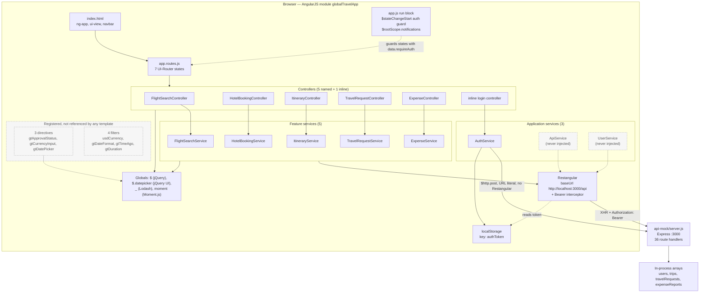
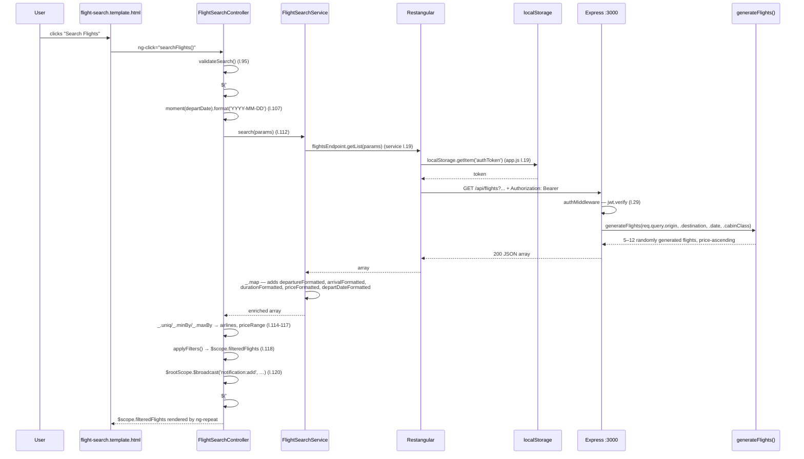
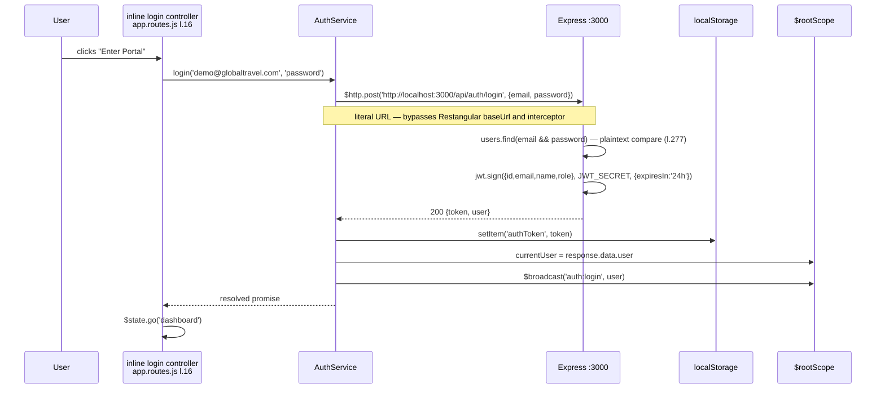
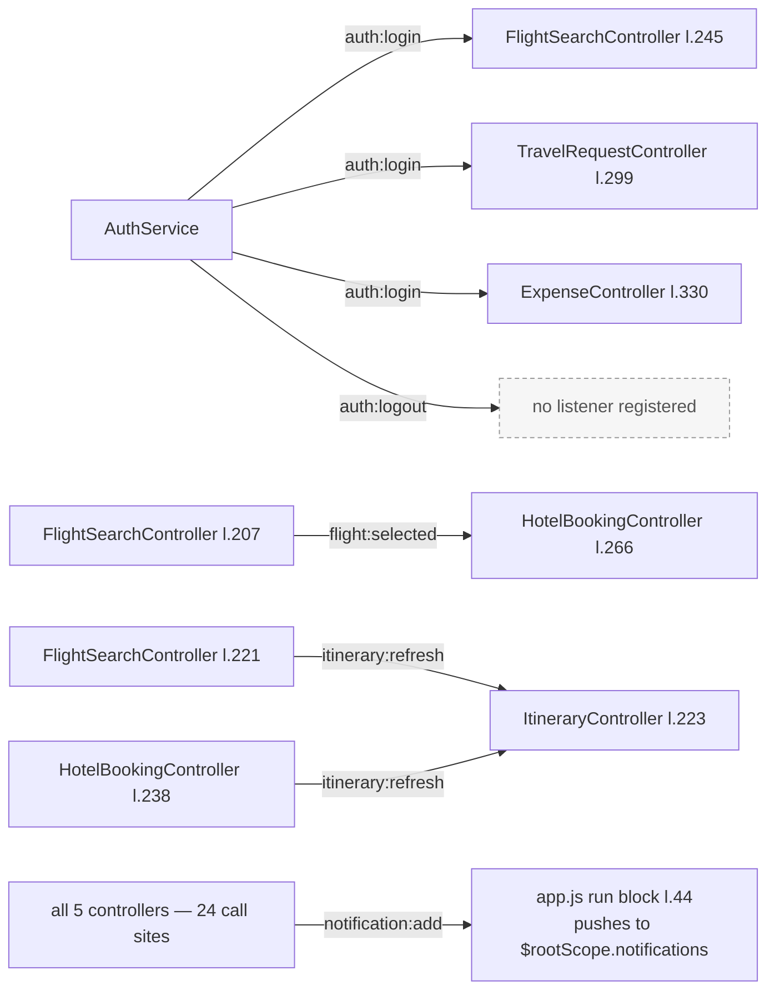
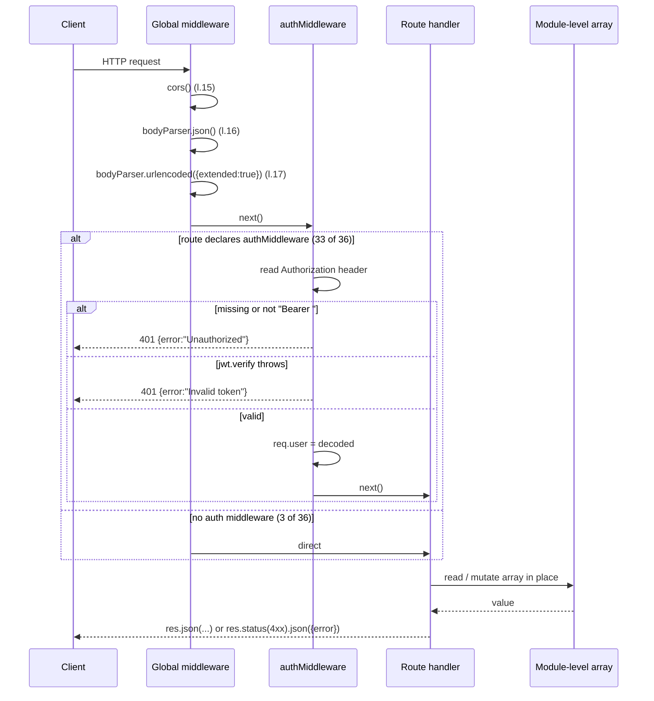

# Architecture Overview — globaltravel-portal

_Extracted on 2026-08-03 by `architecture-mapper`. Documents the architecture as it exists in code._

**Scope:** `app/`, `api-mock/`, `test/`, `Gruntfile.js`. `bower_components/` and `node_modules/`
are treated as opaque vendored trees.

**Source of truth:** code. Where a comment, filename or `README.md` disagrees with behaviour
traced from source, the source is recorded here and the disagreement is listed under
[Comments and filenames vs code](#comments-and-filenames-vs-code).

---

## System Boundaries

Two independently started processes, one repository, no shared runtime.

| Boundary | Runtime | Entry point | Start command | Listens on | Deployment artifact |
|----------|---------|-------------|---------------|------------|---------------------|
| Browser application | Browser (AngularJS 1.6.10) | `app/index.html` → `app/app.js` | `npm run serve` → `grunt serve` | served on `:8080` by `grunt-contrib-connect` | static files (`dist/` after `grunt build`) |
| Mock API | Node.js (Express 4.22.1) | `api-mock/server.js` | `npm run api` → `node api-mock/server.js` | `:3000` | not determinable — no Dockerfile, no deployment config in the repository |

`npm start` runs both under `concurrently` (`package.json` `scripts.start`).

There is no build-time coupling between the two. The browser application reaches the API only at
runtime over HTTP, using a URL literal.

---

## High-Level Architecture

The browser application is organised as a single AngularJS module, `globalTravelApp`, declared once
at `app/app.js:8` and re-opened by every other file via `angular.module('globalTravelApp')` with no
second argument. There are no sub-modules, no ES modules and no bundler; all 20 application scripts
are loaded as separate `<script>` tags in a fixed order (`app/index.html:59-86`), after 9 vendor
scripts (`app/index.html:48-56`), and share the browser global scope.

Layering observed in the browser tier, by directory and by injection direction:

| Layer | Directory | Members | Imports from |
|-------|-----------|---------|--------------|
| Routing/config | `app/app.js`, `app/app.routes.js` | module declaration, Restangular config, run block, 7 states | `AuthService`, `$stateProvider`, `RestangularProvider` |
| Presentation | `app/components/*/​*.template.html`, `app/index.html` | 5 feature templates + shell | scope members published by controllers |
| Presentation logic | `app/components/*/​*.controller.js` | 5 controllers | matching feature service, `$scope`, `$rootScope`, `$timeout`, `$filter`, browser globals |
| Feature data access | `app/components/*/​*.service.js` | 5 services | `Restangular`, `$q`, `_`, `moment` |
| Application services | `app/services/*.js` | `AuthService`, `ApiService`, `UserService` | `Restangular` or `$http`, `$rootScope` |
| Cross-cutting UI | `app/directives/*.js`, `app/filters/*.js` | 3 directives, 4 filters | `$timeout`, `$`, `moment` |

Import direction is strictly one-way from controller to service. No service injects a controller.
No feature service injects another feature service. No controller injects another controller. The
five feature verticals share no code with each other; the only paths between them are
`$rootScope` events and the Restangular singleton.

Each of the five feature folders holds exactly three files with the same shape — controller,
service, template — and the five verticals are structurally identical. `expense-reconciliation` is
the only folder whose files are not named after the folder: they are `expense.controller.js`,
`expense.service.js`, `expense.template.html`.

The API tier is a single file. `api-mock/server.js` declares 36 route handlers inline; there is no
router module, no controller layer, no service layer, and no data access layer. Handlers read and
write module-level arrays directly.

---

## Data Flow

### Authenticated read — flight search

### Authentication

Every subsequent request carries the token because
`RestangularProvider.addFullRequestInterceptor` (`app/app.js:20-28`) reads `authToken` from
`localStorage` on each call and sets the `Authorization` header. The route guard in the run block
(`app/app.js:32-37`) calls `AuthService.isAuthenticated()`, which tests only for the presence of
the `localStorage` key — it does not decode or check expiry of the token.

### `$rootScope` event bus

`$rootScope` is used as an application-wide event bus and as a store for two global values,
`currentUser` and `notifications` (`app/app.js:40-41`).

| Event | Emitted at | Listened at | Listener lifetime |
|-------|-----------|-------------|-------------------|
| `auth:login` | `auth.service.js:24` | `flight-search.controller.js:245`, `travel-request.controller.js:299`, `expense.controller.js:330` | while the emitting controller's state is active |
| `auth:logout` | `auth.service.js:35` | none found in `app/` | — |
| `flight:selected` | `flight-search.controller.js:207` | `hotel-booking.controller.js:266` | while `HotelBookingController` is instantiated |
| `itinerary:refresh` | `flight-search.controller.js:221`, `hotel-booking.controller.js:238` | `itinerary.controller.js:223` | while `ItineraryController` is instantiated |
| `notification:add` | 24 sites across all 5 controllers | `app.js:44` (run block) | application lifetime |
| `$stateChangeStart` | angular-ui-router 0.4.3 | `app.js:32` (run block) | application lifetime |

`flight:selected` and `itinerary:refresh` cross feature boundaries. UI-Router 0.4.3 instantiates a
state's controller when the state is entered and destroys its scope when the state is left, and
each listening controller deregisters on `$destroy`
(`flight-search.controller.js:250`, `hotel-booking.controller.js:272`,
`itinerary.controller.js:227`, `travel-request.controller.js:303`, `expense.controller.js:334`).
Only one feature state is active at a time, so at the moment `flight:selected` is emitted from the
`flights` state, `HotelBookingController` has not been instantiated and its listener is not
registered.

`AuthService.logout()` is defined at `auth.service.js:31` and is not called from any controller,
template or service in `app/`.

### Request handling in the API tier

There is no error-handling middleware, no 404 fallback handler, and no `try`/`catch` in any route
handler. The only `try`/`catch` in `api-mock/server.js` is inside `authMiddleware` (lines 27-34).

---

## Integration Points

| Type | Technology | Used by | Config source |
|------|-----------|---------|---------------|
| External HTTP API | Mock REST API over HTTP | all 5 feature services, `UserService`, `ApiService` | **hardcoded literal** `http://localhost:3000/api` — `app/app.js:14`, `RestangularProvider.setBaseUrl` |
| External HTTP API | Same API, login endpoint only | `AuthService` | **hardcoded literal** `http://localhost:3000/api/auth/login` — `app/services/auth.service.js:18`, via `$http` |
| Browser storage | `localStorage`, key `authToken` | `app/app.js:21` (read), `auth.service.js:22` (write), `:33` (remove), `:43` (read) | key name is a literal |
| Authentication | JWT (HS256 default), 24 h expiry | issued `api-mock/server.js:283-287`, verified `:29` | secret is a **hardcoded literal** `globaltravel-secret-key-2024` — `api-mock/server.js:13` |
| Data store | In-process JavaScript arrays | `api-mock/server.js` route handlers | `users` (l.42), `airports` (l.50), `trips` (l.142), `travelRequests` (l.175), `expenseReports` (l.222), `travelPolicy` (l.257) |
| External CDN | `maxcdn.bootstrapcdn.com` | `itinerary.controller.js:176` — stylesheet written into the print pop-up document | literal URL |
| Browser API | `window.open` + `document.write` + `print()` | `itinerary.controller.js:174-181` | — |
| Browser API | `window.confirm` | `itinerary.controller.js:158`, `travel-request.controller.js:232`, `expense.controller.js:233` | — |
| Browser API | `FormData` file upload | `expense.service.js:83-87` | — |

No database driver, ORM, message queue, cache client, blob storage client, email/SMS SDK, search
client, APM agent, telemetry SDK or logging library appears in `package.json` or in any source file
in scope. The API tier's only output channel besides HTTP responses is `console.log` in the
`app.listen` callback (`api-mock/server.js:706-718`).

### Ports and hosts

| Value | Where | Mechanism |
|-------|-------|-----------|
| `3000` | `api-mock/server.js:12` | `var PORT = 3000;` — not read from `process.env` |
| `8080` | `Gruntfile.js:79` | `connect.server.options.port` |
| `9876` | `test/karma.conf.js:54` | `config.port` |
| `localhost` / `*` | `Gruntfile.js:84` | switched by the `inContainer` flag |

`cors()` is called with no options (`api-mock/server.js:15`), so the package defaults apply.

---

## Client-declared calls vs server-declared routes

Traced by matching every Restangular and `$http` call site in `app/` against the 36 route handlers
in `api-mock/server.js`. Recorded because the two tiers are separate deployables whose contract is
implicit.

### Calls that reach a declared route

| Client call site | Resulting request | Server route |
|------------------|-------------------|--------------|
| `auth.service.js:18` | `POST /api/auth/login` | `server.js:273` |
| `flight-search.service.js:19` | `GET /api/flights?…` | `server.js:328` |
| `flight-search.service.js:39` | `POST /api/flights/:id/book` | `server.js:365` |
| `flight-search.service.js:47` | `GET /api/flights/popular` | `server.js:338` |
| `flight-search.service.js:56` | `GET /api/flights/:id` | `server.js:348` |
| `flight-search.service.js:65` | `GET /api/airports?q=` | `server.js:311` |
| `hotel-booking.service.js:19` | `GET /api/hotels?…` | `server.js:378` |
| `hotel-booking.service.js:37` | `GET /api/hotels/:id/rooms?…` | `server.js:403` |
| `hotel-booking.service.js:48` | `POST /api/bookings/hotels` | `server.js:445` |
| `hotel-booking.service.js:57` | `GET /api/hotels/:id` | `server.js:383` |
| `hotel-booking.service.js:67` | `GET /api/hotels/:id/reviews?page=` | `server.js:414` |
| `itinerary.service.js:16` | `GET /api/trips` | `server.js:461` |
| `itinerary.service.js:31` | `GET /api/trips/:id` | `server.js:480` |
| `itinerary.service.js:50` | `POST /api/itinerary-items/:id/notes` | `server.js:535` |
| `itinerary.service.js:62` | `PUT /api/itinerary-items/:id` | `server.js:518` |
| `itinerary.service.js:71` | `POST /api/trips` | `server.js:465` |
| `itinerary.service.js:81` | `PUT /api/trips/:id` | `server.js:488` |
| `itinerary.service.js:90` | `DELETE /api/trips/:id` | `server.js:497` |
| `itinerary.service.js:100` | `POST /api/trips/:id/share` | `server.js:506` |
| `travel-request.service.js:18` | `GET /api/travel-requests` | `server.js:556` |
| `travel-request.service.js:37` | `GET /api/travel-requests/:id` | `server.js:575` |
| `travel-request.service.js:46` | `POST /api/travel-requests` | `server.js:560` |
| `travel-request.service.js:56` | `PUT /api/travel-requests/:id` | `server.js:583` |
| `travel-request.service.js:65` | `PUT /api/travel-requests/:id` | `server.js:583` |
| `travel-request.service.js:74` | `GET /api/travel-requests/:id/approvals` | `server.js:601` |
| `travel-request.service.js:87` | `GET /api/travel-policy` | `server.js:609` |
| `expense.service.js:18` | `GET /api/expense-reports` | `server.js:617` |
| `expense.service.js:35` | `GET /api/expense-reports/:id` | `server.js:636` |
| `expense.service.js:54` | `POST /api/expense-reports` | `server.js:621` |
| `expense.service.js:64` | `PUT /api/expense-reports/:id` | `server.js:644` |
| `expense.service.js:73` | `DELETE /api/expense-reports/:id` | `server.js:659` |
| `expense.service.js:87` | `POST /api/expenses/:id/receipt` | `server.js:693` |
| `expense.service.js:108` | `PUT /api/expense-reports/:id` | `server.js:644` |

`ApiService` (`app/services/api.service.js:17,27,37,48,58`) builds the same five call shapes from an
`endpoint` argument, so its target routes depend on the caller. It has no callers.

### Calls with no matching route

| Client call site | Resulting request | Nearest declared route |
|------------------|-------------------|------------------------|
| `user.service.js:15` — `Restangular.one('users','me').get()` | `GET /api/users/me` | none. `/api/users` is not declared at any method; the user-profile route that exists is `GET /api/auth/me` (`server.js:299`) |
| `user.service.js:27` — `Restangular.one('users','me').customPUT(...)` | `PUT /api/users/me` | none |

Both call sites are inside `UserService`, which is never injected (see
`specs/docs/architecture/components.md`).

### Route-order shadowing

Express matches routes in declaration order.

| Shadowed route | Declared at | Shadowed by | Declared at | Effect traced from code |
|----------------|-------------|-------------|-------------|-------------------------|
| `GET /api/expense-reports/statistics` | `server.js:668` | `GET /api/expense-reports/:id` | `server.js:636` | `:id` is declared 32 lines earlier and matches the literal segment `statistics`; the handler looks up `expenseReports.find(r => r.id === 'statistics')`, finds nothing, and returns `404 {"error":"Expense report not found"}`. The statistics handler body is unreachable via this path. `ExpenseService.getStatistics` (`expense.service.js:97-98`) is the only caller and is itself never invoked from a controller or template. |

The equivalent pair in the flights group is declared in the opposite order —
`GET /api/flights/popular` at `server.js:338` precedes `GET /api/flights/:id` at `server.js:348` —
so `/api/flights/popular` reaches its own handler.

### Field-name and shape differences across the boundary

| # | Client expects | Server declares | Evidence |
|---|---------------|-----------------|----------|
| 1 | `booking.confirmationCode` | response key is `confirmationNumber` | `flight-search.controller.js:220` vs `server.js:367` |
| 2 | `confirmation.confirmationCode` | response key is `confirmationNumber` | `hotel-booking.controller.js:237` vs `server.js:447` |
| 3 | query parameter `departDate` (and `returnDate`, `passengers`, `tripType`) sent by `getList(params)` | handler reads `req.query.date`; `req.query.departDate` is not read | `flight-search.controller.js:106-110` → `flight-search.service.js:19` vs `server.js:329` |
| 4 | body key `roomId` | handler echoes `req.body.roomType`, which the client does not send | `hotel-booking.controller.js:226` vs `server.js:449` |
| 5 | `getList('reviews', …)` — Restangular `getList` expects a JSON array | handler responds with an object `{reviews, totalCount, page, perPage}` | `hotel-booking.service.js:67` vs `server.js:437-442` |
| 6 | body `{text, createdAt}` posted to `…/notes` | handler assigns `item.notes = req.body.notes`; the client sends no `notes` key | `itinerary.service.js:50-52` vs `server.js:540` |
| 7 | expense `category` values `'Airfare'`, `'Hotel'`, `'Meals'`, `'Ground Transport'`, … | seeded expense records use `'flights'`, `'hotels'`, `'meals'`, `'transport'`, `'other'` | `expense.controller.js:28-32` vs `server.js:234-237`, `:251-252` |
| 8 | `POST /api/flights/:id/book` response consumed as a booking record | handler returns a fresh object and does not record the booking in any array | `flight-search.controller.js:214-222` vs `server.js:365-372` |

Difference 3 is why the `origin`/`destination` values a user types do affect the generated results
(`req.query.origin` and `req.query.destination` are read at `server.js:329`) while the chosen date
does not.

---

## Architectural Patterns Observed

| Pattern | Evidence |
|---------|----------|
| Client–server split over HTTP/JSON | two entry points, no shared code, contract carried only by URL literals in `app/app.js:13` and `auth.service.js:18` |
| Feature-folder organisation in the browser tier | `app/components/{feature}/` each holding controller + service + template, 5 times |
| Layered within a feature vertical | template → controller → feature service → `Restangular` → HTTP; injection is one-directional at every step |
| MVC-style, AngularJS 1.x `$scope` style | state and behaviour published on `$scope` by `.controller()`, bound by templates; no `controllerAs`, no `bindToController`, no `.component()` |
| Global event bus | `$rootScope.$broadcast` / `$rootScope.$on` for 6 event names, 36 call sites (`app/**`) |
| Global mutable application state | `$rootScope.currentUser` and `$rootScope.notifications` set at `app/app.js:39-40`, read and written across services and templates |
| Script-concatenation delivery | 20 application `<script>` tags in a fixed order (`app/index.html:59-86`); `grunt concat` reproduces this as a single file with a different glob order |
| Single-file API with inline handlers | `api-mock/server.js` — 36 `app.<method>(path, [authMiddleware,] handler)` calls, no router, no layers |
| In-memory, non-durable persistence | module-level arrays mutated in place; process restart resets them |
| Route-level authorisation | `authMiddleware` passed per route (33 of 36), not mounted with `app.use` |
| Direct DOM manipulation from controllers | 40 `$(…)` call sites — 34 across the 5 controllers, 6 across the 3 directives — alongside Angular data binding |

Patterns **not** observed, checked for explicitly: dependency inversion / ports and adapters, CQRS,
repository pattern, microservices, serverless functions, message-driven or queue-based processing,
server-side rendering, and modular monolith boundaries (there is exactly one AngularJS module).

---

## jQuery and Angular co-ordination

Both the AngularJS digest cycle and direct jQuery DOM access operate on the same elements. The
selectors used from controllers and the elements that satisfy them:

| Selector | Used at | Target element declared at |
|----------|---------|---------------------------|
| `#departDate`, `#returnDate` | `flight-search.controller.js:72,81` | `flight-search.template.html:57,64` |
| `#search-overlay` | `flight-search.controller.js:104,126` | `flight-search.template.html:109` |
| `#flight-details` | `flight-search.controller.js:203` | `flight-search.template.html:230` |
| `.search-field-required` | `flight-search.controller.js:135` | `flight-search.template.html:40,47` |
| `#cityInput` | `hotel-booking.controller.js:97` | `hotel-booking.template.html:19` |
| `#hotelCheckIn`, `#hotelCheckOut` | `hotel-booking.controller.js:72,81` | `hotel-booking.template.html:29,36` |
| `#hotel-rooms` | `hotel-booking.controller.js:202` | `hotel-booking.template.html:166` |
| `#bookingConfirmationModal` | `hotel-booking.controller.js:241` | `hotel-booking.template.html:236` |
| `#itinerary-details` | `itinerary.controller.js:82,172` | `itinerary.template.html:85` |
| `.itinerary-timeline` | `itinerary.controller.js:131` | `itinerary.template.html:203` |
| `.itinerary-list` | `itinerary.controller.js:133` | `itinerary.template.html:137` |
| `.no-print` | `itinerary.controller.js:173` (via `.find()` on the clone) | `itinerary.template.html:18,166,184` |
| `#trDepartDate`, `#trReturnDate` | `travel-request.controller.js:72,81` | `travel-request.template.html:63,70` |
| `#travel-request-form` | `travel-request.controller.js:139,154` | `travel-request.template.html:22` |
| `#destinationField` | `travel-request.controller.js:204` | `travel-request.template.html:33` |
| `#requestDetailModal` | `travel-request.controller.js:246` | `travel-request.template.html:321` |
| `#expenseDate` | `expense.controller.js:59` | `expense.template.html:112` |
| `#reportStartDate`, `#reportEndDate` | `expense.controller.js:68` (one combined selector) | `expense.template.html:264,267` |
| `#new-expense-report` | `expense.controller.js:146` | `expense.template.html:74` |
| `.expense-required` | `expense.controller.js:156` | `expense.template.html:110,126,133` |
| `#receiptFileInput` | `expense.controller.js:248` | `expense.template.html:154` |
| `#expenseDetailModal` | `expense.controller.js:223` | `expense.template.html:328` |
| `html, body` | `flight-search.controller.js:205`, `hotel-booking.controller.js:204`, `itinerary.controller.js:84`, `travel-request.controller.js:156` | `app/index.html` |

Every id and class selector used from a controller resolves to an element declared in that
controller's own template (22 of 22 checked; the 23rd row targets the document shell). The
templates declare 28 ids in total, so 6 ids exist that no controller selects: `#origin`,
`#destination`, `#passengers`, `#cabinClass` (`flight-search.template.html:43,50,71,83`), `#city`,
`#guests`, `#rooms` (`hotel-booking.template.html:22,43,51`) — these are bound with `ng-model`
instead.

Five targets sit inside an `ng-if` block, so the element exists in the DOM only while the
expression is truthy:

| Element | Guard |
|---------|-------|
| `#travel-request-form` | `ng-if="showForm"` (`travel-request.template.html:22`) |
| `#new-expense-report` | `ng-if="showNewReport"` (`expense.template.html:74`) |
| `#flight-details` | `ng-if="selectedFlight"` (`flight-search.template.html:230`) |
| `#hotel-rooms` | `ng-if="selectedHotel.rooms"` (`hotel-booking.template.html:166`) |
| `#itinerary-details` | `ng-if="itinerary && selectedTrip"` (`itinerary.template.html:85`) |

Four of these five are read behind a `.length` check — `flight-search.controller.js:204`,
`hotel-booking.controller.js:203`, `itinerary.controller.js:83`,
`travel-request.controller.js:155`. `#new-expense-report` (`expense.controller.js:146`) and the
`#itinerary-details` clone taken for printing (`itinerary.controller.js:172`) are not guarded.

Nine jQuery calls that run against `ng-if`-gated or freshly rendered elements are wrapped in
`$timeout(function(){…}, 0)` to defer past the current digest: `flight-search.controller.js:70`,
`hotel-booking.controller.js:71`, `itinerary.controller.js:129`,
`travel-request.controller.js:71,138,153`, `expense.controller.js:58,145`.

`$apply` is invoked manually from jQuery callbacks at 10 sites — 8 in controllers
(`flight-search.controller.js:76,85`, `hotel-booking.controller.js:76,85`,
`travel-request.controller.js:76,85`, `expense.controller.js:63,256`) and 2 in directives
(`date-picker.directive.js:42`, `currency-input.directive.js:43`, both using the directive's local
`scope`). All 8 controller sites are inside a jQuery UI `datepicker` `onSelect` handler except
`expense.controller.js:256`, which is inside a native `change` listener on the file input.

---

## Comments and filenames vs code

Per the rule that code wins, the following are recorded as discrepancies. In each case this
document describes the behaviour traced from source, not the label in the comment or filename.

| Artefact | What it says | What the code shows |
|----------|--------------|---------------------|
| Comment blocks in 14 files under `app/` | headers containing the words `Legacy` and `Anti-patterns:` — e.g. `app/app.js:31`, `app/directives/date-picker.directive.js:6`, `app/services/api.service.js:3` | these are comments only; they describe no behaviour and change none. This document records structure and data flow from the executable statements. |
| `app/filters/date-format.filter.js` (filename, singular) | one filter | three `.filter()` registrations: `gtDateFormat` (l.14), `gtTimeAgo` (l.47), `gtDuration` (l.60) |
| `app/directives/date-picker.directive.js` | a date-picker directive used by the application | registers `gtDatePicker`; no template in `app/` uses `gt-date-picker`. The datepickers actually rendered are initialised directly by the five controllers via `$('#…').datepicker(...)` |
| `app/services/api.service.js:2-3` comment `"API Service - Restangular wrapper / Additional abstraction layer"` | an abstraction layer in use | `ApiService` is registered at `api.service.js:9` and injected nowhere in `app/` or `test/` |
| `app/services/auth.service.js:47` comment `"Get current user from localStorage"` | the user record is read back from `localStorage` | `getCurrentUser` (l.49-51) returns `$rootScope.currentUser`, an in-memory value. Only the token is written to `localStorage` (l.22); the user object never is. After a page reload `isAuthenticated()` (l.42) still returns `true` while `$rootScope.currentUser` is `undefined` |
| `app.js:31` comment `"Global event bus for cross-component communication"` placed above the `$stateChangeStart` handler | the handler is the event bus | `$stateChangeStart` (l.32) is the route guard. The notification bus is the separate `$rootScope.$on('notification:add')` handler at l.44 |
| `app.routes.js:15` inline template text `"Mock login - click to enter"` | — | matches the code — the login state takes credentials from the literal pair `demo@globaltravel.com` / `password` hardcoded at `app.routes.js:20`, not from any input field |
| `README.md:53,355` "~36 routes" | approximate | exactly 36 route handlers, enumerated in `specs/contracts/api/` |
| `README.md:243` "Hash routing (`#!/flights`)" | — | matches the code by default: no `$locationProvider`, `hashPrefix` or `html5Mode` call exists in `app/`, and no `<base href>` tag exists in `app/index.html`, so the AngularJS 1.6 default `!` hash prefix applies |
| `Gruntfile.js:61` copies `app/assets/images/` | the directory exists | `app/assets/` contains only `css/style.css`; `app/assets/images/` is not present in the repository |

---

## Not determinable from source

| Question | Status |
|----------|--------|
| Target deployment environment for either tier | unknown — no Dockerfile, no CI workflow, no IaC, no `azure.yaml`, no host configuration in the repository |
| Intended production API base URL | unknown — the only URL in source is the `localhost:3000` literal; no environment variable is read by `app/` |
| Whether a real backend ever existed behind these contracts | unknown — the repository contains only `api-mock/`; nothing references another origin |
| Node.js version the API tier is intended to run on | unknown — no `engines` field, no `.nvmrc`, no `.tool-versions` |
| Browser support matrix | unknown — no browserslist config, no polyfill imports, no transpiler |
| Why `POST /api/flights` and `GET /api/flights` both exist | unknown — both generate results via `generateFlights` (`server.js:328-336`), differing only in where the date comes from: the GET form reads `req.query.date`, the POST form reads `req.body.departDate`. Only the GET form is reached by any code in `app/`. |
