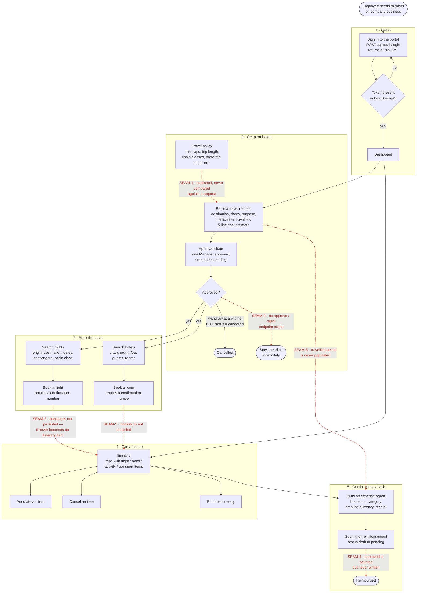
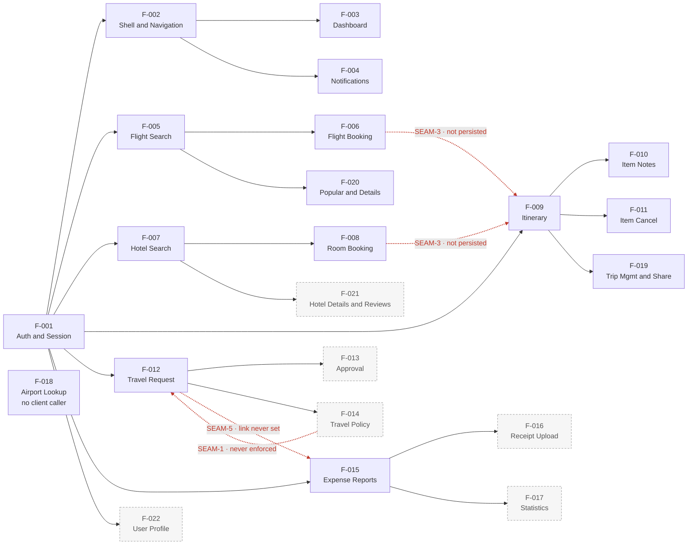
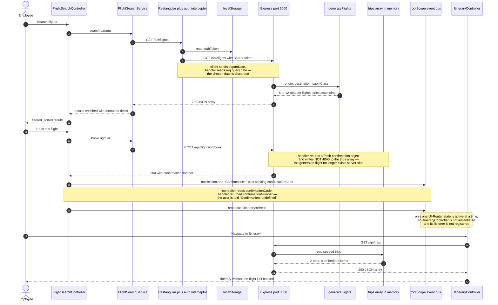

# Product Requirements Document

**Product:** GlobalTravel Corp — Corporate Travel Portal (`globaltravel-portal`, v1.6.0)
**Mode:** Brownfield · Phase B2a · reverse-engineered by the `prd-generator` skill
**Generated:** 2026-08-04 · **Status:** approved at the B2a human gate, 2026-08-04

> **How to read this document.** This PRD was reconstructed from the Phase B1 extraction
> artifacts, which were themselves extracted from source and approved at the B1 human gate on
> 2026-08-03 (`.spec2cloud/state.json` → `gateReview`). No claim below was written from the
> application source directly. Every factual statement carries a citation of the form
> `[artifact §section → source:line]`, where the artifact is the extraction document that
> recorded the fact and `source:line` is the code location that artifact cites.
>
> | Key | Extraction artifact |
> |-----|---------------------|
> | `[stack]` | `specs/docs/technology/stack.md` |
> | `[deps]` | `specs/docs/technology/dependencies.md` |
> | `[arch]` | `specs/docs/architecture/overview.md` |
> | `[comp]` | `specs/docs/architecture/components.md` |
> | `[data]` | `specs/docs/architecture/data-models.md` |
> | `[tests]` | `specs/docs/testing/coverage.md` |
> | `[api:auth]` `[api:flight]` `[api:hotel]` `[api:itin]` `[api:tr]` `[api:exp]` | `specs/contracts/api/{auth,flight-search,hotel-booking,itinerary,travel-request,expense-reconciliation}.yaml` |
>
> Statements that go beyond what an artifact records are prefixed **`Inferred:`** and state the
> reasoning. Product intent that cannot be resolved from the artifacts at all is **not resolved
> here** — it is listed under [Open Questions](#open-questions).

---

## Product Flow Diagram

The end-to-end job the portal does for an employee of GlobalTravel Corp: get permission to
travel, book the travel, carry the trip, and get the money back.

Solid arrows are transitions the code carries end to end. **Dashed red arrows are transitions the
product implies but no code performs** — each is a recorded extraction finding, cited in the
legend below the diagram.

All five feature screens are also reachable directly from the navbar at any time — the sequence
above is the business workflow, not a navigation constraint
`[stack §Routing — 7 UI-Router states]`, `[arch §High-Level Architecture]`.

**Legend — the five product seams the code does not carry**

> `SEAM-n` identifies a gap in the *product workflow* above. It is unrelated to the spec2cloud
> pipeline phases `B0`–`B3` (Onboarding, Extract, Spec-Enable, Track A/B) referenced elsewhere in
> this document.

| # | Seam | Evidence |
|---|------|----------|
| **SEAM-1** | Travel policy is published but never enforced. The portal declares cost caps, a max trip duration, allowed cabin classes and preferred suppliers, but no create, search or booking path compares anything against them, and the client method that fetches the policy has no caller. | `[api:tr §x-discrepancies/policy-never-enforced → api-mock/server.js:257-267, :609]`, `[data §TravelPolicy]`, `[comp §TravelRequestService → travel-request.service.js:86]` |
| **SEAM-2** | An approval decision cannot be recorded. Every created request receives exactly one hardcoded `{approver:'Mike Chen', role:'Manager', status:'pending', date:null}` entry, and no approve or reject endpoint exists. Seed record `tr-2` carries two completed approvals that no handler could have produced. | `[api:tr §x-discrepancies/approval-chain-is-static → api-mock/server.js:567]`, `[data §Approval]` |
| **SEAM-3** | A booking never reaches the itinerary. `POST /api/flights/{id}/book` and `POST /api/bookings/hotels` return a confirmation and write nothing; a subsequent `GET /api/trips` does not show the booking. Both controllers nevertheless broadcast `itinerary:refresh`. | `[api:flight §x-discrepancies/booking-not-persisted → api-mock/server.js:365-372]`, `[api:hotel §x-discrepancies/booking-not-persisted → api-mock/server.js:445]`, `[arch §$rootScope event bus]` |
| **SEAM-4** | An expense report cannot be approved. `approved` is counted by the statistics handler but is present in no seed and written by no handler; the only route that could set it is a client-supplied `PUT` body. | `[data §ExpenseReport → api-mock/server.js:671]`, `[api:exp §x-discrepancies/uncalled-endpoints]` |
| **SEAM-5** | Spend is never tied back to the approval that authorised it. `ExpenseReport.travelRequestId` is `null` in both seeds, no handler sets it, and the only writer — `ExpenseService.linkToTravelRequest` — has no caller. | `[data §Referential integrity]`, `[comp §ExpenseService → expense.service.js:107]` |

---

## Product Vision

GlobalTravel Corp's travel portal is the single internal place where an employee handles a
business trip end to end: sign in with a corporate account, raise a travel request with a costed
justification and route it to a manager for approval, search and book flights and hotels, follow
the resulting trip as a day-by-day itinerary, and file an expense report against the money spent
— all behind one authenticated session, on one screen set, with a company travel policy published
alongside. The product's value proposition is consolidation: five activities that would otherwise
live in five systems are exposed as five screens over one API and one identity
`[stack §Routing — 7 UI-Router states; arch §High-Level Architecture — 5 feature verticals]`. As
built, the portal is a complete and coherent **front office** for that journey — every screen,
form, list and detail view exists and is reachable — sitting on a **mock back office**: state
lives in five module-level JavaScript arrays that reset when the process restarts, search results
are randomly generated per request, and the decision points that make the workflow a workflow
(policy enforcement, approval, reimbursement) are declared but not implemented
`[data §Data layer summary; api:tr §x-discrepancies]`.

---

## User Personas

The codebase declares exactly one role vocabulary, with two values, in one place: the seeded
`users` array `[data §User → api-mock/server.js:42-45]`. Both values are carried in the JWT
`role` claim `[api:auth §securitySchemes → api-mock/server.js:284]`. **No handler in the API
reads `req.user.role`** `[api:tr §x-discrepancies/no-authorization-check]`, and no UI-Router state
or template branches on role `[stack §Routing]` — so the two personas below are distinguishable in
the data but not in behaviour.

### Employee — the traveller

- **Role**: A GlobalTravel Corp staff member who needs to travel on company business. Seeded as
  `Sarah Johnson / demo@globaltravel.com / Engineering / role: "employee"`.
- **Needs**: Permission to travel; flights and hotels within policy; one place to see what has
  been booked; reimbursement for what was spent.
- **Goals**: Get a trip authorised, booked, carried and reimbursed without leaving the portal.
- **Source**: **Explicit in codebase** — `[data §User → api-mock/server.js:42-45]`. All six
  authenticated screens are reachable by this persona
  `[stack §Routing — 6 of 7 states carry data.requireAuth: true]`. Every seeded `Trip`,
  `TravelRequest` and `ExpenseReport` belongs to `userId: 1`, this user
  `[data §Trip, §TravelRequest, §ExpenseReport]`.

### Manager — the approver

- **Role**: A staff member who reviews and authorises a colleague's travel request. Seeded as
  `Mike Chen / manager@globaltravel.com / Engineering / role: "manager"`.
- **Needs**: Visibility of pending requests; the ability to approve or reject against policy.
- **Goals**: Control travel spend before it is committed.
- **Source**: **Explicit in the data, absent from behaviour.** The role value exists
  `[data §User → api-mock/server.js:44]` and `Mike Chen` is the hardcoded approver written into
  every new travel request `[api:tr §x-discrepancies/approval-chain-is-static →
  api-mock/server.js:567]`. But there is **no approver-facing screen** — all 7 UI-Router states
  are the traveller's `[stack §Routing]` — **no approve or reject endpoint**, and **no handler
  reads the role claim** `[api:tr §x-discrepancies/no-authorization-check]`. If this persona signs
  in, they receive the traveller's portal and can read, modify and delete every other user's
  requests, trips and expense reports, because no handler compares `req.user.id` to the record's
  `userId` `[api:itin §x-discrepancies/no-ownership-check]`, `[api:exp §x-discrepancies/no-ownership-check]`, `[api:tr §x-discrepancies/no-authorization-check]`.

### Personas checked for and **not** found

| Candidate persona | Why it was rejected |
|-------------------|---------------------|
| Administrator | No admin route, no admin state, no user create/update/delete handler exists for the `User` entity `[data §User — "No create, update or delete handler exists for this entity"]` |
| Finance / reimbursement officer | The only finance-shaped surface, `GET /api/expense-reports/statistics`, is unreachable: it is registered after `GET /api/expense-reports/:id`, so Express matches the parameterised route first and the handler is dead code `[api:exp §x-discrepancies/statistics-route-shadowed → api-mock/server.js:668 vs :636]` |
| API consumer / integrator | No API key management, no webhook config, no SDK, no published OpenAPI document in the repository — the contracts under `specs/contracts/` were produced by this extraction, not shipped by the product `[api:auth §info]` |
| Operator / system persona | No scheduled job, no queue consumer, no background worker, no CLI binary `[stack §Entry Points]` |

---

## Service Guarantees

What the system actually promises a caller, read from the contracts. Stated as guarantees so that
the FRD and Gherkin phases have an unambiguous baseline.

### Guaranteed

| # | Guarantee | Evidence |
|---|-----------|----------|
| G-1 | **Every screen except login requires a session.** 6 of 7 UI-Router states declare `data.requireAuth: true` and are refused by the run-block guard without a token; `otherwise` redirects to `/login`. | `[stack §Routing]`, `[arch §Authentication → app/app.js:32-37, app.routes.js:10]` |
| G-2 | **Every API route except three requires a bearer token.** 33 of 36 handlers take `authMiddleware`, which returns `401 {"error":"Unauthorized"}` for a missing/malformed header and `401 {"error":"Invalid token"}` for a token that fails `jwt.verify`. | `[api:auth §x-source.authMiddleware → api-mock/server.js:23-35]`, `[comp §Express server]` |
| G-3 | **A successful login returns a JWT valid for 24 hours** carrying `{id, email, name, role}`, plus the user record without the password field. | `[api:auth §/auth/login → api-mock/server.js:283-287, :291]` |
| G-4 | **Search always returns results.** A flight search returns 5–12 flights sorted by price ascending; a hotel search returns 6–15 hotels sorted by rating descending. Neither can return an empty list, and neither can fail. | `[data §Generated entities → api-mock/server.js:78-108, :110-139]` |
| G-5 | **Create, read, update and delete are durable for the session** on trips, travel requests and expense reports — the three entities with full CRUD handlers. | `[api:itin, api:tr, api:exp §paths]`, `[data §Persisted entities]` |
| G-6 | **An expense report's `totalAmount` is recomputed server-side on update**, and only there, and only when the expense array is non-empty. | `[api:exp §x-discrepancies/totalAmount-recalculated-only-on-put → api-mock/server.js:652-654]` |
| G-7 | **Every user action produces an in-app notification.** All five controllers broadcast `notification:add`; the run block appends to `$rootScope.notifications`. 24 broadcast sites. | `[arch §$rootScope event bus → app/app.js:44]` |

### Explicitly **not** guaranteed

| # | Non-guarantee | Evidence |
|---|---------------|----------|
| N-1 | **Durability.** All state is five module-level arrays and one object literal. Nothing is written to disk; no `fs` require, no database driver, no ORM, no migrations. A process restart discards every create, update and delete. | `[data §Data layer summary; §Where data lives]` |
| N-2 | **Session invalidation.** `POST /api/auth/logout` returns a fixed message, reads nothing and invalidates nothing; tokens stay valid for the full 24 hours. The client's logout removes the localStorage key only — and has no caller. | `[api:auth §x-discrepancies/logout-is-client-side-only → api-mock/server.js:296]`, `[comp §AuthService]` |
| N-3 | **Session expiry enforcement in the browser.** The route guard tests only that the `authToken` key is present; it never decodes the token or checks `exp`. | `[arch §Authentication → app/services/auth.service.js:42]` |
| N-4 | **Data isolation between users.** No handler compares `req.user.id` with a record's `userId`. `GET /api/trips`, `/travel-requests` and `/expense-reports` each return the whole array; `PUT`/`DELETE` accept any id from any authenticated caller. | `[api:itin §x-discrepancies/no-ownership-check]`, `[api:exp §x-discrepancies/no-ownership-check]`, `[api:tr §x-discrepancies/no-authorization-check]`, `[data §Referential integrity]` |
| N-5 | **Authorisation by role.** The JWT carries `role`; no handler reads it. | `[api:tr §x-discrepancies/no-authorization-check]` |
| N-6 | **Server-side validation of anything.** No schema, no validation library, no enumeration is declared or checked anywhere. `POST /api/travel-requests` runs `Object.assign(skeleton, req.body)` with the body **second**, so a client-supplied `id`, `userId`, `status`, `createdAt` or `approvals` silently overrides the server value. | `[data §Data layer summary; §Vocabulary and enumerations]`, `[api:tr §x-discrepancies/object-assign-body-wins → api-mock/server.js:561-569]` |
| N-7 | **Search inputs are honoured.** Flight `origin` and `destination` reach the generator; the chosen **departure date does not** — the client sends `departDate`, the handler reads `req.query.date`. Hotel `checkIn`/`checkOut` are passed to the generator and never read in its body. | `[api:flight §x-discrepancies/flight-date-param-name → api-mock/server.js:329]`, `[api:hotel §x-discrepancies/checkin-checkout-ignored → api-mock/server.js:110]` |
| N-8 | **Search results are stable.** Flights, hotels, rooms and reviews are generated per request with random ids, prices and counts. Two identical requests return different data, and a booked flight no longer exists server-side by the time the booking call arrives. | `[data §Generated entities]`, `[api:flight §x-discrepancies/booking-not-persisted]` |
| N-9 | **Error handling.** There is no error-handling middleware, no 404 fallback route, and no `try`/`catch` in any of the 36 handlers — the only `try`/`catch` in the server is inside `authMiddleware`. | `[api:auth §x-source.errorHandling]`, `[comp §Express server]` |
| N-10 | **Receipt storage.** `POST /api/expenses/{id}/receipt` registers no multipart parser, reads neither `req.body` nor `req.file`, stores nothing, and returns a `receiptUrl` for a file that was never received. `Expense` has no receipt field. | `[api:exp §x-discrepancies/receipt-upload-is-a-stub → api-mock/server.js:693-699]` |
| N-11 | **A shared vocabulary between the screens and the API.** The expense category dropdown offers 12 Title-Case values; every stored expense and the statistics breakdown use 5 lowercase values. None match by string equality. | `[data §Vocabulary and enumerations]`, `[api:exp §x-discrepancies/category-vocabulary-mismatch]` |
| N-12 | **Correct confirmation feedback.** Both booking handlers return `confirmationNumber`; both controllers read `confirmationCode`, so the success notification reads "Confirmation: undefined". | `[api:flight, api:hotel §x-discrepancies/confirmation-key-mismatch]` |

---

## Feature List

**Priority rubric — adapted, and why.** The `prd-generator` default rubric grades a feature partly
by test coverage. That dimension carries no signal in this repository: there is one spec file, it
targets one controller, all 11 tests execute and **all 11 fail**, and no coverage tooling is
configured `[tests §Summary; §Execution evidence]`. Priority below is therefore derived from
**reachability and completeness of the end-to-end path**, and the rule is stated per band:

- **P0 (Critical)** — reachable from the UI, the path completes, no contract break on the path.
- **P1 (High)** — reachable from the UI and the path completes, but the extraction records at
  least one contract break on it.
- **P2 (Medium)** — implemented on one tier only, or implemented on both but with no caller
  wiring the two together.
- **P3 (Low)** — stubbed, unreachable, or dead.

| ID | Feature | Description | Priority | Dependencies |
|----|---------|-------------|----------|--------------|
| F-001 | Authentication & Session | Email/password login returns a 24h JWT; the token is stored in `localStorage` and attached to every subsequent request by a Restangular request interceptor; a run-block guard refuses any state declaring `data.requireAuth`. 3 routes. `[api:auth]`, `[arch §Authentication]`, `[stack §Routing]` | **P0** | — |
| F-002 | Application Shell & Navigation | Single-page shell with a navbar and `ui-view`; 7 UI-Router states; hash routing with the AngularJS 1.6 default `!` prefix; `otherwise('/login')`. `[stack §Routing]`, `[comp §Templates]` | **P0** | F-001 |
| F-003 | Dashboard | Landing state after login. Declares an inline template string and **no controller**. `[stack §Routing]`, `[comp §Templates]` | **P2** — reachable, but has no behaviour to exercise | F-001, F-002 |
| F-004 | In-App Notifications | Application-wide notification bus: all 5 controllers broadcast `notification:add` from 24 sites; the run block appends to `$rootScope.notifications`. `[arch §$rootScope event bus → app/app.js:44]` | **P1** — works, but notifications report success for calls that persisted nothing (SEAM-3) and print `undefined` confirmations (N-12) | F-002 |
| F-005 | Flight Search | Origin/destination/date/passengers/cabin-class form; results enriched client-side with formatted times, duration and price; client-side filtering by airline, stops and max price, and sorting. 5–12 generated results per search. `[api:flight §/flights]`, `[comp §FlightSearchController]` | **P1** — the departure date the user picks is discarded server-side `[api:flight §x-discrepancies/flight-date-param-name]` | F-001 |
| F-006 | Flight Booking | Book a selected flight; returns a confirmation number. `[api:flight §/flights/{id}/book]` | **P1** — nothing is persisted and the confirmation key is misread `[api:flight §x-discrepancies/booking-not-persisted]`, `[api:flight §x-discrepancies/confirmation-key-mismatch]` | F-005 |
| F-007 | Hotel Search | City/check-in/check-out/guests/rooms form; results enriched client-side with rating text, price and amenities summary; client-side filtering and sorting. 6–15 generated results per search. `[api:hotel §/hotels]`, `[comp §HotelBookingController]` | **P1** — the date range is ignored by the generator `[api:hotel §x-discrepancies/checkin-checkout-ignored]` | F-001 |
| F-008 | Hotel Room Selection & Booking | Fetch rooms for a hotel, select one, book it; returns a confirmation number. `[api:hotel §/hotels/{id}/rooms]`, `[api:hotel §/bookings/hotels]` | **P1** — room objects carry no `id` and use `price` where the client reads `pricePerNight`, so the displayed total is `NaN`; the booking is not persisted and the confirmation key is misread `[api:hotel §x-discrepancies/room-key-mismatch]`, `[api:hotel §x-discrepancies/room-price-field-mismatch]`, `[api:hotel §x-discrepancies/booking-not-persisted]`, `[api:hotel §x-discrepancies/confirmation-key-mismatch]` | F-007 |
| F-009 | Trip Itinerary | List trips, open a trip, view its embedded items as a timeline or a list, switch views, print. Item types: flight, hotel, activity, transport. `[api:itin §/trips]`, `[api:itin §/trips/{id}]`, `[comp §ItineraryController]` | **P1** — `Trip.totalCost` as stored and as displayed disagree, because the client overwrites the server value with the sum of item costs `[data §Trip; §Client-side derived fields]` | F-001 |
| F-010 | Itinerary Item Annotation | Add a note to an itinerary item. `[api:itin §/itinerary-items/{id}/notes]` | **P1** — the client posts `{text, createdAt}` and the handler assigns `req.body.notes`, which is undefined, so the note text is discarded while the UI reports "Note added" `[api:itin §x-discrepancies/note-key-mismatch]` | F-009 |
| F-011 | Itinerary Item Cancellation | Set an item's status to `cancelled` via `PUT /api/itinerary-items/{id}`. `[api:itin §/itinerary-items/{id}]`, `[comp §ItineraryService]` | **P0** | F-009 |
| F-012 | Travel Request Lifecycle | List, create, edit and cancel travel requests. Captures destination, dates, purpose, department, justification, a 5-line cost estimate, a travellers list, and visa/insurance flags. Cancellation is a `PUT` to `status: 'cancelled'`, not a delete. `[api:tr §/travel-requests]`, `[comp §TravelRequestController]` | **P1** — `Object.assign` lets the request body override server-assigned fields `[api:tr §x-discrepancies/object-assign-body-wins]` | F-001 |
| F-013 | Travel Request Approval | Every created request gets one `pending` Manager approval; an approval history route exists. `[api:tr §/travel-requests/{id}/approvals]`, `[data §Approval]` | **P3** — the chain is a hardcoded literal, there is no approve/reject endpoint, and the history route has no caller `[api:tr §x-discrepancies/approval-chain-is-static]`, `[api:tr §x-discrepancies/uncalled-endpoints]` | F-012 |
| F-014 | Travel Policy | Publishes cost caps, max trip duration, allowed cabin classes, advance-booking days, and preferred airlines and hotels. `[data §TravelPolicy → api-mock/server.js:257-267]` | **P3** — served by one route with no caller; no code compares any request or booking against it `[api:tr §x-discrepancies/policy-never-enforced]` | F-012 |
| F-015 | Expense Report Lifecycle | List, create, open and delete expense reports; build line items with date, category, description, amount, currency and notes; running total; server recomputes `totalAmount` on update. `[api:exp §/expense-reports]`, `[comp §ExpenseController]` | **P1** — the client and server category vocabularies do not intersect, so grouping produces separate buckets `[api:exp §x-discrepancies/category-vocabulary-mismatch]`, `[data §Client-side derived fields]` | F-001 |
| F-016 | Receipt Upload | A hidden file input on the expense screen; a multipart client method; a server route that returns a `receiptUrl`. `[api:exp §/expenses/{id}/receipt]` | **P3** — the controller method only triggers the file dialog and never calls the service; the server parses no multipart body and stores nothing; `Expense` has no receipt field `[comp §ExpenseController]`, `[api:exp §x-discrepancies/receipt-upload-is-a-stub]` | F-015 |
| F-017 | Expense Statistics | Totals, report counts, pending/approved counts, a category breakdown and monthly totals. `[api:exp §/expense-reports/statistics]` | **P3** — unreachable: the literal route is registered after `/expense-reports/:id` and is shadowed by it, returning `404 {"error":"Expense report not found"}`. Its `categoryBreakdown` and `monthlyTotals` are literals that would not change with the data `[api:exp §x-discrepancies/statistics-route-shadowed]`, `[api:exp §x-discrepancies/statistics-values-hardcoded]` | F-015 |
| F-018 | Airport Lookup | Type-ahead style search over 10 seeded airports by code, name or city. The only route that reads a stored collection without auth. `[data §Airport → api-mock/server.js:311]` | **P2** — fully implemented server-side; the client method `searchAirports` exists and has no caller `[comp §FlightSearchService]` | — |
| F-019 | Trip Management & Sharing | Create, update, delete and share a trip by email; the share route returns a `https://globaltravel.com/shared/...` link. `[api:itin §/trips]`, `[api:itin §/trips/{id}]`, `[api:itin §/trips/{id}/share]` | **P2** — 4 of 8 itinerary handlers, each with a client method that has no caller `[api:itin §x-discrepancies/uncalled-endpoints]` | F-009 |
| F-020 | Popular Routes & Flight Details | `GET /api/flights/popular` and `GET /api/flights/{id}`. `[api:flight]` | **P2** — implemented on both tiers, no caller. A test asserts `$scope.popularRoutes` exists; it is never assigned anywhere in the app `[tests §Assertions that do not match the implementation]` | F-005 |
| F-021 | Hotel Details & Reviews | `GET /api/hotels/{id}` and paginated `GET /api/hotels/{id}/reviews`. `[api:hotel]` | **P3** — no caller; and the reviews route returns an object envelope where the client's `getList` expects a JSON array, which Restangular rejects `[api:hotel §x-discrepancies/reviews-envelope-vs-array]` | F-007 |
| F-022 | User Profile & Preferences | `UserService.getProfile()` and `updatePreferences()`. | **P3** — targets `GET`/`PUT /api/users/me`, **neither of which is declared at any method**; the declared route is `GET /api/auth/me`, which no client code calls. `UserService` itself is never injected `[api:auth §x-discrepancies/users-me-not-declared]`, `[comp §UserService]` | F-001 |

### Registered but unreferenced product surface

Nine AngularJS registrations are loaded into the browser on every page and referenced by no
template, no controller and no test `[comp §Components with no dependent found]`. They are listed
because they describe product capability that was built and is not delivered — not as features.

| Registration | Kind | Intended capability, read from the registration | Status |
|--------------|------|--------------------------------------------------|--------|
| `gtApprovalStatus` | directive (element) | An approval-status badge with icon, animation and size options | Registered, no template uses `<gt-approval-status>` |
| `gtCurrencyInput` | directive (attribute) | A currency input with max value and negative-number control | Registered, no template uses it |
| `gtDatePicker` | directive (attribute) | A date picker with min/max and a change callback | Registered, no template uses it. The date pickers the app renders are jQuery UI widgets initialised directly from the five controllers `[comp §Directives]` |
| `usdCurrency` | filter | US-dollar formatting | Registered, never applied. Two controllers call the AngularJS built-in `currency` filter instead |
| `gtDateFormat`, `gtTimeAgo`, `gtDuration` | filters | Date, relative-time and duration formatting | Registered, never applied. The same formatting is done inline with Moment.js in the five feature services `[data §Client-side derived fields]` |
| `ApiService` | service | A generic Restangular CRUD wrapper | Registered, never injected |
| `UserService` | service | Profile read/write — see F-022 | Registered, never injected |

Additionally, the module declares `ui.bootstrap` and loads its script, and no `uib-` directive,
`$uibModal` or `$uibModalInstance` appears anywhere in the app; the three modals in the templates
are Bootstrap 3 markup opened with the jQuery `.modal('show')` plugin call
`[stack §AngularJS module composition]`, `[comp §Components with no dependent found]`.

### Feature dependency map

Shared, cross-cutting dependencies used by every feature: the single AngularJS module
`globalTravelApp`, the Restangular singleton with its base-URL and auth interceptor
configuration, `$rootScope.currentUser`, and `$rootScope.notifications`
`[arch §High-Level Architecture; §$rootScope event bus]`. The five feature verticals share no code
with each other — the only paths between them are `$rootScope` events (`flight:selected`,
`itinerary:refresh`) and the Restangular singleton `[arch §High-Level Architecture]`. There is no
circular dependency: injection is strictly one-way template → controller → feature service →
Restangular → HTTP, and no service injects a controller `[arch §High-Level Architecture]`,
`[comp §Module dependency graph]`.

---

## Non-Functional Requirements

Every entry is read from configuration or source as recorded in the extraction. Where the
extraction records that a control is absent, that is stated as an absence, not as a gap
assessment.

### Performance

| Aspect | As built | Evidence |
|--------|----------|----------|
| Caching | No cache client, no HTTP cache headers, no CDN for application assets. The one CDN URL in the product is a Bootstrap stylesheet written into the itinerary print pop-up. | `[arch §Integration Points]` |
| Pagination | One paginated route in 36: `GET /api/hotels/{id}/reviews`, with `page`/`perPage` and a **hardcoded** `totalCount: 47` unrelated to the parent hotel. All collection routes return the whole array. | `[data §Review]`, `[api:hotel §/hotels/{id}/reviews]` |
| Rate limiting / throttling | None. Global middleware is exactly `cors()`, `bodyParser.json()`, `bodyParser.urlencoded()`. | `[api:auth §x-source.globalMiddleware → api-mock/server.js:15-17]` |
| Payload delivery | 9 vendor + 20 application `<script>` tags loaded serially in a fixed order; no bundler, no code splitting, no tree shaking, no transpiler. The Grunt `build` task concatenates and minifies, in a **different glob order** from the runtime `index.html` order. | `[arch §High-Level Architecture]`, `[stack §Build Tools; §Grunt tasks]` |
| Client-side work per search | Every result is re-mapped in the browser to attach formatted fields; airline lists and price bounds are derived with Lodash; filtering and sorting are entirely client-side. | `[data §Client-side derived fields]`, `[comp §FlightSearchController]` |
| Load/perf testing | No load test configuration, no benchmark, no perf budget in the repository. | `[stack §Absent from the repository]` |

### Security

| Aspect | As built | Evidence |
|--------|----------|----------|
| Authentication | JWT via `jsonwebtoken` 9.0.3, `expiresIn: '24h'`, algorithm unspecified so the library default applies. | `[api:auth §securitySchemes → api-mock/server.js:283-287]` |
| Secret management | The signing secret is a **hardcoded literal** `globaltravel-secret-key-2024` in source. No environment variable is read anywhere in `app/` or `api-mock/`; no `.env` file exists. | `[stack §Configuration values embedded in source → api-mock/server.js:13]` |
| Credential storage | Passwords are stored **in plaintext** in the seeded `users` array and compared with `===`. No hashing library is declared in `package.json`. | `[api:auth §x-discrepancies/seeded-passwords-plaintext]`, `[deps §Runtime Dependencies]` |
| Token storage | `localStorage`, key `authToken`, attached by a Restangular full-request interceptor on every call. No `httpOnly` cookie, no `sessionStorage`. | `[arch §Integration Points; §Authentication]` |
| Session termination | Server-side logout is a no-op; the token remains valid to expiry. | `[api:auth §x-discrepancies/logout-is-client-side-only]` |
| Authorisation | None. No handler reads `req.user.role`; no handler compares `req.user.id` with a record's `userId`. | `[api:tr §x-discrepancies/no-authorization-check]`, `[api:itin §x-discrepancies/no-ownership-check]`, `[api:exp §x-discrepancies/no-ownership-check]` |
| Input validation | None on either tier. No schema, no validator, no enumeration check. `Object.assign(skeleton, req.body)` with the body second on travel-request create. | `[data §Data layer summary]`, `[api:tr §x-discrepancies/object-assign-body-wins]` |
| CORS | `cors()` called with **no options** — package defaults apply to all 36 routes. | `[arch §Ports and hosts → api-mock/server.js:15]` |
| Transport | Both tiers are plain HTTP on `localhost`; no TLS configuration exists in the repository. | `[arch §System Boundaries; §Ports and hosts]` |
| CSP / security headers | No `helmet`, no CSP, no security-header middleware in `package.json` or in source. | `[deps §Runtime Dependencies]`, `[api:auth §x-source.globalMiddleware]` |
| Unauthenticated surface | 3 routes of 36: `POST /api/auth/login`, `POST /api/auth/logout`, `GET /api/airports`. | `[comp §Express server — Unauthenticated routes]` |
| Dependency posture | AngularJS is pinned to 1.6.10 — end-of-life since January 2022. jQuery 2.2.4, Bootstrap 3.3.7, Restangular 1.6.1, Bower as the browser package manager, with `bower_components/` committed to the repository. | `[stack §Frameworks; §Vendored dependencies]`, `[deps §Manifest: bower.json]` |

### Reliability

| Aspect | As built | Evidence |
|--------|----------|----------|
| Durability | None. Five module-level arrays plus one object literal; nothing serialised; restart resets to seed. | `[data §Data layer summary; §Where data lives]` |
| Error handling | No error-handling middleware, no 404 fallback route, no `try`/`catch` in any of the 36 handlers. The only `try`/`catch` is inside `authMiddleware`. | `[api:auth §x-source.errorHandling]`, `[comp §Express server]` |
| Retries / circuit breakers / timeouts | None declared on either tier. | `[arch §Integration Points]` |
| Health checks | No health, readiness or liveness route among the 36. | `[api:*  §paths]`, `[comp §Express server]` |
| Referential integrity | No foreign keys, no cascade rules, no existence checks. Deleting a trip, request or report is unconditional. | `[data §Referential integrity]` |
| Idempotency / uniqueness | `generateId()` output is not checked for collision before push; runtime ids do not match the seed id format. | `[data §Identifier scheme]` |
| Automated verification | 1 spec file, 11 tests, **0 passing, 11 failing**, exit code 1. No coverage tooling, no coverage report, no CI configuration of any kind. 0 of 8 services, 0 of 3 directives, 0 of 4 filters, 0 of 7 states and 0 of 36 route handlers are referenced by a test. | `[tests §Summary; §Execution evidence; §What is not covered]` |

### Scalability

| Aspect | As built | Evidence |
|--------|----------|----------|
| Horizontal scale | Not possible as built: all state is in-process, so two instances would not share data. | `[data §Where data lives]` |
| Containerisation | No `Dockerfile`, `docker-compose.yml` or `.dockerignore`. | `[stack §Absent from the repository]` |
| Orchestration / IaC | No `infra/`, `terraform/`, `bicep/`, `cdk/` or `azure.yaml`; no CI workflow files. | `[stack §Absent from the repository]` |
| Configuration | Ports, hosts, base URLs and the JWT secret are literals; `PORT` is `var PORT = 3000`, not `process.env`. The only `process.env` reads in the repository are container/CI detection flags in the build and test configs. | `[stack §Configuration values embedded in source]`, `[arch §Ports and hosts]` |
| Async processing | No queue, no worker, no scheduled job, no background process. | `[stack §Entry Points]`, `[arch §Integration Points]` |
| Deployment artifact | Browser tier builds to static files under `dist/`. API tier: **not determinable** — no deployment configuration exists. | `[arch §System Boundaries]` |

### Observability

| Aspect | As built | Evidence |
|--------|----------|----------|
| Logging | No logging library on either tier. The API's only non-HTTP output is `console.log` in the `app.listen` callback. | `[arch §Integration Points]`, `[comp §Express server]` |
| Metrics | None. | `[arch §Integration Points]` |
| Tracing / APM | No APM agent, no telemetry SDK, no OpenTelemetry. | `[arch §Integration Points]` |
| Error reporting | No client error handler, no `$exceptionHandler` decorator, no error-reporting SDK. | `[arch §Integration Points]`, `[deps §Manifest: bower.json]` |
| Alerting | No alert rules, no monitoring configuration. | `[stack §Absent from the repository]` |
| Audit trail | No audit log. The one auditable moment in the domain — an approval decision — has no endpoint to record it. | `[api:tr §x-discrepancies/approval-chain-is-static]` |

---

## Out of Scope

Capabilities a corporate travel portal's domain would suggest, that this product does **not**
implement. Each row is an observed absence in the extraction, not a recommendation.

| Not implemented | Evidence |
|-----------------|----------|
| **Supplier / GDS integration.** No airline, hotel or agency connection exists. All flights, hotels, rooms and reviews are generated per request from random values inside the mock server. | `[data §Generated entities]`, `[arch §Integration Points]` |
| **Payment, settlement or reimbursement.** No payment SDK, no card handling, no settlement route among the 36. An expense report cannot reach an `approved` state, and no route disburses anything. | `[deps §Runtime Dependencies]`, `[data §ExpenseReport]` |
| **Approval decisioning.** No approve or reject endpoint; no approver UI; the role claim is never read. | `[api:tr §x-discrepancies/approval-chain-is-static]`, `[api:tr §x-discrepancies/no-authorization-check]`, `[stack §Routing]` |
| **Policy enforcement.** The policy object is published and compared against nothing. | `[api:tr §x-discrepancies/policy-never-enforced]` |
| **User administration.** No create, update or delete handler exists for `User`; the two users are seed literals. | `[data §User]` |
| **Outbound communication.** No email, SMS or push SDK. Trip sharing returns a URL string and sends nothing. | `[arch §Integration Points]`, `[api:itin §/trips/{id}/share]` |
| **File / receipt storage.** No blob storage client, no `fs` usage, no multipart parser. | `[data §Data layer summary]`, `[api:exp §x-discrepancies/receipt-upload-is-a-stub]` |
| **Multi-currency handling.** The expense form offers 6 currencies; every seeded expense is `USD`; `currency` is stored and read by no handler; `totalAmount` sums across currencies with no conversion and no rate source. | `[data §Expense; §Vocabulary and enumerations]` |
| **Reporting and analytics.** The single statistics route is shadowed and unreachable, and two of its five values are literals. | `[api:exp §x-discrepancies/statistics-route-shadowed]`, `[api:exp §x-discrepancies/statistics-values-hardcoded]` |
| **Search over the real catalogue.** Flight `origin`/`destination` are free text drawn from a `cities` array whose entries embed an airport code — `'New York (JFK)'` — while `airports[].city` holds the bare `'New York'`. Nothing reconciles the two, and nothing validates a search against the airport list. | `[data §Flight; §Lookup arrays]` |
| **Internationalisation / localisation.** No i18n library, no locale files, no translation keys. | `[deps §Manifest: bower.json]`, `[stack §Frameworks]` |
| **Accessibility programme.** No a11y tooling, linting or test configuration in the repository. | `[stack §Absent from the repository]` |
| **Mobile or native clients.** One browser entry point, `app/index.html`. | `[stack §Entry Points]` |
| **Offline / PWA support.** No service worker, no manifest, no IndexedDB; the only browser persistence is one `localStorage` string. | `[data §Data layer summary]` |
| **CI/CD, deployment and environments.** No workflow files, no IaC, no container definition, no `.env` or `.env.example`, no `engines`/`.nvmrc`. | `[stack §Absent from the repository]` |

---

## Implementation Diagram

`[arch]` already holds sequence diagrams for the authenticated read and the login flow. The
as-built diagram that adds information here is the one that crosses the product's central seam:
what actually happens when a traveller books a flight and then opens the itinerary expecting to
see it. Every step and every note below is cited.

| Step | Recorded finding | Evidence |
|------|------------------|----------|
| Date discarded | `flight-date-param-name` | `[api:flight §x-discrepancies → api-mock/server.js:329]` |
| Results generated per request | 5–12 flights, random ids and prices, sorted by price | `[data §Generated entities → api-mock/server.js:78-108]` |
| Booking writes nothing | `booking-not-persisted` | `[api:flight §x-discrepancies → api-mock/server.js:365-372]` |
| Confirmation misread | `confirmation-key-mismatch` | `[api:flight §x-discrepancies]` |
| `itinerary:refresh` has no live listener | Each listening controller registers on instantiation and deregisters on `$destroy`; UI-Router 0.4.3 keeps one state active at a time, so at the moment the `flights` state broadcasts, `ItineraryController` does not exist | `[arch §$rootScope event bus]` |
| Itinerary shows only seeded data | 2 trips, 8 embedded items, no create path from booking | `[data §Trip; §ItineraryItem]` |

---

## Open Questions

Per the extraction rule that code is the source of truth, the questions below are ones the code
**cannot** answer. Each is recorded in an extraction artifact's *Not determinable from source*
section or arises from a recorded contradiction between two parts of the codebase. **They are
deliberately left unresolved here** — resolving them is a product decision, not an archaeology
exercise, and every downstream FRD, Gherkin scenario and migration increment inherits the answer.

| # | Question | Why the code cannot answer it | Evidence |
|---|----------|-------------------------------|----------|
| **Q-1** | **Is a manager an approver?** Should `role: "manager"` grant the ability to approve or reject a travel request, and does the product need an approver-facing screen? | The role exists in the data and in the JWT, is read by no handler, has no UI, and there is no approve/reject endpoint — yet seed record `tr-2` carries two *completed* approvals that no code path could have produced. | `[data §User; §Approval]`, `[api:tr §x-discrepancies/no-authorization-check]`, `[api:tr §x-discrepancies/approval-chain-is-static]` |
| **Q-2** | **Is travel policy advisory or blocking?** Should a request or booking that exceeds `maxFlightCost`, `maxHotelPerNight`, `maxMealPerDay`, `maxTripDuration` or `advanceBookingDays` be refused, warned about, or simply routed for approval? | The policy is fully specified and compared against nothing on either tier. `allowedCabinClasses` omits `first`, which the pricing code prices and the UI offers — so even the policy's own values contradict the product surface. | `[api:tr §x-discrepancies/policy-never-enforced]`, `[data §TravelPolicy; §Vocabulary and enumerations]` |
| **Q-3** | **Should a booking create an itinerary item?** The product implies "book it, then see it on your itinerary", but neither booking handler persists anything, while both controllers broadcast `itinerary:refresh` as though something had changed. | No source states whether persistence was intended and dropped, or whether the itinerary was only ever meant to show pre-seeded trips. | `[api:flight, api:hotel §x-discrepancies/booking-not-persisted]`, `[arch §$rootScope event bus]` |
| **Q-4** | **Which expense category vocabulary is canonical?** The form offers 12 Title-Case values; the data and the statistics breakdown use 5 lowercase values. They do not intersect. | Recorded verbatim as *not determinable*: "No source file states which is authoritative, and the server validates neither." | `[data §Not determinable from source]`, `[api:exp §x-discrepancies/category-vocabulary-mismatch]` |
| **Q-5** | **Should an expense report be linked to the travel request that authorised it?** `travelRequestId` exists on every report and is never populated. | The field is `null` in both seeds, no handler sets it, and the only writer has no caller. | `[data §Referential integrity; §Not determinable from source]` |
| **Q-6** | **What is a trip's cost?** The API reports `2450`/`1800`; the browser displays `1330`/`1160`, because the client overwrites the server value with the sum of item costs. | Recorded verbatim as *not determinable*: "no source comment states which is intended." | `[data §Trip; §Not determinable from source]` |
| **Q-7** | **Is data private to its owner?** Should a user see only their own trips, requests and expense reports? | Every collection route returns the entire array and no handler compares `req.user.id`; with only one seeded owner the intent is unobservable. | `[api:itin §x-discrepancies/no-ownership-check]`, `[api:exp §x-discrepancies/no-ownership-check]`, `[api:tr §x-discrepancies/no-authorization-check]`, `[data §Referential integrity]` |
| **Q-8** | **Is multi-user login in scope?** The login screen takes no input — it calls the API with the literal pair `demo@globaltravel.com` / `password` — yet the API implements a real credential check against a user table with two users. | The client bypasses its own authentication surface; no source states whether the credential form was removed, deferred, or never built. | `[comp §Inline login controller]`, `[api:auth §/auth/login]` |
| **Q-9** | **Is multi-currency real?** The expense form offers 6 currencies against data that uses one; `currency` is stored and read by nothing; totals are summed across currencies with no conversion. | Recorded verbatim as *not determinable*: "no rate source exists." | `[data §Expense; §Not determinable from source]` |
| **Q-10** | **Are the 9 unreferenced registrations product surface or dead code?** `ApiService`, `UserService`, 3 directives and 4 filters are loaded on every page and used nowhere; 25 of 44 service methods have no caller; `ui.bootstrap` is declared and unused. | Recorded verbatim as *unknown*: "no consuming code exists in the repository at this commit, and the repository holds no history reference that would answer it from source." | `[comp §Components with no dependent found; §Not determinable from source]` |
| **Q-11** | **What did the failing test suite intend to specify?** All 11 tests fail. Four assertions describe a `popularRoutes` load on init, a `POST` flight search, and a `{airlines, priceRange}` filter shape — none of which any source file implements. | Recorded verbatim as *unknown*: "No source states whether the spec led the implementation or the implementation moved away from the spec." | `[tests §Failure analysis; §Not determinable from source]` |
| **Q-12** | **What is the intended production datastore, API base URL and deployment target?** | Recorded as *unknown* in two artifacts: no driver, no connection string, no environment variable, no Dockerfile, no CI workflow, no IaC, no host configuration. | `[data §Not determinable from source]`, `[arch §Not determinable from source]` |

> **Human gate.** Q-1 through Q-7 change the shape of the FRDs and of every Gherkin scenario that
> follows, because they decide whether a behaviour is a **defect to be preserved as-is** (Track A
> green baseline) or a **requirement to be implemented**. They should be answered before B2b
> (FRD generation). Q-8 through Q-12 can be answered later, but Q-12 must be answered before any
> cloud-native or deployment increment is planned.

> **Status — 2026-08-05, final.** Q-1 … Q-7 were answered at the close of B2a and recorded in
> ADR-001. **Q-8 … Q-12 have since been answered** at the B2c Refinement Review gate and recorded
> in `specs/adrs/adr-002-remaining-product-intent-decisions.md`. **No product question remains
> open.** Q-12 was answered by a scope decision — production deployment is out of scope for this
> hackathon — which removes the cloud-native and deployment increments rather than unblocking them.

### Resolved product decisions

Answered by the product owner on 2026-08-04. These are **product decisions, not extraction
findings** — they are not derivable from the code, which is precisely why they were asked.
Recorded in `specs/adrs/adr-001-product-intent-decisions.md`.

| # | Question | Decision | Consequence for delivery |
|---|----------|----------|--------------------------|
| **Q-1** | Is a manager an approver? | **No** — the approval chain is informational; nobody acts on it. | SEAM-2 is **accepted as-is**. No approve/reject endpoint, no approver UI. `role` stays a data field. F-013 stays P3. Seed `tr-2`'s two completed approvals are documented as fixture data with no producing code path. |
| **Q-2** | Is travel policy advisory or blocking? | **Display-only** — publish the limits, never compare against them. | SEAM-1 is **accepted as-is**. No rules engine. F-014 stays a read-only surface. The `allowedCabinClasses` / `first` contradiction is documented, not resolved. |
| **Q-3** | Should a booking create an itinerary item? | **Yes** — a booking must persist and appear on the traveller's itinerary. | SEAM-3 is a **defect to fix**. Both booking handlers must persist; `GET /api/trips` must reflect a new booking. The existing `itinerary:refresh` broadcast becomes correct rather than misleading. Raises F-006 and F-008 above their current P1 rank. |
| **Q-4** | Which expense category vocabulary is canonical? | **The 5 lowercase server values.** | The 12 Title-Case client values are a **defect to fix**: the expense form must be re-based onto the server vocabulary. Statistics `categoryBreakdown` becomes meaningful. |
| **Q-5** | Link an expense report to its travel request? | **Optional** — populate `travelRequestId` when a request exists. | SEAM-5 is a **defect to fix, non-blocking**. `ExpenseService.linkToTravelRequest` acquires a caller; the field stays nullable. |
| **Q-6** | What is a trip's cost? | **Server recomputes from items** — both current values are wrong. | `Trip.totalCost` becomes derived, not stored-and-overwritten. Removes the 2450/1330 and 1800/1160 divergence. The client-side overwrite in `ItineraryController` is deleted rather than reproduced. |
| **Q-7** | Is data private to its owner? | **Yes** — scope every collection to the authenticated user. | N-4 moves from *not guaranteed* to *required*. Every collection route filters on `req.user.id`; `PUT`/`DELETE` verify ownership. Does **not** introduce role-based access (that would require Q-1 = yes). |

**Net effect on the five seams:** SEAM-1 and SEAM-2 are **accepted** as intended product behaviour
and will be captured as-is in the Track A green baseline. SEAM-3, SEAM-4 (via Q-3's persistence
work) and SEAM-5 are **defects to fix** and become target behaviour in the increment plan.

> **Scope note.** Q-1 = no and Q-2 = display-only deliberately keep an approver UI and a policy
> engine out of scope. If either is later reversed, F-013 / F-014 and every FRD derived from them
> must be regenerated — they are not additive changes.

### Resolved at the B2c gate — Q-8 … Q-12

Answered by the product owner on 2026-08-05 and recorded in
`specs/adrs/adr-002-remaining-product-intent-decisions.md`. As with Q-1 … Q-7, these are **product
decisions, not extraction findings**.

| # | Question | Decision | Consequence for delivery |
|---|----------|----------|--------------------------|
| **Q-8** | Is multi-user login in scope? | **Yes** — build the real credential form. | The gap is entirely client-side: the API already checks credentials against a two-user table. F-001 gains target behaviour (form, validation, error states) with **no current implementation to capture as a baseline** — its acceptance criteria must separate captured from target behaviour. |
| **Q-9** | Is multi-currency real? | **No** — single currency (USD); remove the 6-value selector. | `currency` stays on the wire but the client stops offering alternatives. Removes cross-currency summation, which produced totals that mix currencies without conversion. API-visible for any consumer that set a non-USD value. |
| **Q-10** | Are the 9 unreferenced registrations product surface or dead code? | **Dead code** — do not port. | 3 directives, 4 filters, `ApiService`, `UserService` and `ui.bootstrap` are excluded from the React migration, together with 24 of the 25 uncalled service methods. The exception is `ExpenseService.linkToTravelRequest`, which acquires a caller under Q-5. Re-verified mechanically at the gate: 0 consumers each. |
| **Q-11** | What did the failing test suite intend to specify? | **Stale** — no authority over the baseline. | The Track A green baseline is authored from observed behaviour of the running application. The 11 failing tests are **preserved unmodified** (existing tests are sacred) but do not define the baseline, and their failure does not block the gate. |
| **Q-12** | Production datastore, API base URL and deployment target? | **Out of scope** — no production deployment for this hackathon. | The project targets the AngularJS → React migration exercised locally. `api-mock/server.js` and its in-memory fixtures remain the datastore. **Phase 2 Step 4 loses its Azure form**: no `azd provision`, no `azd deploy`, no `infra/`, no live smoke tests. An increment is done when all tests pass locally. |

**Net effect on scope.** Q-8 is the only decision that *adds* product surface. Q-9, Q-10 and Q-12
each remove some. Q-11 removes a false constraint on the baseline. No question remains open, and
the testability gate — whose two open inputs were Q-10 and Q-11 — is unblocked.

> **Reversal cost.** Q-12 is the expensive one to reverse: restoring deployment requires a
> cloud-native assessment that has not been run, plus a new ADR. Q-10 is irreversible in practice —
> once the port omits a directive, restoring it means re-implementing rather than translating,
> though the AngularJS originals remain in git history.

---

## Appendix: Extraction Evidence

### Section-to-artifact traceability

| PRD section | Primary extraction sources | Key code locations behind the claims |
|-------------|---------------------------|--------------------------------------|
| Product Flow Diagram | `[arch §High-Level Architecture; §Data Flow]`, `[api:*  §paths, §x-discrepancies]`, `[data §Entity relationship diagram]` | `app/app.routes.js` 7 states; `api-mock/server.js:257-267, :365, :445, :567` |
| Product Vision | `[stack §Routing; §Additional Observations]`, `[arch §High-Level Architecture]`, `[data §Data layer summary]` | `package.json`/`bower.json` `description: "GlobalTravel Corp - Corporate Travel Booking Portal"`, `name: globaltravel-portal`, `version: 1.6.0` |
| User Personas | `[data §User; §Approval]`, `[api:auth §securitySchemes, §schemas/User]`, `[api:tr §x-discrepancies]`, `[stack §Routing]` | `api-mock/server.js:42-45, :284, :567` |
| Service Guarantees | `[api:auth §x-source]`, `[api:* §x-discrepancies]`, `[arch §Authentication; §Request handling in the API tier]`, `[data §Generated entities]` | `api-mock/server.js:23-35, :78-108, :110-139, :283-287, :652-654`; `app/app.js:20-37` |
| Feature List | `[comp §Controllers; §Feature services; §Directives; §Filters; §Templates]`, `[api:* §paths]`, `[stack §Routing; §AngularJS registration inventory]` | 5 feature folders under `app/components/`; 36 handlers in `api-mock/server.js` |
| Feature dependency map | `[comp §Module dependency graph]`, `[arch §High-Level Architecture; §$rootScope event bus]` | `app/app.js:8-11`; injection annotations across `app/**` |
| NFR · Performance | `[arch §Integration Points; §High-Level Architecture]`, `[stack §Build Tools; §Grunt tasks]`, `[data §Review; §Client-side derived fields]` | `app/index.html:48-86`; `Gruntfile.js:14-74`; `api-mock/server.js:437-442` |
| NFR · Security | `[api:auth §securitySchemes, §x-discrepancies]`, `[stack §Configuration values embedded in source; §Frameworks]`, `[arch §Integration Points; §Ports and hosts]`, `[deps §Runtime Dependencies]` | `api-mock/server.js:13, :15, :23-35, :277, :283-287`; `app/app.js:14, 20-28`; `app/services/auth.service.js:18, 22, 42` |
| NFR · Reliability | `[api:auth §x-source.errorHandling]`, `[comp §Express server]`, `[data §Data layer summary; §Referential integrity; §Identifier scheme]`, `[tests §Summary; §What is not covered]` | `api-mock/server.js:29-34, :66, :705`; `test/karma.conf.js:50` |
| NFR · Scalability | `[stack §Absent from the repository; §Configuration values embedded in source]`, `[arch §Ports and hosts; §System Boundaries]`, `[data §Where data lives]` | `api-mock/server.js:12`; `Gruntfile.js:79`; `test/karma.conf.js:15-16` |
| NFR · Observability | `[arch §Integration Points]`, `[comp §Express server]`, `[stack §Absent from the repository]` | `api-mock/server.js:706-718` |
| Out of Scope | `[data §Generated entities; §Expense; §Lookup arrays]`, `[api:exp, api:itin §x-discrepancies]`, `[stack §Absent from the repository]`, `[deps §Runtime Dependencies]` | `api-mock/server.js:47-64, :668, :693-699` |
| Implementation Diagram | `[arch §Data Flow; §$rootScope event bus]`, `[api:flight §x-discrepancies]`, `[data §Generated entities; §Trip]` | `app/components/flight-search/*`; `api-mock/server.js:328-372, :461` |
| Open Questions | *Not determinable from source* sections of `[arch]`, `[comp]`, `[data]`, `[tests]`, plus `[api:* §x-discrepancies]` | — |

### Verified counts carried into this PRD

Reproduced from `.spec2cloud/state.json` → `verifiedCounts`, which the B1 human gate confirmed by
re-counting from source (`gateReview.evidence`).

| Metric | Value | Where it is used above |
|--------|-------|------------------------|
| Files in scope / lines in scope | 30 / 5,966 | Product Vision context |
| AngularJS modules | 1 (`globalTravelApp`) | Feature dependency map |
| Feature verticals | 5 | Product Vision, Feature List |
| UI-Router states | 7 | G-1, F-002, persona rejection table |
| Controllers | 5 named + 1 inline anonymous | Feature List, Q-8 |
| Services | 8 (3 application + 5 feature), 44 methods, 25 with no caller | Feature List, Q-10 |
| Directives / filters | 3 / 4 — all unreferenced | Unreferenced product surface |
| Express routes ↔ OpenAPI operations | 36 ↔ 36, matched 1:1 by method and normalised path | Feature List, G-2 |
| Persisted / generated entities | 11 / 4 | Service Guarantees, Out of Scope |
| Bower runtime dependencies | 9 | NFR · Security |
| Tests: pass / fail / total | 0 / 11 / 11, exit code 1 | Priority rubric, NFR · Reliability |

### Generation metadata

| Field | Value |
|-------|-------|
| Skill | `prd-generator` (brownfield) |
| Inputs | 6 extraction artifacts + 6 OpenAPI contracts, all produced in Phase B1 and approved at the B1 human gate on 2026-08-03 |
| Source code read during generation | **None.** This PRD was generated from the extraction artifacts only, per the task constraint. `app/`, `api-mock/` and `test/` were not opened. |
| Features identified | 22 (`F-001` … `F-022`) — P0: 3, P1: 9, P2: 4, P3: 6 |
| Personas identified | 2 explicit, 4 candidate personas checked and rejected with evidence |
| Fabricated features | 0 — every entry cites a route, controller, service or registration recorded in an extraction artifact |
| Heaviest inference | The Product Vision paragraph and the persona *Needs*/*Goals* lines. Every other statement is a direct citation. Product intent that could not be derived was routed to Open Questions rather than resolved. |
| Open Questions raised | 12 — 7 blocking for FRD generation |
| Diagrams | 3 — product flow (`flowchart`), feature dependency map (`graph`), as-built booking→itinerary flow (`sequenceDiagram`) |
